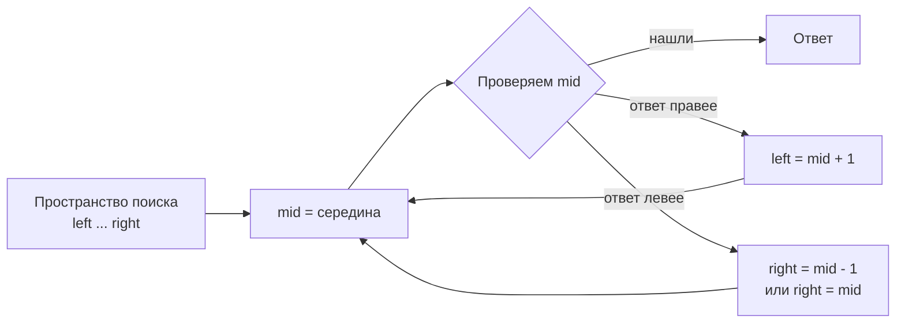
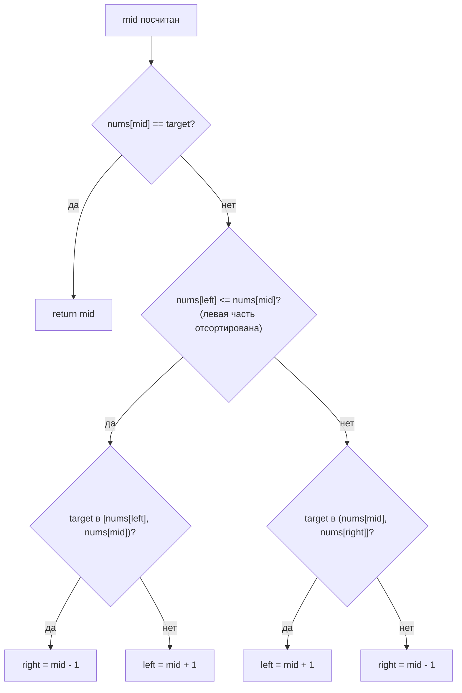
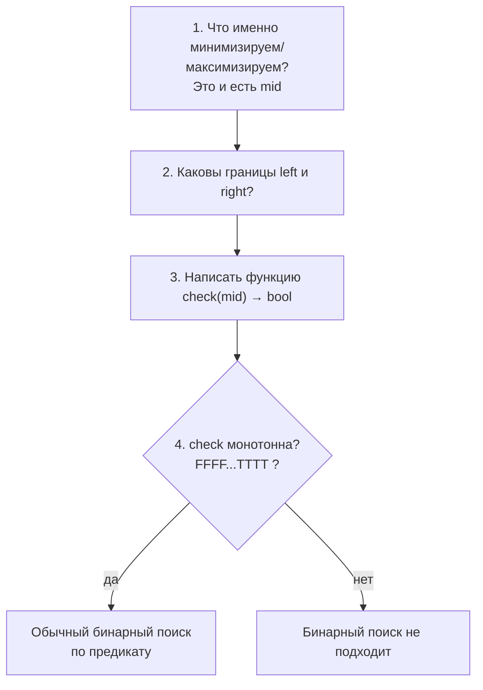

# Бинарный поиск (Binary Search)

## Алгоритмы и подходы в этой папке

| # | Название подхода | Где применяется | Задачи |
|---|---|---|---|
| 1 | **Классический бинарный поиск** (точное совпадение) | Массив отсортирован, ищем конкретное значение | 704 |
| 2 | **Lower bound / поиск точки вставки** (`left` как ответ) | Значения может не быть — нужен «первый ≥ target» | 35, 34 |
| 3 | **Бинарный поиск по ответу** (Binary Search on Answer) | Массива нет, есть диапазон значений и монотонная проверка | 69, 367, 1011 |
| 4 | **Бинарный поиск по предикату** (первый `True`) | Массив «FFFFTTTT» | 278, 162 |
| 5 | **Поиск в частично отсортированном массиве** | Массив повёрнут (rotated) | 33 |
| 6 | **Бинарный поиск в 2D-матрице** | Матрица развёрнута в «виртуальный» одномерный массив | 74 |

---

## 1. Главная идея простыми словами

Представьте телефонный справочник на 1000 страниц. Вы ищете фамилию «Петров».
Вы **не листаете подряд** — вы открываете середину, смотрите букву и выбрасываете
половину справочника. Потом ещё половину. И так далее.

```
1000 → 500 → 250 → 125 → 62 → 31 → 15 → 7 → 3 → 1
```

10 шагов вместо 1000. Это и есть `O(log n)`.

**Условие применимости — монотонность.** Не обязательно «массив отсортирован».
Достаточно, чтобы пространство поиска делилось на две части одним правилом:
слева — «не подходит», справа — «подходит» (или наоборот).



---

## 2. Скелет кода: два шаблона

### Шаблон А — `while left <= right` (ищем точное значение)

```python
left, right = 0, len(nums) - 1
while left <= right:
    mid = left + (right - left) // 2
    if nums[mid] == target:
        return mid
    elif nums[mid] < target:
        left = mid + 1     # ответ строго правее
    else:
        right = mid - 1    # ответ строго левее
return -1                  # или return left — точка вставки
```

Границы **всегда сдвигаются** (`mid ± 1`), поэтому цикл гарантированно завершится.

### Шаблон Б — `while left < right` (ищем границу/первый подходящий)

```python
left, right = 0, len(nums) - 1
while left < right:
    mid = left + (right - left) // 2
    if not ok(mid):
        left = mid + 1     # mid точно не ответ — выбрасываем
    else:
        right = mid        # mid МОЖЕТ быть ответом — оставляем!
return left                # left == right == ответ
```

> ⚠️ Ключевое отличие: в шаблоне Б `right = mid` **без минус единицы**, потому что
> сам `mid` ещё может оказаться искомой границей. И условие цикла обязано быть
> `left < right`, иначе при `right = mid` получим бесконечный цикл.

### Почему `mid = left + (right - left) // 2`, а не `(left + right) // 2`?

В Python разницы нет (целые числа безразмерные). Но в C++/Java `left + right` может
переполнить `int`. Формула `left + (right - left) // 2` — привычка, которая
переносится на другие языки. Результат тот же.

### Таблица выбора шаблона

| Что нужно найти | Шаблон | Условие | Обновление right | Ответ |
|---|---|---|---|---|
| Точный индекс элемента | А | `left <= right` | `mid - 1` | `mid` или `-1` |
| Точку вставки / первый ≥ target | А | `left <= right` | `mid - 1` | `left` |
| Первый `True` в FFFTTT | Б | `left < right` | `mid` | `left` |
| Минимальное возможное значение | Б или А | — | `mid` / `mid - 1` | `left` |

---

## 3. Разбор задач

### 704. Binary Search — эталон

Файл: `e704_Binary_Search.py`

`nums = [-1, 0, 3, 5, 9, 12]`, `target = 9`.

| Шаг | left | right | mid | nums[mid] | Сравнение | Действие |
|---|---|---|---|---|---|---|
| 1 | 0 | 5 | 2 | 3 | 3 < 9 | `left = 3` |
| 2 | 3 | 5 | 4 | 9 | 9 == 9 | **найдено, index = 4** |

Если бы искали `target = 2`:

| Шаг | left | right | mid | nums[mid] | Действие |
|---|---|---|---|---|---|
| 1 | 0 | 5 | 2 | 3 | 3 > 2 → `right = 1` |
| 2 | 0 | 1 | 0 | -1 | -1 < 2 → `left = 1` |
| 3 | 1 | 1 | 1 | 0 | 0 < 2 → `left = 2` |
| — | 2 | 1 | — | — | `left > right` → выход, `-1` |

---

### 35. Search Insert Position — почему ответ это `left`

Файл: `e35_Search_Insert_Position.py`

Задача: если элемента нет, вернуть индекс, **куда его надо вставить**.

Магия в том, что после выхода из цикла шаблона А переменная `left` уже указывает
на нужное место. Причина: цикл заканчивается, когда `left > right`, и в этот момент
`left` — это первая позиция, где значение **больше или равно** target.

`nums = [1, 3, 5, 6]`, `target = 2`:

```
Индексы:   0   1   2   3
Значения:  1   3   5   6
                ^
           сюда надо вставить 2 → ответ 1
```

| Шаг | left | right | mid | val | Действие |
|---|---|---|---|---|---|
| 1 | 0 | 3 | 1 | 3 | 3 > 2 → `right = 0` |
| 2 | 0 | 0 | 0 | 1 | 1 < 2 → `left = 1` |
| — | 1 | 0 | | | выход → **return 1** ✅ |

Краевые случаи, которые получаются «бесплатно»:
* `target = 0` (меньше всех) → `left = 0`
* `target = 7` (больше всех) → `left = 4` (за концом массива)

---

### 278. First Bad Version — поиск первого `True`

Файл: `e278_First_Bad_Version.py`

Это классический «FFFFTTTT»-поиск. Версии выглядят так:

```
версия:   1     2     3     4     5     6
качество: OK    OK    OK    BAD   BAD   BAD
                            ^^^
                       ответ = 4
```

Ключевая логика:

```python
if not isBadVersion(mid):
    left = mid + 1   # mid хороший → ответ точно правее
else:
    right = mid      # mid плохой → он МОЖЕТ быть первым плохим, не выбрасываем
```

Здесь нельзя писать `right = mid - 1`: если `mid` и есть первая сбойная версия,
мы её потеряем.

---

### 162. Find Peak Element — бинарный поиск без сортировки

Файл: `e162_Find_Peak_Element.py`

Массив **не отсортирован**, но бинарный поиск работает. Почему?

Правило: смотрим на `nums[mid]` и `nums[mid+1]`.

* Если `nums[mid] < nums[mid+1]` — мы стоим на **подъёме**. Значит справа
  обязательно есть пик (либо склон продолжается до конца массива, и тогда пик —
  последний элемент). → `left = mid + 1`
* Иначе мы на **спуске**, пик слева или это сам `mid`. → `right = mid`

```
nums = [1, 2, 1, 3, 5, 6, 4]

       6 ●
     5 ●   ● 4
   3 ●
 2 ●
1 ●   ● 1
```

| Шаг | left | right | mid | nums[mid] | nums[mid+1] | Вывод |
|---|---|---|---|---|---|---|
| 1 | 0 | 6 | 3 | 3 | 5 | подъём → `left = 4` |
| 2 | 4 | 6 | 5 | 6 | 4 | спуск → `right = 5` |
| 3 | 4 | 5 | 4 | 5 | 6 | подъём → `left = 5` |
| — | 5 | 5 | | | | **ответ 5** (значение 6) |

Задача гарантирует `nums[-1] = nums[n] = -∞`, поэтому пик существует всегда.

---

### 34. Find First and Last Position — два бинарных поиска

Файл: `e34_...py`

Нужны **обе границы** диапазона одинаковых значений.

```
nums = [5, 7, 7, 8, 8, 8, 10],  target = 8
индекс: 0  1  2  3  4  5   6
                  ^^^^^^^
                 first=3, last=5
```

Хитрый приём из решения: вместо двух разных функций пишется одна `findFirst(x)` —
«первая позиция, где значение ≥ x». Тогда:

* `start = findFirst(target)` — первое вхождение
* `end = findFirst(target + 1) - 1` — позиция перед первым элементом, который уже
  больше target

Для примера: `findFirst(8) = 3`, `findFirst(9) = 6`, значит `end = 6 - 1 = 5`. ✅

**Альтернативный подход** — две отдельные функции с «продолжением поиска»:

```python
def find_left(nums, target):
    left, right, res = 0, len(nums) - 1, -1
    while left <= right:
        mid = left + (right - left) // 2
        if nums[mid] == target:
            res = mid
            right = mid - 1    # нашли, но ищем ещё левее
        elif nums[mid] < target:
            left = mid + 1
        else:
            right = mid - 1
    return res

def find_right(nums, target):
    left, right, res = 0, len(nums) - 1, -1
    while left <= right:
        mid = left + (right - left) // 2
        if nums[mid] == target:
            res = mid
            left = mid + 1     # нашли, но ищем ещё правее
        elif nums[mid] < target:
            left = mid + 1
        else:
            right = mid - 1
    return res
```

Оба подхода дают `O(log n)`.

---

### 33. Search in Rotated Sorted Array

Файл: `e33_Search_in_Rotated_Sorted_Array.py`

Массив отсортировали, а потом «провернули»:

```
Было:  [0, 1, 2, 4, 5, 6, 7]
Стало: [4, 5, 6, 7, 0, 1, 2]
        └─ часть A ─┘└ B ┘
```

**Ключевое наблюдение:** какой бы `mid` мы ни взяли, **минимум одна из половин
всегда полностью отсортирована**. Её мы умеем проверять обычным сравнением.

```
[4, 5, 6, 7, 0, 1, 2]     mid = 3 (значение 7)
 └──────┘  ← левая половина [4..7] отсортирована
           └────┘ ← правая половина сломана
```

Алгоритм:

```python
if nums[left] <= nums[mid]:            # левая половина отсортирована
    if nums[left] <= target < nums[mid]:
        right = mid - 1                # target внутри упорядоченной части
    else:
        left = mid + 1
else:                                  # значит правая половина отсортирована
    if nums[mid] < target <= nums[right]:
        left = mid + 1
    else:
        right = mid - 1
```



> 📌 В файле цикл написан как `while left < right`. Безопаснее использовать
> `while left <= right`, иначе при сужении до одного элемента последняя проверка
> может не выполниться (например, `nums = [3, 1]`, `target = 1`).

---

### 74. Search a 2D Matrix — матрица как одномерный массив

Файл: `e74_Search_a_2D_Matrix.py`

Матрица отсортирована так, что если её «размотать» построчно, получится обычный
отсортированный массив:

```
матрица 3×4:                размотка:
[ 1,  3,  5,  7]            [1, 3, 5, 7, 10, 11, 16, 20, 23, 30, 34, 60]
[10, 11, 16, 20]             0  1  2  3   4   5   6   7   8   9  10  11
[23, 30, 34, 60]
```

Значит можно вести бинарный поиск по индексам `0 .. m*n-1` и переводить
одномерный индекс в координаты:

```
row = mid // n     ← сколько ПОЛНЫХ строк уместилось
col = mid % n      ← остаток: позиция внутри строки
```

Пример: `n = 4` (столбцов), `mid = 6` → `row = 6 // 4 = 1`, `col = 6 % 4 = 2` →
`matrix[1][2] = 16`. ✅

```
          col0  col1  col2  col3
row 0:    [0]   [1]   [2]   [3]
row 1:    [4]   [5]   [6]   [7]     ← mid=6 попадает сюда
row 2:    [8]   [9]  [10]  [11]
```

Сложность: `O(log(m·n))`.

**Альтернативный подход (тоже в файле, метод `searchMatrix`)** — два бинарных
поиска подряд:
1. Найти строку, в которой `matrix[row][0] <= target <= matrix[row][n-1]`.
2. Внутри найденной строки — обычный бинарный поиск.

Сложность `O(log m + log n)` — математически то же самое, но кода больше.
Зато этот вариант работает и для задачи 240, где строки не «склеиваются» в один
отсортированный массив.

---

### 69. Sqrt(x) и 367. Valid Perfect Square — поиск по ответу

Файлы: `e69_Sqrt_x.py`, `e367_vps.py`

Здесь **нет массива**. Мы ищем число в диапазоне `[0, x]`, а «отсортированность»
берётся из монотонности функции `f(mid) = mid * mid` — она растёт.

```
x = 8, ищем ⌊√8⌋ = 2

кандидат:  1   2   3   4  ...  8
квадрат:   1   4   9  16  ... 64
          ok  ok  >8  >8       >8
              ^^^ последний подходящий
```

| Шаг | left | right | mid | mid² | vs 8 | Действие |
|---|---|---|---|---|---|---|
| 1 | 1 | 8 | 4 | 16 | > | `right = 3` |
| 2 | 1 | 3 | 2 | 4 | < | `left = 3` |
| 3 | 3 | 3 | 3 | 9 | > | `right = 2` |
| — | 3 | 2 | | | | выход |

`return right = 2` ✅ — при поиске «наибольшего подходящего» ответом становится
`right`, а не `left`. Полезное правило-зеркало:

* ищем **минимальное** подходящее → возвращаем `left`
* ищем **максимальное** подходящее → возвращаем `right`

Для 367 достаточно вернуть `True` только при точном `mid * mid == num`.

---

### 1011. Capacity To Ship Packages — бинарный поиск по ответу (сложный случай)

Файл: `e1011_Capacity_To_Ship.py`

Самая «непохожая на бинарный поиск» задача. Нужно найти минимальную
грузоподъёмность корабля, чтобы развезти всё за `days` дней.

**Шаг 1. Определить диапазон ответа.**

```python
left  = max(weights)   # меньше нельзя — самая тяжёлая посылка не влезет
right = sum(weights)   # больше не нужно — увезём всё за 1 день
```

Для `weights = [1..10]`: `left = 10`, `right = 55`.

**Шаг 2. Написать проверку `can(capacity)` — «уложимся ли в days дней?»**

```python
turns, cur = 1, 0
for w in weights:
    cur += w
    if cur > mid:      # не влезло — начинаем новый день
        cur = w
        turns += 1
```

**Шаг 3. Понять, что проверка монотонна.**

```
capacity:  10  11  ...  14  15  16  ...  55
уложимся?   ✗   ✗        ✗   ✓   ✓        ✓
                             ^^^ первый True = ответ
```

Чем больше корабль, тем меньше дней. Значит это снова «FFFFTTTT» — и ответом
будет первый `True`.

```python
if turns > days:
    left = mid + 1      # корабль мал → нужен больше
else:
    right = mid - 1     # справились → пробуем сэкономить
return left
```

Сложность: `O(n · log(sum(weights)))`.

> 💡 Этот же шаблон решает целый класс задач: 410 (Split Array Largest Sum),
> 875 (Koko Eating Bananas), 1482 (Minimum Days to Make Bouquets),
> 1552 (Magnetic Force Between Two Balls).

**Универсальный рецепт «бинарный поиск по ответу»:**



---

## 4. Частые ошибки

| Ошибка | Симптом | Лечение |
|---|---|---|
| `right = mid` при `while left <= right` | Бесконечный цикл | Либо `right = mid - 1`, либо цикл `left < right` |
| `right = mid - 1` при поиске границы | Ответ «проскакивает» на 1 | Границу-кандидат не выбрасывать: `right = mid` |
| `right = len(nums)` вместо `len(nums) - 1` | IndexError | Определитесь: полуинтервал `[left, right)` или отрезок `[left, right]`, и не смешивайте |
| Забыли пустой массив | IndexError | `if not nums: return -1` |
| Проверка немонотонна | Неправильный ответ | Нарисуйте таблицу FFFF/TTTT — она должна разделяться ровно один раз |

---

## 5. Сложность

| Задача | Время | Память |
|---|---|---|
| 704, 35, 278, 162, 33 | `O(log n)` | `O(1)` |
| 34 | `O(log n)` (2 прохода) | `O(1)` |
| 74 | `O(log(m·n))` | `O(1)` |
| 69, 367 | `O(log x)` | `O(1)` |
| 1011 | `O(n · log S)`, S = сумма весов | `O(1)` |

---

## 6. Чек-лист «а нужен ли тут бинарный поиск?»

- [ ] Данные отсортированы **или** есть монотонное свойство?
- [ ] В условии есть слова «минимальное/максимальное такое, что…»?
- [ ] Размер входа большой (10⁵ и выше), а `O(n²)` не проходит по времени?
- [ ] Можно за `O(n)` или `O(1)` проверить одного кандидата?

Если 2+ галочки — почти наверняка бинарный поиск.
