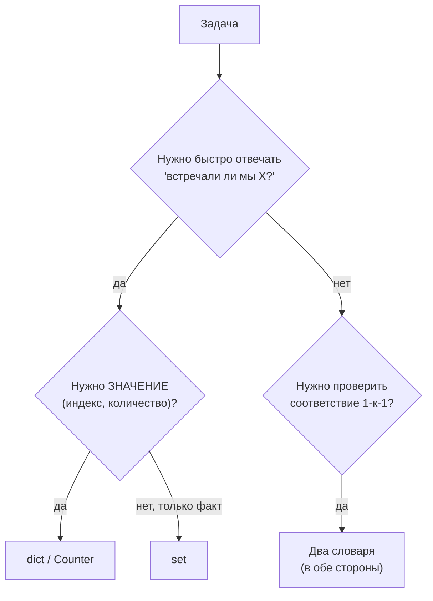
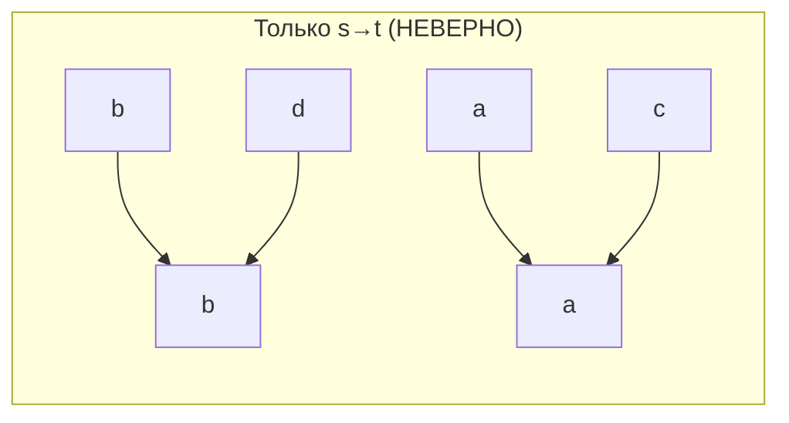

# Хеш-таблицы (Hash Tables / Hash Maps)

## Алгоритмы и подходы в этой папке

| # | Название подхода | Суть | Задачи |
|---|---|---|---|
| 1 | **Словарь «видели раньше»** (Seen Map / One-pass complement) | Идём по массиву и запоминаем то, что уже встретили | 1 (Two Sum) |
| 2 | **Частотный словарь** (Frequency Counter) | Считаем, сколько раз встретился каждый элемент | 242 (Valid Anagram) |
| 3 | **Двусторонний маппинг** (Bijection / Two-way mapping) | Два словаря для проверки взаимно-однозначного соответствия | 205 (Isomorphic Strings) |
| 4 | **Словарь-справочник** (Lookup Table) | Готовая таблица «символ → значение» | 13 (Roman to Integer) |
| 5 | **Множество** (Set) для проверки уникальности | Только факт наличия, без значений | 217, 36 (см. `../Matrix`) |

---

## 1. Главная идея простыми словами

Хеш-таблица — это **гардероб с номерками**. Вы отдаёте пальто и получаете номерок.
Когда возвращаетесь — не обыскиваете весь гардероб, а сразу идёте к нужной вешалке.

```
Список (list)                  Словарь (dict)
"есть ли 42 в массиве?"        "есть ли ключ 42?"
→ проверяем ВСЕ элементы       → считаем хеш(42) → сразу адрес ячейки
→ O(n)                         → O(1)
```

**Главный трюк всех задач этой темы: обменять память на скорость.**
Вложенный цикл `O(n²)` превращается в один проход `O(n)` за счёт `O(n)` памяти.



---

## 2. Инструменты Python

| Структура | Для чего | Пример |
|---|---|---|
| `dict` | ключ → значение | `{'a': 1, 'b': 2}` |
| `set` | только уникальные ключи | `{1, 2, 3}` |
| `collections.Counter` | готовый частотный словарь | `Counter("aab") → {'a': 2, 'b': 1}` |
| `collections.defaultdict` | словарь со значением по умолчанию | `defaultdict(int)` — не падает на новом ключе |

Сложность операций (в среднем):

| Операция | dict / set | list |
|---|---|---|
| Вставка | `O(1)` | `O(1)` в конец |
| Поиск `x in ...` | `O(1)` | `O(n)` |
| Удаление | `O(1)` | `O(n)` |

> ⚠️ `O(1)` — **в среднем**. В худшем случае (все ключи с одинаковым хешем) — `O(n)`.
> На интервью это оговаривать полезно, но на LeetCode неважно.

---

## 3. Подход 1: словарь «видели раньше»

### 1. Two Sum

Файл: `1-Two_Sum.py`

Найти два индекса, сумма значений по которым равна `target`.

**Наивно:** два вложенных цикла — `O(n²)`.

**Через хеш-таблицу — один проход.** Ключевая мысль: вместо «искать пару вперёд»
мы для каждого элемента спрашиваем «а не встречали ли мы уже его *дополнение*?»

```
current = nums[i]
нужное дополнение = target - current
```

```python
seen = {}                       # значение → индекс
for i, current in enumerate(nums):
    complement = target - current
    if complement in seen:
        return [seen[complement], i]
    seen[current] = i
```

Разбор `nums = [2, 7, 11, 15]`, `target = 9`:

| i | nums[i] | complement = 9 - nums[i] | Есть в seen? | Действие | seen после шага |
|---|---|---|---|---|---|
| 0 | 2 | 7 | нет | запомнили 2 | `{2: 0}` |
| 1 | 7 | 2 | **да, индекс 0** | return `[0, 1]` | — |

Разбор `nums = [3, 2, 4]`, `target = 6`:

| i | nums[i] | complement | Есть в seen? | seen после |
|---|---|---|---|---|
| 0 | 3 | 3 | нет (себя ещё не записали!) | `{3: 0}` |
| 1 | 2 | 4 | нет | `{3: 0, 2: 1}` |
| 2 | 4 | 2 | **да, индекс 1** | return `[1, 2]` ✅ |

**Почему запись в словарь идёт ПОСЛЕ проверки?**
Если бы мы сначала записали `nums[0] = 3`, а потом искали `complement = 3`, то нашли
бы сами себя и вернули `[0, 0]` — неправильно. Проверка перед записью автоматически
гарантирует, что мы используем два *разных* индекса.

Разбор `nums = [3, 3]`, `target = 6`:

| i | nums[i] | complement | seen | Результат |
|---|---|---|---|---|
| 0 | 3 | 3 | `{}` — пусто, не нашли | записали `{3: 0}` |
| 1 | 3 | 3 | **нашли индекс 0** | `[0, 1]` ✅ |

Дубликаты обрабатываются корректно «бесплатно».

> ⚠️ В коде файла используется `seen_values.get(second_value)` и проверка
> `if is_found == None`. Это ломается, если валидный индекс равен... нет, индекс 0
> тоже не `None`, но `if is_found == None` и `if not is_found` — разные вещи!
> Вторая форма была бы багом при индексе 0. Надёжнее писать
> `if second_value in seen_values:`.

| Подход | Время | Память |
|---|---|---|
| Два вложенных цикла | `O(n²)` | `O(1)` |
| Хеш-таблица, один проход | `O(n)` | `O(n)` |
| Сортировка + два указателя | `O(n log n)` | `O(n)` на сохранение исходных индексов |

---

## 4. Подход 2: частотный словарь

### 242. Valid Anagram

Файл: `242-Valid_Anagram.py`

Анаграмма — те же буквы в другом порядке: `"anagram"` и `"nagaram"`.

**Идея:** посчитать, сколько раз встречается каждая буква, и сравнить словари.

```
s = "anagram"        t = "nagaram"
a: 3                 a: 3
n: 1                 n: 1
g: 1                 g: 1
r: 1                 r: 1
m: 1                 m: 1
                    → словари равны → True
```

```
s = "rat"            t = "car"
r: 1                 c: 1
a: 1                 a: 1
t: 1                 r: 1
                    → t ≠ c → False
```

Решение в файле считает оба счётчика в одном цикле:

```python
if len(s) != len(t):
    return False            # ранний выход — важная оптимизация

sc, tc = Counter(), Counter()
for i in range(len(s)):
    sc[s[i]] += 1
    tc[t[i]] += 1
return sc == tc
```

**Более короткие варианты:**

```python
return Counter(s) == Counter(t)      # 1 строка
return sorted(s) == sorted(t)        # через сортировку
```

| Подход | Время | Память | Комментарий |
|---|---|---|---|
| Два `Counter` | `O(n)` | `O(k)`, k = размер алфавита | Быстрее всего |
| `sorted(s) == sorted(t)` | `O(n log n)` | `O(n)` | Короче, но медленнее |
| Массив на 26 букв | `O(n)` | `O(1)` | Если гарантированы только a-z |
| Один `Counter` с +1/-1 | `O(n)` | `O(k)` | Экономит один словарь (см. ниже) |

Вариант с одним словарём:

```python
if len(s) != len(t): return False
cnt = Counter(s)
for ch in t:
    cnt[ch] -= 1
    if cnt[ch] < 0:          # символа в t больше, чем в s
        return False
return True
```

> 💡 Проверка `len(s) != len(t)` в начале — не косметика. Без неё строки
> `"aa"` и `"aab"` по «одному счётчику» могли бы дать неверный результат в наивных
> реализациях.

---

## 5. Подход 3: двусторонний маппинг

### 205. Isomorphic Strings

Файл: `205-Isomorphic_Strings.py`

Строки изоморфны, если существует **взаимно-однозначная** замена символов.

```
"egg" → "add"
e → a
g → d          ✅ каждая буква s имеет ровно одну «пару» в t, и наоборот
```

**Ловушка** — почему одного словаря мало:

```
s = "badc"  t = "baba"
b → b   ✅
a → a   ✅
d → b   ✅ (словарь s→t не против: d ещё не занят)
c → a   ✅
```

Один словарь скажет «изоморфны». Но это **неверно**: в `t` буква `b` получена
и из `b`, и из `d` — соответствие не однозначное. Нужен второй словарь `t → s`,
который поймает конфликт: `b` уже сопоставлен с `b`, а мы пытаемся `b → d`.



Две стрелки, приходящие в один узел — это и есть нарушение.

Код:

```python
transcode = {}          # s → t
transcode_contra = {}   # t → s

for first, second in zip(s, t):
    if first in transcode and transcode[first] != second:
        return False                 # символ s уже отображён в другую букву
    transcode[first] = second

    if second in transcode_contra and transcode_contra[second] != first:
        return False                 # символ t уже получен из другой буквы
    transcode_contra[second] = first

return True
```

Пошаговый разбор `s = "paper"`, `t = "title"`:

| Шаг | s | t | Проверка s→t | Проверка t→s | s→t после | t→s после |
|---|---|---|---|---|---|---|
| 1 | p | t | новый | новый | `{p:t}` | `{t:p}` |
| 2 | a | i | новый | новый | `{p:t, a:i}` | `{t:p, i:a}` |
| 3 | p | t | `p→t` совпадает ✅ | `t→p` совпадает ✅ | без изменений | без изменений |
| 4 | e | l | новый | новый | `{p:t,a:i,e:l}` | `{t:p,i:a,l:e}` |
| 5 | r | e | новый | новый | `+{r:e}` | `+{e:r}` |

→ `True` ✅

Разбор `s = "f11"`, `t = "b23"`:

| Шаг | s | t | Что происходит |
|---|---|---|---|
| 1 | f | b | новая пара `f→b` |
| 2 | 1 | 2 | новая пара `1→2` |
| 3 | 1 | 3 | `transcode['1'] == '2' != '3'` → **False** ✅ |

**Альтернатива в одну строку** — сравнить «шаблоны» первых вхождений:

```python
return [s.index(c) for c in s] == [t.index(c) for c in t]
```

Красиво, но `str.index` внутри цикла даёт `O(n²)`. Для интервью лучше показать
вариант с двумя словарями.

> 📎 Эта же техника решает задачу **290. Word Pattern** (соответствие «буква ↔ слово»).

Тесты: `test_205_isomorphic.py` — параметризованный pytest с краевыми случаями
(`"ab"` / `"aa"`, `"foo"` / `"bar"`).

---

## 6. Подход 4: словарь-справочник

### 13. Roman to Integer

Файл: `13-Roman_to_Integer.py`

Римские цифры почти всегда складываются, но есть 6 «вычитающих» пар:

| Пара | Значение | Пара | Значение |
|---|---|---|---|
| IV | 4 | XL | 40 |
| IX | 9 | XC | 90 |
| CD | 400 | CM | 900 |

**Подход А (в файле): два словаря + просмотр вперёд на 1 символ.**

```python
double = {"IV":4, "IX":9, "XL":40, "XC":90, "CD":400, "CM":900}
ones   = {"I":1, "V":5, "X":10, "L":50, "C":100, "D":500, "M":1000}

i, total = 0, 0
while i < len(s):
    pair = s[i:i+2]                # срез безопасен даже в конце строки
    if pair in double:
        total += double[pair]
        i += 2                     # съели ДВА символа
    else:
        total += ones[s[i]]
        i += 1
```

Разбор `"MCMXCIV"` = 1994:

| i | Окно | В `double`? | Прибавили | Сумма | Новый i |
|---|---|---|---|---|---|
| 0 | `MC` | нет | `M` = 1000 | 1000 | 1 |
| 1 | `CM` | **да** | 900 | 1900 | 3 |
| 3 | `XC` | **да** | 90 | 1990 | 5 |
| 5 | `IV` | **да** | 4 | 1994 | 7 |
| — | конец | | | **1994** ✅ | |

**Подход Б: сравнение с соседом справа (один словарь).**

Правило: если текущий символ **меньше** следующего — вычитаем, иначе прибавляем.

```python
val = {"I":1,"V":5,"X":10,"L":50,"C":100,"D":500,"M":1000}
total = 0
for i in range(len(s)):
    if i + 1 < len(s) and val[s[i]] < val[s[i+1]]:
        total -= val[s[i]]
    else:
        total += val[s[i]]
return total
```

`"MCMXCIV"`:

```
M(1000) vs C(100)  → 1000 >= 100 → +1000    → 1000
C(100)  vs M(1000) → 100 < 1000  → -100     →  900
M(1000) vs X(10)   → +1000                  → 1900
X(10)   vs C(100)  → 10 < 100   → -10       → 1890
C(100)  vs I(1)    → +100                    → 1990
I(1)    vs V(5)    → 1 < 5     → -1          → 1989
V(5)    последний  → +5                      → 1994 ✅
```

| Подход | Словарей | Строк кода | Комментарий |
|---|---|---|---|
| А: пары + одиночки | 2 | ~20 | Прямолинейно, «как в учебнике» |
| Б: сравнение с соседом | 1 | ~7 | Элегантнее, чаще ждут на интервью |

Оба — `O(n)` времени, `O(1)` памяти (словари фиксированного размера).

---

## 7. Подход 5: множество (set)

Когда нужно только «встречали / не встречали», значение не важно — используйте `set`.

```python
# 217. Contains Duplicate
def containsDuplicate(nums):
    return len(set(nums)) != len(nums)

# или с ранним выходом:
def containsDuplicate(nums):
    seen = set()
    for x in nums:
        if x in seen:
            return True
        seen.add(x)
    return False
```

Множества также используются в задаче **36. Valid Sudoku** (см. папку `../Matrix`) —
там для каждой строки, столбца и блока 3×3 проверяется уникальность цифр.

---

## 8. Сводная таблица

| Задача | Подход | Время | Память |
|---|---|---|---|
| 1. Two Sum | seen-map, один проход | `O(n)` | `O(n)` |
| 13. Roman to Integer | lookup-словарь | `O(n)` | `O(1)` |
| 205. Isomorphic Strings | два словаря (биекция) | `O(n)` | `O(k)` |
| 242. Valid Anagram | частотный словарь | `O(n)` | `O(k)` |

`k` — размер алфавита (для латиницы — 26, для ASCII — 128).

---

## 9. Частые ошибки

| Ошибка | Последствие | Как избежать |
|---|---|---|
| Запись в словарь **до** проверки (Two Sum) | Элемент находит сам себя → `[0,0]` | Сначала `if complement in seen`, потом `seen[x] = i` |
| `if not seen.get(x)` вместо `if x in seen` | Индекс 0 и значение 0 считаются «отсутствующими» | Проверять через `in` |
| Один словарь вместо двух (Isomorphic) | Проходят неизоморфные строки типа `"badc"/"baba"` | Всегда проверять соответствие в обе стороны |
| Забыли проверить длины (Anagram) | `"aa"` и `"aab"` могут пройти | `if len(s) != len(t): return False` |
| Срез `s[i:i+2]` без проверки границ | В Python **не** падает, вернёт 1 символ | Тут всё безопасно, но помните об этом в других языках |
| Изменяемый объект как ключ | `TypeError: unhashable type: 'list'` | Ключом может быть только `tuple`, `str`, число, `frozenset` |

---

## 10. Как распознать задачу «на хеш-таблицу»

- [ ] Нужно **быстро проверять наличие** элемента.
- [ ] Нужно **считать количества** (сколько раз встретилось, самый частый элемент).
- [ ] Нужно **группировать** элементы по признаку (анаграммы, одинаковый остаток).
- [ ] Нужно установить **соответствие** между двумя множествами.
- [ ] Наивное решение — вложенные циклы, и хочется свести `O(n²)` к `O(n)`.
- [ ] В условии есть слова: «дубликаты», «частота», «уникальные», «анаграмма»,
      «пара с суммой», «первый неповторяющийся».

**Цена вопроса:** дополнительная память `O(n)`. Если в условии требуют `O(1)` памяти
— скорее всего, задача решается двумя указателями (см. `../TwoPointers`) или
битовыми операциями (см. `../BitManipulation`).
