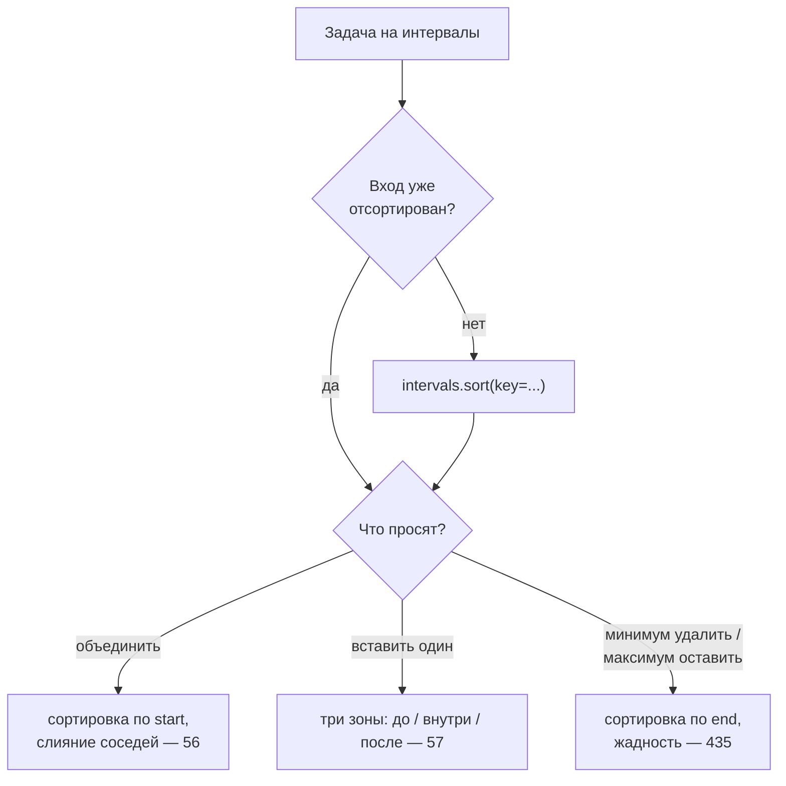

# Интервалы (Intervals)

## Алгоритмы и подходы в этой папке

| # | Название подхода | Суть | Задачи |
|---|---|---|---|
| 1 | **Сортировка по началу + слияние** | Отсортировали по `start`, идём слева направо и «растягиваем» текущий интервал | 56 |
| 2 | **Три зоны: слева / пересекает / справа** | Список уже отсортирован, новый интервал впитывает всё, что его касается | 57 |
| 3 | **Жадный выбор по концу** (activity selection) | Сортируем по `end`, оставляем интервал с самым ранним концом | 435 |

---

## 1. Главная идея простыми словами

Интервал — пара `[start, end]`. Почти всё в этой теме сводится к одному вопросу:
**пересекаются ли два интервала?**

```
A: [1, 5]        B: [3, 8]        пересекаются:  B.start <= A.end
   ├─────┤          ├──────┤                     3 <= 5  ✅
   1     5          3      8

A: [1, 5]        C: [6, 8]        не пересекаются: C.start > A.end
   ├─────┤              ├──┤                       6 > 5
   1     5              6  8
```

Формула для двух произвольных интервалов:

```python
overlap = a[0] <= b[1] and b[0] <= a[1]
```

Но перебирать все пары — `O(n²)`. Поэтому первый шаг почти всегда —
**отсортировать**, после чего достаточно сравнивать соседей, а это `O(n log n)`.



**По какому полю сортировать?**

| Цель | Ключ | Почему |
|---|---|---|
| Слить пересекающиеся | `start` | Чтобы «растягивать» текущий интервал вправо и точно не пропустить пересечение |
| Оставить максимум непересекающихся | `end` | Интервал с самым ранним концом оставляет больше всего места остальным |

---

## 2. Разбор задач

### 56. Merge Intervals — сортировка + растягивание

Файл: `e56_Merge_Intervals.py`

```python
intervals.sort(key=lambda x: x[0])
last = intervals[0]
result = []
for item in intervals:
    if item[0] <= last[1]:              # касается текущего
        last[1] = max(last[1], item[1]) # растягиваем конец
    else:
        result.append(last)             # закрываем текущий
        last = item
result.append(last)                     # не забыть последний!
```

```
после сортировки: [1,3] [2,6] [8,10] [15,18]

last=[1,3]
[2,6]:   2 <= 3  → last=[1,6]
[8,10]:  8 > 6   → result=[[1,6]],        last=[8,10]
[15,18]: 15 > 10 → result=[[1,6],[8,10]], last=[15,18]
финал:            result=[[1,6],[8,10],[15,18]] ✅
```

Зачем `max(last[1], item[1])`, а не просто `item[1]`? Интервал может лежать
**целиком внутри** текущего: `[1,10]` и `[2,3]` → конец должен остаться `10`.

> 📌 В файле остался отладочный `print(f"res: {intervals}")` внутри `merge` —
> он печатает исходный (уже мутированный сортировкой) массив, а не результат.
>
> 📌 `last` — это ссылка на элемент `intervals`, и `last[1] = ...` меняет
> входной список. Для LeetCode это допустимо, но если входные данные нужны
> дальше — копируйте: `last = intervals[0][:]`.

---

### 57. Insert Interval — три зоны

Файл: `e57_Insert_Interval.py`

Список уже отсортирован и без пересечений, сортировать не нужно — `O(n)`.
Каждый существующий интервал попадает ровно в одну из трёх зон относительно
нового `[ns, ne]`:

```
                 ns          ne
                 ├───────────┤        новый
  ├──┤                                item[1] < ns   → слева, копируем как есть
            ├──────┤                  пересекает      → впитываем: ns=min, ne=max
                          ├───────┤   пересекает      → впитываем
                                  ├──┤ item[0] > ne   → справа, копируем как есть
```

```python
left, right = [], []
ns, ne = newInterval
for s, e in intervals:
    if e < ns:        left.append([s, e])
    elif s > ne:      right.append([s, e])
    else:             ns, ne = min(ns, s), max(ne, e)
return left + [[ns, ne]] + right
```

```
intervals=[[1,3],[6,9]], new=[2,5]

[1,3]: 3 < 2? нет; 1 > 5? нет → впитываем: ns=1, ne=5
[6,9]: 9 < 1? нет; 6 > 5? да  → right=[[6,9]]
ответ: [] + [[1,5]] + [[6,9]] = [[1,5],[6,9]] ✅
```

Поскольку интервалы отсортированы, порядок `left → new → right` получается
автоматически, отдельно сортировать результат не нужно.

> 📌 В файле `if not intervals: return []` — это **ошибка**: при пустом входе
> надо вернуть `[newInterval]` (пример 3 на LeetCode: `intervals=[]`,
> `newInterval=[5,7]` → `[[5,7]]`). Проверку можно просто убрать — цикл по
> пустому списку и так вернёт `[[ns, ne]]`.

---

### 435. Non-overlapping Intervals — жадность по концу

Файл: `e435_Non-overlapping_Intervals.py`

Вопрос «сколько удалить» = `n − (сколько максимум можно оставить)`. А максимум
непересекающихся — классическая задача **activity selection**: сортируем по
`end`, жадно берём интервал, если он начинается не раньше конца последнего
взятого.

```python
intervals.sort(key=lambda x: x[1])      # ← по КОНЦУ
removed = 0
end = intervals[0][1]
for s, e in intervals[1:]:
    if s < end:          # пересекается с оставленным → удаляем его
        removed += 1
    else:                # не пересекается → оставляем, двигаем границу
        end = e
return removed
```

Почему сортировать именно по концу: среди пересекающихся интервалов выгоднее
всего оставить тот, который **раньше заканчивается** — он «освобождает место»
для максимального числа последующих.

```
[[1,2],[2,3],[3,4],[1,3]]  → sort by end → [1,2] [2,3] [1,3] [3,4]

end=2
[2,3]: 2 < 2? нет → оставляем, end=3
[1,3]: 1 < 3? да  → removed=1
[3,4]: 3 < 3? нет → оставляем, end=4
ответ: 1 ✅
```

Обратите внимание на **строгое** `s < end`: интервалы `[1,2]` и `[2,3]` по
условию задачи **не** пересекаются (касание границами допустимо).

---

## 3. Сводная таблица сложности

| Задача | Подход | Время | Память |
|---|---|---|---|
| 56 Merge Intervals | sort by start + слияние | `O(n log n)` | `O(n)` под ответ |
| 57 Insert Interval | три зоны, без сортировки | `O(n)` | `O(n)` под ответ |
| 435 Non-overlapping Intervals | sort by end + жадность | `O(n log n)` | `O(1)` |

---

## 4. Частые ошибки

| Ошибка | Последствие | Как избежать |
|---|---|---|
| Забыли `result.append(last)` после цикла | Последний интервал теряется | Финальный `append` — обязательная строка шаблона |
| `last[1] = item[1]` вместо `max(...)` | Вложенный интервал укорачивает объединённый | Всегда `max(last[1], item[1])` |
| В 435 сортировка по `start` | Жадность даёт неоптимальный ответ | Для «максимум непересекающихся» — только по `end` |
| `<=` вместо `<` в 435 | Касающиеся интервалы считаются пересекающимися | Прочитать в условии, считается ли касание пересечением |
| В 57 сортировка / перебор пар | Лишний `O(n log n)` или `O(n²)` | Вход уже отсортирован — один проход |
| В 57 `return []` на пустом входе | Потерян `newInterval` | Убрать проверку, цикл сам вернёт `[[ns, ne]]` |

---

## 5. Как распознать задачу «на интервалы»

- [ ] На входе список пар `[start, end]` (встречи, отрезки, расписания, диапазоны).
- [ ] Слова «объединить», «пересекаются», «вставить», «минимум удалить»,
      «сколько комнат/ресурсов», «свободные окна».
- [ ] Наивное решение — сравнить каждый с каждым, `O(n²)`.
- [ ] Первая строка решения почти всегда — `intervals.sort(key=...)`, и главный
      вопрос — **по какому полю**.
