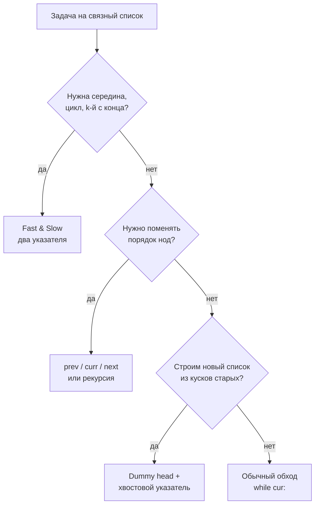
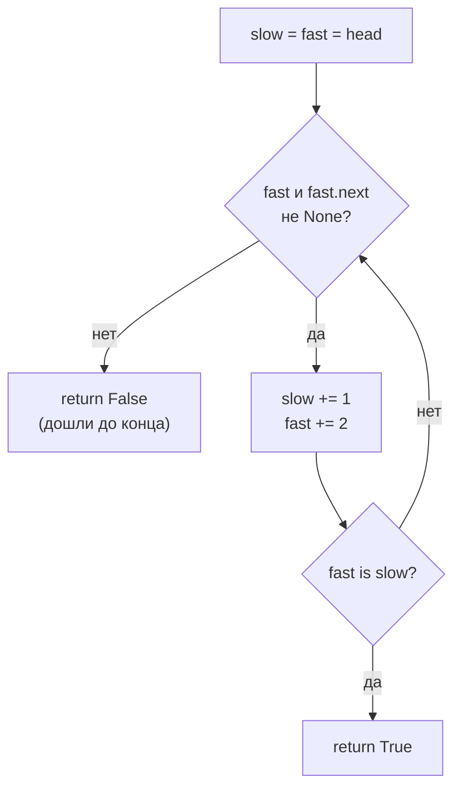

# Связные списки (Linked List)

## Алгоритмы и подходы в этой папке

| # | Название подхода | Суть | Задачи |
|---|---|---|---|
| 1 | **Fast & Slow** («черепаха и заяц», алгоритм Флойда) | Два указателя, один идёт в 2 раза быстрее | 876, 141, 234 |
| 2 | **Разворот «на месте»** (три указателя `prev / curr / next`) | Перевешиваем стрелку `next` назад, не создавая новых нод | 206, 234 |
| 3 | **Рекурсивный разворот** | Уходим до хвоста, стрелки перевешиваем на выходе из рекурсии | 206 |
| 4 | **Фиктивная голова** (dummy head) + слияние | Заводим пустую ноду-якорь, чтобы не разбирать «а если список пуст» | 21, 206 (вариант 1), 148 |
| 5 | **Множество посещённых** (visited set) | Простое, но `O(n)` по памяти | 141 (вариант 1) |
| 6 | **Две дорожки одинаковой длины** (переключение голов) | Два указателя проходят `m + n` и встречаются в точке пересечения | 160 |
| 7 | **Подмена значения вместо перелинковки** | Нет доступа к предыдущей ноде — «становимся» следующей нодой | 237 |
| 8 | **Merge sort по списку** (разделяй и властвуй) | Делим по середине через fast & slow, сливаем как в 21 | 148 |

Общие утилиты лежат в `utils.py`: `ListNode`, `makeList`, `printList`, `sortList`,
`getNodeByVal` (линейный поиск ноды по значению — нужен там, где вход задачи не
голова, а конкретная нода, как в 237).

---

## 1. Главная идея простыми словами

Связный список — это цепочка нод, каждая знает только **значение** и **ссылку на
следующую**. Никакого индекса `nums[i]` нет: чтобы добраться до k-й ноды, надо
прошагать `k` раз по `next`.

```
head
 │
 ▼
┌───┬───┐   ┌───┬───┐   ┌───┬───┐   ┌───┬───┐
│ 1 │ ●─┼──▶│ 2 │ ●─┼──▶│ 3 │ ●─┼──▶│ 4 │ ∅ │
└───┴───┘   └───┴───┘   └───┴───┘   └───┴───┘
```

Из этого вытекают три следствия, на которых построены все задачи папки:

1. **Длину не знаем заранее** → либо считаем отдельным проходом, либо используем
   два указателя с разной скоростью.
2. **Идти можно только вперёд** → «назад» = переворачивать стрелки.
3. **Ноды можно переиспользовать** → сливаем/разворачиваем без выделения памяти,
   меняя только `next`.



---

## 2. Шаблоны

### Шаблон А — обход

```python
cur = head
while cur:            # cur is not None
    ...               # работаем с cur.val
    cur = cur.next
```

### Шаблон Б — Fast & Slow

```python
slow = fast = head
while fast and fast.next:     # fast «смотрит» на два шага вперёд
    slow = slow.next
    fast = fast.next.next
# здесь slow — середина (для чётной длины — вторая из двух средних)
```

Условие `fast and fast.next` — единственно правильное: без `fast` упадём на
пустом списке, без `fast.next` — на списке нечётной длины (`fast.next.next`
от `None`).

### Шаблон В — dummy head

```python
dummy = ListNode()      # фиктивная нода перед началом ответа
tail = dummy            # tail всегда указывает на последнюю ноду ответа
...
tail.next = node        # приклеили
tail = node             # сдвинули хвост
...
return dummy.next       # настоящая голова — следующая за фиктивной
```

Без dummy пришлось бы отдельно обрабатывать «первая нода ещё не создана».
Именно так работает `makeList` в `utils.py`.

---

## 3. Разбор задач

### 876. Middle of the Linked List — эталон Fast & Slow

Файл: `e876_Middle_of_the_Linked_List.py`

Два решения в файле:

| Метод | Идея | Проходов |
|---|---|---|
| `sol_direct` | Посчитать длину, затем прошагать `size // 2` | 2 (≈ 1.5n шагов) |
| `two_pointers` | `slow` на 1 шаг, `fast` на 2 | 1 (n/2 итераций) |

Почему работает: когда `fast` прошёл весь список (n шагов), `slow` прошёл
ровно половину.

```
[1, 2, 3, 4, 5]                 [1, 2, 3, 4, 5, 6]
 s                               s
 f                               f
    s     f                         s     f
       s        f=∅ → стоп             s        f
                                          s        f=∅ → стоп
 ответ: 3                        ответ: 4 (вторая из средних) ✅
```

Для чётной длины `slow` останавливается на **второй** средней — ровно то, что
просит задача. Если бы нужна была первая, стартовали бы `fast = head.next`.

> 📌 В файле список создаётся как `makeList({1, 2, 3, 4, 5, 6})` — это `set`,
> а не `list`. Для маленьких целых порядок обхода множества совпадает с
> числовым, поэтому тест проходит, но полагаться на это нельзя — используйте
> `[1, 2, 3, 4, 5, 6]`.

---

### 141. Linked List Cycle — Fast & Slow ловит цикл

Файл: `e141_Linked_List_Cycle.py`

**Вариант 1 (`MyFirstSolution`)** — `set` посещённых нод. Кладём в множество
сами объекты `ListNode` (не значения — они могут повторяться). Если нода
встретилась второй раз — цикл. `O(n)` времени, `O(n)` памяти.

**Вариант 2 (`MyOptimizedSolution`)** — алгоритм Флойда, `O(1)` памяти.

Идея: если бегун и пешеход бегут по кольцу, быстрый **обязательно догонит**
медленного. Если кольца нет — быстрый упрётся в `None`.

```
3 → 2 → 0 → -4
    ▲         │
    └─────────┘

шаг 0:  s=3   f=3
шаг 1:  s=2   f=0
шаг 2:  s=0   f=2       (f: -4 → 2)
шаг 3:  s=-4  f=-4      f == s → цикл ✅
```

Почему догонит именно за `O(n)`: как только оба внутри кольца, расстояние между
ними уменьшается на 1 за шаг, а длина кольца конечна.



> 📌 Сравнивать надо **объекты**, а не значения: `fast is slow`. В файле
> используется `fast == slow` — для `ListNode` без `__eq__` это то же самое,
> что `is`, но явное `is` читается честнее.
>
> 📌 Тестовый список тоже собран из `set` `{3, 2, 0, -4}` — реальный порядок
> нод будет иным, чем в условии. Цикл всё равно найдётся, но лучше передать
> `list`.

---

### 206. Reverse Linked List — три способа

Файл: `e206_Reverse_Linked_List.py`

**Вариант 1 (`myFirstSolution`)** — выгрузить значения в `list`, развернуть,
собрать новый список. Работает, но это `O(n)` памяти и не «разворот», а
«копия задом наперёд».

**Вариант 2 (`mySecondSolution`)** — итеративно, `O(1)` памяти. Каноническое
решение:

```python
prev, cur = None, head
while cur:
    nxt = cur.next        # 1. запомнить следующего
    cur.next = prev       # 2. перевесить стрелку назад
    prev = cur            # 3. сдвинуть prev
    cur = nxt             # 4. сдвинуть cur
return prev               # prev — новая голова
```

В файле те же четыре действия записаны одной строкой:

```python
current.next, prev, current = prev, current, current.next
```

Это работает потому, что Python **сначала** вычисляет всю правую часть
(`prev, current, current.next` — старые значения), и только потом присваивает
слева направо.

```
None  1 → 2 → 3 → ∅
prev  cur

None ← 1   2 → 3 → ∅        cur.next = prev
      prev cur

None ← 1 ← 2   3 → ∅
          prev cur

None ← 1 ← 2 ← 3   ∅
              prev cur=∅ → стоп, return prev (3) ✅
```

**Вариант 3 (`myThirdSolution`)** — рекурсивно. Уходим до последней ноды (она
станет новой головой), а стрелки перевешиваем **на выходе** из рекурсии:

```python
if not head or not head.next:
    return head                         # хвост = новая голова
new_head = self.reverse(head.next)      # развернуть всё правее
head.next.next = head                   # следующий теперь смотрит на меня
head.next = None                        # я больше не смотрю вперёд
return new_head
```

```
reverse(1) → reverse(2) → reverse(3)  = 3     (база)
                    ↑ 2.next.next = 2  →  3 → 2,  2.next = None
          ↑ 1.next.next = 1            →  3 → 2 → 1,  1.next = None
```

Глубина рекурсии = длина списка. При лимите задачи (5000 нод) в CPython это
уже на грани `RecursionError` (по умолчанию лимит 1000) — на практике
предпочитайте итеративный вариант.

| Вариант | Время | Память | Меняет исходные ноды |
|---|---|---|---|
| через `list` | `O(n)` | `O(n)` | нет (строит копию) |
| итеративный | `O(n)` | `O(1)` | да |
| рекурсивный | `O(n)` | `O(n)` стек | да |

---

### 21. Merge Two Sorted Lists — dummy head + два курсора

Файл: `e21_Merge_Two_Sorted_Lists.py`

Тот же приём, что и слияние массивов в `TwoPointers` (задача 88), только вместо
индексов — указатели на ноды.

```python
dummy = ListNode()
tail = dummy
while list1 and list2:
    if list1.val < list2.val:
        tail.next, list1 = list1, list1.next
    else:
        tail.next, list2 = list2, list2.next
    tail = tail.next
tail.next = list1 or list2      # приклеить остаток
return dummy.next
```

```
l1: 1 → 2 → 4          l2: 1 → 3 → 4

dummy → 1(l2)                       l2.val не меньше → берём l2 (else)
dummy → 1 → 1(l1)
dummy → 1 → 1 → 2(l1)
dummy → 1 → 1 → 2 → 3(l2)
dummy → 1 → 1 → 2 → 3 → 4(l1)      l1 кончился
dummy → 1 → 1 → 2 → 3 → 4 → 4(l2)  хвост приклеен целиком ✅
```

> 📌 Условие требует «splicing together the nodes» — переиспользовать ноды
> исходных списков. Решение в файле на каждом шаге создаёт `ListNode()` и
> копирует `val`, то есть тратит `O(n + m)` памяти вместо `O(1)`. Ответ
> LeetCode примет, но идиоматичный вариант — выше.
>
> 📌 `sortList` в файле и в `utils.py` не нужен для задачи: по условию оба
> списка уже отсортированы.

---

### 234. Palindrome Linked List — fast & slow + разворот половины

Файл: `e234_Palindrome_Linked_List.py`

Задача соединяет два уже знакомых приёма: шаблон Б находит середину, шаблон из
206 разворачивает вторую половину, после чего половины сравниваются лоб в лоб.

```
1 → 2 → 2 → 1

шаг 1: fast & slow → slow встал на второй «2» (начало правой половины)

1 → 2 → 2 → 1                 1 → 2 → 2
        ▲                             ▲
      slow                     1 ← 2 ─┘   ← развернули хвост, prev = 1

шаг 2: идём head (1 → 2 → …) и prev (1 → 2 → None) параллельно
       1 == 1,  2 == 2,  prev кончился → палиндром ✅
```

Ключевой момент: сравнение идёт `while current`, где `current` — голова
**развёрнутой** половины. Она короче или равна левой, поэтому именно её
исчерпание и есть условие выхода — левая половина никогда не упрётся в `None`
раньше.

На нечётной длине средний элемент попадает в обе половины и сравнивается сам с
собой — на ответ это не влияет:

```
1 → 2 → 3 → 2 → 1     slow → 3,  развёрнутая половина: 1 → 2 → 3
                      сравнение: 1=1, 2=2, 3=3 → True ✅
```

`O(n)` времени, `O(1)` памяти — то, что просит follow-up. Наивный вариант
(выгрузить значения в `list` и сравнить с `list[::-1]`) тоже `O(n)` по времени,
но тратит `O(n)` памяти.

> 📌 Список после вызова остаётся разрушенным: левая половина по-прежнему ведёт
> в середину, а хвост развёрнут. LeetCode это принимает, но если структуру надо
> сохранить — развернуть вторую половину обратно перед `return`.
>
> 📌 `logging.basicConfig(level=DEBUG)` печатает строку на каждый сравниваемый
> узел. При лимите задачи (10⁵ нод) это главный тормоз решения — уровень стоит
> поднять до `INFO`.

---

### 160. Intersection of Two Linked Lists — две дорожки одинаковой длины

Файл: `e160_Intersection_of_Two_Linked_Lists.py`

Пересечение здесь — это **общая нода** (один объект в памяти), а не совпадение
значений. После точки пересечения списки идут одним хвостом:

```
A:    4 → 1 ┐
            ├→ 8 → 4 → 5
B: 5 → 6 → 1┘
```

Мешает то, что «головы» на разном расстоянии от пересечения (2 и 3). Приём:
дойдя до конца своего списка, указатель прыгает на голову **чужого**. Тогда оба
проходят ровно `m + n` нод и выравниваются:

```
A + B:  4 1 [8 4 5] 5 6 1 [8 4 5]      обе дорожки длиной m + n
B + A:  5 6 1 [8 4 5] 4 1 [8 4 5]      → встреча в первой общей ноде
```

```python
lineA, lineB = headA, headB
while lineA != lineB:
    lineA = lineA.next if lineA is not None else headB
    lineB = lineB.next if lineB is not None else headA
return lineA
```

Если пересечения нет, оба указателя становятся `None` **одновременно** (после
`m + n + 1` шагов), условие `lineA != lineB` перестаёт выполняться и функция
возвращает `None` — отдельная проверка не нужна. Именно поэтому переход на
чужую голову делается **после** `None`, а не вместо него: сокращённая запись
`lineA = lineA.next or headB` пропустила бы `None` и зациклилась на непересекающихся
списках.

`O(m + n)` времени, `O(1)` памяти. Альтернативы — множество нод списка A
(`O(m)` памяти) или выравнивание по разнице длин (два дополнительных прохода).

> 📌 Сравнивать нужно объекты: `lineA is lineB`. `!=` работает только потому,
> что у `ListNode` нет `__eq__` — как и в 141.
>
> 📌 В файле результат не печатается и не проверяется: `sol.getIntersectionNode(listA, listB)`
> вызывается «в никуда». Стоит добавить `assert ... .val == 8`.

---

### 237. Delete Node in a Linked List — удаление без доступа к предыдущей ноде

Файл: `e237_Delete_Node_in_a_Linked_List.py`

Задача-парадокс: дают **саму ноду**, а не голову. Обычное удаление
(`prev.next = node.next`) невозможно — до `prev` не добраться.

Разгадка: раз ноду нельзя выкинуть, можно её **переодеть** в следующую и
выкинуть уже следующую:

```
до:   4 → [5] → 1 → 9        нам дали ноду 5
                                       ↓ node.val = node.next.val
      4 → [1] → 1 → 9
                                       ↓ node.next = node.next.next
после: 4 → [1] ──────→ 9     значения 5 в списке нет, длина -1 ✅
```

```python
node.val = node.next.val
node.next = node.next.next
```

`O(1)` времени и памяти. Работает ровно потому, что условие гарантирует: нода
не последняя (иначе `node.next.val` упал бы) и значения уникальны.

**Вариант 1 (`myFirstDolution`)** делает то же самое, но сдвигает значения по
всей цепочке до конца и отцепляет хвост — `O(n)` вместо `O(1)`. Тот же результат
достигается парой строк выше.

> 📌 Именно для этой задачи в `utils.py` появился `getNodeByVal`: локальный
> прогон должен передать в решение ноду, а не голову.

---

### 148. Sort List — заготовка

Файл: `e148_Sort_List.py` — пока **только условие**, решения нет.

Рабочая реализация лежит в соседней папке: `Sort/e148_Sort_List.py` (merge sort
по списку: `divide` режет пополам через fast & slow, `merge` сливает как в 21) —
и разобрана в `Sort/README.md`. Здесь задача уместна как связка трёх приёмов
папки:

```
разделение — шаблон Б (fast & slow ищет середину, связь рвём: prev.next = None)
слияние    — шаблон В (dummy head + хвостовой указатель), тот же код, что в 21
рекурсия   — sortList(left), sortList(right), затем merge
```

`O(n log n)` времени, `O(log n)` на стек рекурсии. Follow-up просит `O(1)`
памяти — это восходящий (bottom-up) merge sort без рекурсии.

---

## 4. Сводная таблица сложности

| Задача | Подход | Время | Память |
|---|---|---|---|
| 876 Middle of the Linked List | fast & slow | `O(n)` | `O(1)` |
| 141 Linked List Cycle | visited set | `O(n)` | `O(n)` |
| 141 Linked List Cycle | Флойд | `O(n)` | `O(1)` |
| 206 Reverse Linked List | итеративно | `O(n)` | `O(1)` |
| 206 Reverse Linked List | рекурсивно | `O(n)` | `O(n)` стек |
| 21 Merge Two Sorted Lists | dummy + два курсора | `O(n + m)` | `O(1)` при склейке нод / `O(n + m)` в файле |
| 234 Palindrome Linked List | fast & slow + разворот половины | `O(n)` | `O(1)` |
| 234 Palindrome Linked List | выгрузка в `list` | `O(n)` | `O(n)` |
| 160 Intersection of Two Linked Lists | переключение голов | `O(m + n)` | `O(1)` |
| 160 Intersection of Two Linked Lists | множество нод | `O(m + n)` | `O(m)` |
| 237 Delete Node in a Linked List | подмена значения | `O(1)` | `O(1)` |
| 237 Delete Node in a Linked List | сдвиг всех значений (`myFirstDolution`) | `O(n)` | `O(1)` |
| 148 Sort List | merge sort (в `Sort/`) | `O(n log n)` | `O(log n)` стек |

---

## 5. Частые ошибки

| Ошибка | Последствие | Как избежать |
|---|---|---|
| `while fast.next` без проверки `fast` | `AttributeError` на пустом или чётном списке | Всегда `while fast and fast.next` |
| Потеряли `cur.next` до перевешивания стрелки | Оторвали хвост, список обрезался | Сначала `nxt = cur.next`, потом `cur.next = prev` |
| Вернули `head` после разворота | Получили одну ноду (старая голова стала хвостом) | Возвращать `prev` |
| Сравнение нод по `val` при поиске цикла | Ложное срабатывание на повторяющихся значениях | Сравнивать объекты: `fast is slow` |
| Забыли приклеить остаток при слиянии | Потеряли хвост более длинного списка | `tail.next = list1 or list2` после цикла |
| Рекурсия на списке в тысячи нод | `RecursionError` | Итеративный вариант или `sys.setrecursionlimit` |
| `makeList({…})` вместо `makeList([…])` | Порядок нод не гарантирован | Передавать `list` |
| `a = a.next or headB` в задаче 160 | Пропустили `None` → вечный цикл на непересекающихся списках | `a = a.next if a is not None else headB` |
| Ищем пересечение по `val` | Найдётся «пересечение» там, где просто равные значения | Сравнивать ссылки на ноды |
| В 234 сравниваем, пока жива левая половина | Выход за конец развёрнутой части | Цикл по развёрнутой половине — она короче |
| В 237 применили решение к последней ноде | `AttributeError` на `node.next.val` | Условие гарантирует, что нода не хвостовая; приём работает только так |
| Не разорвали список пополам перед merge sort (148) | Рекурсия не сходится, «левая» половина = весь список | После поиска середины `prev.next = None` |
| `logging` уровня `DEBUG` в горячем цикле | Решение упирается в таймлимит на больших входах | Печать только под отладку |

---

## 6. Как распознать задачу «на связный список»

- [ ] На входе `ListNode`, а не массив — индекса нет, только `next`.
- [ ] Слова «середина», «k-й с конца», «цикл» → **fast & slow**.
- [ ] Слова «разверни», «переставь», «поменяй местами» → **prev / curr / next**.
- [ ] Строим новый список из нод старых → **dummy head** + `tail`.
- [ ] Просят `O(1)` памяти → значит, копировать в `list` нельзя, работаем со стрелками.
- [ ] Два списка и вопрос «где они сходятся» → **переключение голов** (160).
- [ ] На вход дали ноду, а не голову → предыдущей ноды нет, остаётся **подмена
      значения** (237).
- [ ] «Палиндром», «сравни начало с концом» → середина + **разворот второй
      половины** (234).
