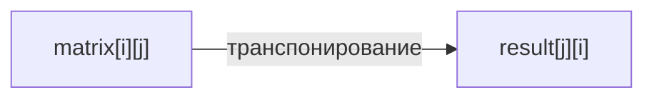
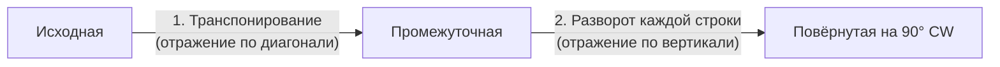

# Матрицы (Matrix / 2D Arrays)

## Алгоритмы и подходы в этой папке

| # | Название подхода | Суть | Задачи |
|---|---|---|---|
| 1 | **Транспонирование** (Transpose) | `result[j][i] = matrix[i][j]` — отражение по главной диагонали | 867 |
| 2 | **Транспонирование + разворот строк** (Transpose + Reverse) | Поворот матрицы на 90° на месте | 48 |
| 3 | **Обход по слоям / границам** (Layer-by-layer, Boundary traversal) | Четыре указателя: top, bottom, left, right | 54 |
| 4 | **Индексная арифметика диагоналей** | `mat[i][i]` и `mat[i][n-1-i]` | 1572 |
| 5 | **Хеширование блоков 3×3** (`i // 3 * 3 + j // 3`) | Одним проходом разложить клетки по блокам | 36 |
| 6 | **Один проход + три набора множеств** | Проверка строк, столбцов, блоков за `O(n²)` | 36 |

---

## 1. Базовая терминология и индексы

```
matrix[i][j]
        ↑  ↑
        │  └── j = столбец (column), горизонталь
        └───── i = строка (row), вертикаль
```

```
              j=0   j=1   j=2   j=3
        i=0 [  1  ,  2  ,  3  ,  4  ]
        i=1 [  5  ,  6  ,  7  ,  8  ]
        i=2 [  9  , 10  , 11  , 12  ]

m = len(matrix)       = 3   (строк)
n = len(matrix[0])    = 4   (столбцов)
```

**Важные формулы, которые нужно помнить наизусть:**

| Что нужно | Формула | Пример (n = 3) |
|---|---|---|
| Главная диагональ | `matrix[i][i]` | (0,0), (1,1), (2,2) |
| Побочная диагональ | `matrix[i][n-1-i]` | (0,2), (1,1), (2,0) |
| Транспонирование | `res[j][i] = matrix[i][j]` | — |
| Разворот строки | `row[::-1]` | — |
| Развёртка 2D → 1D | `idx = i * n + j` | (1,2) → 1·3+2 = 5 |
| Свёртка 1D → 2D | `i = idx // n`, `j = idx % n` | 5 → (1, 2) |
| Номер блока 3×3 | `(i // 3) * 3 + (j // 3)` | (4,7) → 1·3+2 = 5 |

---

## 2. Транспонирование

### 867. Transpose Matrix

Файл: `867-Transpose_Matrix.py`

Транспонирование — это отражение матрицы относительно главной диагонали:
строки становятся столбцами.

```
   было (2×3)              стало (3×2)
  [1, 2, 3]                [1, 4]
  [4, 5, 6]      →         [2, 5]
                           [3, 6]
```



**Ключевой момент — размеры меняются местами.** Матрица `m × n` превращается в
`n × m`, поэтому результат нельзя сделать на месте (кроме квадратных матриц):

```python
row_count = len(matrix)          # m
col_count = len(matrix[0])       # n
result = [[0] * row_count for _ in range(col_count)]   # n × m !

for i in range(row_count):
    for j in range(col_count):
        result[j][i] = matrix[i][j]
```

Разбор для `[[1,2,3],[4,5,6]]`:

| i | j | matrix[i][j] | Куда пишем | result |
|---|---|---|---|---|
| 0 | 0 | 1 | `result[0][0]` | `[[1,0],[0,0],[0,0]]` |
| 0 | 1 | 2 | `result[1][0]` | `[[1,0],[2,0],[0,0]]` |
| 0 | 2 | 3 | `result[2][0]` | `[[1,0],[2,0],[3,0]]` |
| 1 | 0 | 4 | `result[0][1]` | `[[1,4],[2,0],[3,0]]` |
| 1 | 1 | 5 | `result[1][1]` | `[[1,4],[2,5],[3,0]]` |
| 1 | 2 | 6 | `result[2][1]` | `[[1,4],[2,5],[3,6]]` ✅ |

> ⚠️ **Ловушка при создании матрицы:**
> ```python
> result = [[0] * n] * m      # ❌ ВСЕ строки — один и тот же объект!
> result = [[0] * n for _ in range(m)]   # ✅ правильно
> ```
> В первом варианте `result[0][0] = 5` изменит первый элемент **всех** строк.

**Питоническая альтернатива:**

```python
return [list(row) for row in zip(*matrix)]
```

`zip(*matrix)` распаковывает строки как отдельные аргументы и «сшивает» их
поэлементно — это в точности транспонирование.

---

## 3. Транспонирование + разворот = поворот на 90°

### 48. Rotate Image

Файл: `48-Rotate_Image.py`

Повернуть квадратную матрицу на 90° по часовой стрелке **на месте** (`O(1)` памяти).

**Идея в два шага:**

```
Шаг 0: исходная       Шаг 1: транспонировали   Шаг 2: развернули строки
 [1, 2, 3]              [1, 4, 7]                 [7, 4, 1]
 [4, 5, 6]      →       [2, 5, 8]        →        [8, 5, 2]
 [7, 8, 9]              [3, 6, 9]                 [9, 6, 3]
```



**Почему это работает?** Два отражения = поворот. Отражение по главной диагонали
плюс отражение по вертикальной оси дают ровно поворот на 90° по часовой стрелке.

**Шаг 1 — транспонирование на месте.** Критично: обходить только **половину**
матрицы, иначе каждый элемент поменяется дважды и вернётся на место.

```python
for i in range(n):
    for j in range(n):
        if j > i:                       # только выше главной диагонали
            matrix[i][j], matrix[j][i] = matrix[j][i], matrix[i][j]
```

Эквивалентная (и более идиоматичная) запись:

```python
for i in range(n):
    for j in range(i + 1, n):           # j стартует с i+1
        matrix[i][j], matrix[j][i] = matrix[j][i], matrix[i][j]
```

Какие ячейки затрагиваются при n = 3:

```
   j=0  j=1  j=2
i=0  ·    ✓    ✓        · — диагональ, не трогаем
i=1  ·    ·    ✓        ✓ — обмениваем с зеркальной
i=2  ·    ·    ·
```

**Шаг 2 — разворот каждой строки** двумя указателями:

```python
for i in range(n):
    left, right = 0, n - 1
    while left < right:
        matrix[i][left], matrix[i][right] = matrix[i][right], matrix[i][left]
        left += 1
        right -= 1
```

Или короче: `matrix[i].reverse()`.

**Как повернуть в другую сторону:**

| Направление | Рецепт |
|---|---|
| 90° по часовой (CW) | транспонировать → развернуть **строки** |
| 90° против часовой (CCW) | транспонировать → развернуть **столбцы** (`matrix.reverse()`) |
| 180° | развернуть строки **и** столбцы |

Сложность: `O(n²)` времени (каждый элемент трогаем константное число раз),
`O(1)` дополнительной памяти.

---

## 4. Обход по слоям (спираль)

### 54. Spiral Matrix

Файл: `54-Spiral_Matrix.py`

Обойти матрицу по спирали: вправо → вниз → влево → вверх, сужаясь.

```
[ 1,  2,  3,  4]        Порядок обхода:
[ 5,  6,  7,  8]    →   1 → 2 → 3 → 4
[ 9, 10, 11, 12]                    ↓
                        9 ← 10 ← 11 ← 8    (5..12)
                        ↑           
                        5 → 6 → 7
                        
Результат: [1,2,3,4,8,12,11,10,9,5,6,7]
```

**Идея — четыре границы**, которые сжимаются после каждого прохода:

```
        left            right
          ↓               ↓
  top →  [ ■  ■  ■  ■  ■ ]
         [ ■  ·  ·  ·  ■ ]
bottom → [ ■  ■  ■  ■  ■ ]
```

Цикл из четырёх шагов:

```python
top, bottom = 0, m          # bottom и right — ИСКЛЮЧИТЕЛЬНЫЕ границы
left, right = 0, n

while True:
    # 1. Вправо по верхней строке
    for i in range(left, right):
        result.append(matrix[top][i])
    top += 1
    if top >= bottom: break

    # 2. Вниз по правому столбцу
    for i in range(top, bottom):
        result.append(matrix[i][right - 1])
    right -= 1
    if left >= right: break

    # 3. Влево по нижней строке
    for i in range(right - 1, left - 1, -1):
        result.append(matrix[bottom - 1][i])
    bottom -= 1
    if top >= bottom: break

    # 4. Вверх по левому столбцу
    for i in range(bottom - 1, top - 1, -1):
        result.append(matrix[i][left])
    left += 1
    if left >= right: break
```

**Самая частая ошибка — забыть проверки между шагами.** Для матрицы 1×n или n×1
после первого прохода границы схлопываются, и без `break` мы прочитаем элементы
повторно.

```
matrix = [[1, 2, 3]]     (одна строка)

шаг 1 «вправо»: берём 1, 2, 3 → top = 1
проверка: top(1) >= bottom(1) → BREAK ✅

Без проверки шаг 2 «вниз» ничего не добавит,
а шаг 3 «влево» прочитает 3, 2, 1 ПОВТОРНО ❌
```

Разбор `3×3` матрицы `[[1,2,3],[4,5,6],[7,8,9]]`:

| Шаг | Направление | Диапазон | Добавили | Границы после (top,bottom,left,right) |
|---|---|---|---|---|
| старт | | | | (0, 3, 0, 3) |
| 1 | вправо | `matrix[0][0..2]` | 1, 2, 3 | top = 1 |
| 2 | вниз | `matrix[1..2][2]` | 6, 9 | right = 2 |
| 3 | влево | `matrix[2][1..0]` | 8, 7 | bottom = 2 |
| 4 | вверх | `matrix[1][0]` | 4 | left = 1 |
| 5 | вправо | `matrix[1][1..1]` | 5 | top = 2 |
| — | проверка | top(2) >= bottom(2) | **стоп** | |

Результат: `[1,2,3,6,9,8,7,4,5]` ✅

> 📎 В коде файла границы заданы как `bottom = msize`, `right = nsize`
> (исключительные), поэтому доступ идёт через `right - 1` и `bottom - 1`.
> Альтернативный стиль — включительные границы (`bottom = m - 1`, `right = n - 1`),
> тогда `-1` в индексах не нужно, но условия становятся `top <= bottom`.

**Альтернативный подход — «съедаем» первую строку и поворачиваем:**

```python
result = []
while matrix:
    result += matrix.pop(0)                       # забрали верхнюю строку
    matrix = [list(row) for row in zip(*matrix)][::-1]   # повернули CCW
return result
```

Красиво и коротко, но `O(m·n)` дополнительной памяти и медленнее.

Сложность основного решения: `O(m · n)` времени, `O(1)` памяти (не считая ответа).

---

## 5. Диагонали

### 1572. Matrix Diagonal Sum

Файл: `1572-Matrix_Diagonal_Sum.py`

Сумма обеих диагоналей квадратной матрицы. Общие элементы считаются один раз.

```
n = 3                      главная: (0,0),(1,1),(2,2)
[ 1,  2,  3]               побочная: (0,2),(1,1),(2,0)
[ 4,  5,  6]                          ^^^^^ пересекаются в центре!
[ 7,  8,  9]

главная  = 1 + 5 + 9 = 15
побочная = 3 + 5 + 7 = 15
пересечение = 5 (посчитано дважды)
итог = 15 + 15 - 5 = 25 ✅
```

```python
n = len(mat)
main = sum(mat[i][i] for i in range(n))
secondary = sum(mat[i][n - 1 - i] for i in range(n))

if n % 2 == 0:
    center = 0                    # чётный размер → диагонали не пересекаются
else:
    center = mat[n // 2][n // 2]

return main + secondary - center
```

**Почему нужна проверка на чётность?**

```
n = 3 (нечётное)              n = 4 (чётное)
[ X  ·  X ]                   [ X  ·  ·  X ]
[ ·  ⊗  · ]  ← пересечение    [ ·  X  X  · ]  ← НЕТ общей ячейки
[ X  ·  X ]                   [ ·  X  X  · ]
                              [ X  ·  ·  X ]
```

При чётном `n` диагонали проходят «между» ячейками и не пересекаются.
Проверка `[[1,1,1,1],[1,1,1,1],[1,1,1,1],[1,1,1,1]]`: `4 + 4 - 0 = 8` ✅

**Формула побочной диагонали.** Для строки `i` нужен столбец `n - 1 - i`:

| i | n-1-i (n=3) | Ячейка |
|---|---|---|
| 0 | 2 | `mat[0][2]` |
| 1 | 1 | `mat[1][1]` |
| 2 | 0 | `mat[2][0]` |

Признак: у элементов побочной диагонали **сумма индексов постоянна**: `i + j = n - 1`.
У главной — **разность равна нулю**: `i == j`. Это же правило используется для
проверки «ферзи бьют друг друга» в задачах N-Queens.

Сложность: `O(n)` времени (один проход по строкам), `O(1)` памяти.

---

## 6. Проверка блоков: хеширование 3×3

### 36. Valid Sudoku

Файл: `36-Valid_Sudoku.py`

Проверить, что в судоку 9×9 нет повторов цифр в строках, столбцах и блоках 3×3.
Заполнять доску не нужно, только проверить текущее состояние.

**Три условия:**

```
1. Каждая СТРОКА — без повторов
2. Каждый СТОЛБЕЦ — без повторов
3. Каждый БЛОК 3×3 — без повторов
```

**Главный трюк — формула номера блока:**

```
box_index = (i // 3) * 3 + (j // 3)
```

Она даёт следующую нумерацию:

```
       j:  0 1 2 | 3 4 5 | 6 7 8
    i: 0 [   0   |   1   |   2   ]
       1 [   0   |   1   |   2   ]
       2 [   0   |   1   |   2   ]
         ---------+-------+--------
       3 [   3   |   4   |   5   ]
       4 [   3   |   4   |   5   ]
       5 [   3   |   4   |   5   ]
         ---------+-------+--------
       6 [   6   |   7   |   8   ]
       7 [   6   |   7   |   8   ]
       8 [   6   |   7   |   8   ]
```

Проверка: клетка `(4, 7)` → `(4//3)*3 + (7//3)` = `1*3 + 2` = **5** ✅ — это средний
правый блок.

Как читать формулу:
* `i // 3` — «в каком ряду блоков мы находимся» (0, 1 или 2),
* `j // 3` — «в каком столбце блоков» (0, 1 или 2),
* `* 3 +` — переводим пару `(ряд, столбец)` в один номер 0..8, как в развёртке 2D→1D.

**Подход в файле:** один проход по доске, в котором одновременно
1. проверяются строки (`is_not_unique(board[i])`),
2. строится транспонированная доска (`transp_board[j][i] = value`) для последующей
   проверки столбцов,
3. клетки раскладываются по 9 спискам-блокам через формулу выше.

Проверка на дубликаты — сравнение длины строки с длиной множества её символов:

```python
clean = "".join(filter(str.isdigit, values))   # выбрасываем точки
return len(clean) != len(set(clean))           # True = есть дубли
```

**Каноническая альтернатива — три набора множеств и один проход:**

```python
rows = [set() for _ in range(9)]
cols = [set() for _ in range(9)]
boxes = [set() for _ in range(9)]

for i in range(9):
    for j in range(9):
        v = board[i][j]
        if v == '.':
            continue
        b = (i // 3) * 3 + (j // 3)
        if v in rows[i] or v in cols[j] or v in boxes[b]:
            return False
        rows[i].add(v)
        cols[j].add(v)
        boxes[b].add(v)
return True
```

| Подход | Проходов по доске | Доп. память | Ранний выход |
|---|---|---|---|
| Из файла (транспонирование + списки блоков) | ~3 | `O(n²)` (копия доски) | частичный |
| Три набора множеств | 1 | `O(n²)`, но без копии доски | да, при первом же дубле |

Сложность обоих: `O(81)` = `O(1)` для фиксированной доски 9×9,
в общем виде — `O(n²)`.

> 💡 Существует и «однострочный» приём: класть в **одно** множество кортежи-маркеры
> `(i, v)`, `(v, j)`, `(i//3, j//3, v)`. Если очередной маркер уже есть — доска
> невалидна.

---

## 7. Сводная таблица

| Задача | Подход | Время | Память |
|---|---|---|---|
| 867. Transpose Matrix | прямое транспонирование | `O(m·n)` | `O(m·n)` под ответ |
| 48. Rotate Image | транспонирование + разворот строк | `O(n²)` | `O(1)` |
| 54. Spiral Matrix | четыре границы | `O(m·n)` | `O(1)` |
| 1572. Diagonal Sum | индексная арифметика | `O(n)` | `O(1)` |
| 36. Valid Sudoku | множества + формула блока | `O(n²)` | `O(n²)` |

---

## 8. Частые ошибки

| Ошибка | Последствие | Как избежать |
|---|---|---|
| `[[0] * n] * m` | Все строки — один объект, изменения дублируются | `[[0] * n for _ in range(m)]` |
| Полный двойной цикл при транспонировании на месте | Каждый элемент меняется дважды → матрица не меняется | `for j in range(i + 1, n)` |
| Путают `m` и `n` | `IndexError` на неквадратных матрицах | `m = len(matrix)`, `n = len(matrix[0])` |
| Нет проверок между шагами спирали | Дубли элементов на матрицах 1×n и n×1 | `break` после каждого сужения границы |
| В диагоналях не вычли центр | Центральный элемент посчитан дважды | Вычитать при нечётном `n` |
| Смешали включительные и исключительные границы | Смещение на 1, пропуск элементов | Выбрать один стиль и держаться его |
| Забыли проверить пустую матрицу | `IndexError` на `matrix[0]` | `if not matrix or not matrix[0]: return ...` |

---

## 9. Как распознать задачу «на матрицы»

- [ ] Вход — двумерный список.
- [ ] Просят повернуть, отразить, транспонировать.
- [ ] Просят обойти в необычном порядке (спираль, зигзаг, по диагоналям).
- [ ] Требуется модификация **на месте** (`in-place`, `O(1)` памяти).
- [ ] Есть блочная структура (судоку, тайлы).

**Что учить дальше:** 59 (Spiral Matrix II — заполнение спиралью), 73 (Set Matrix
Zeroes — обнуление с использованием первой строки/столбца как флагов), 240 (Search a
2D Matrix II — поиск «лесенкой» из правого верхнего угла), 289 (Game of Life —
кодирование двух состояний в одном числе), 498 (Diagonal Traverse).
