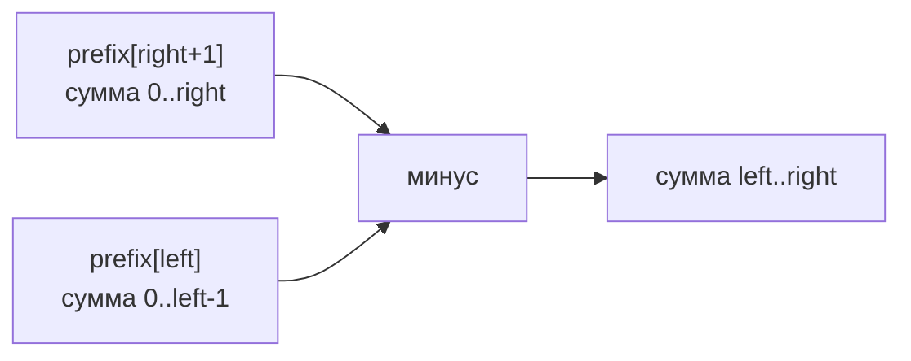

# Префиксные суммы (Prefix Sum)

## Алгоритмы и подходы в этой папке

| # | Название подхода | Суть | Задачи |
|---|---|---|---|
| 1 | **Одномерная префиксная сумма** (1D Prefix Sum) | `prefix[i]` = сумма первых `i` элементов | 303, 724, 1732 |
| 2 | **Массив со сдвигом на 1** (Sentinel / padded prefix) | `prefix[0] = 0`, чтобы убрать `if` для краёв | 303, 724, 1732 |
| 3 | **Двумерная префиксная сумма** + формула включений-исключений | Сумма прямоугольника за `O(1)` | 304 |
| 4 | **Бегущая сумма + хеш-таблица** (Running Sum + HashMap) | Считаем подмассивы с заданной суммой за один проход | 560 |
| 5 | **Running Sum на лету** | Префикс не хранится, только максимум/текущее значение | 1732 |

---

## 1. Главная идея простыми словами

Представьте, что вы поднимаетесь на лифте и хотите знать, на какой высоте
находитесь после каждого этажа. Вы не пересчитываете всё заново — просто
**добавляете** к предыдущей высоте.

Префиксная сумма — это «нарастающий итог»:

```
nums   =  [  2,   4,   6,   8,  10 ]
prefix =  [0, 2,   6,  12,  20,  30 ]
           ^   ^    ^    ^    ^    ^
           |   |    |    |    |    └─ сумма всех 5
           |   |    |    |    └────── сумма первых 4
           |   |    |    └─────────── сумма первых 3
           |   |    └──────────────── сумма первых 2
           |   └───────────────────── сумма первого 1
           └───────────────────────── сумма нуля элементов = 0
```

**Зачем?** Чтобы получить сумму любого куска массива за `O(1)`:

```
сумма nums[left..right] = prefix[right + 1] - prefix[left]
```

Пример: сумма `nums[1..3]` = `4 + 6 + 8 = 18`.
По формуле: `prefix[4] - prefix[1] = 20 - 2 = 18` ✅



Наглядно:

```
prefix[4] = ■■■■□        (сумма 0..3)
prefix[1] = ■□□□□        (сумма 0..0)
разность  = □■■■□        (сумма 1..3) ✅
```

---

## 2. Ключевой приём: массив длины n+1

Есть два способа построить префиксный массив.

**Способ А (плохой) — длина n:**

```python
prefix[0] = nums[0]
prefix[i] = prefix[i-1] + nums[i]
# сумма(left, right) = prefix[right] - prefix[left-1]
#                                                 ^^^ а если left == 0? IndexError!
```

Приходится каждый раз писать `if left == 0`.

**Способ Б (правильный) — длина n+1 со сдвигом:**

```python
prefix = [0] * (n + 1)
for i in range(n):
    prefix[i + 1] = prefix[i] + nums[i]
# сумма(left, right) = prefix[right + 1] - prefix[left]     ← никаких if
```

`prefix[0] = 0` — это «сумма пустого префикса». Она играет роль **часового
(sentinel)** и убирает все краевые случаи.

| | Способ А | Способ Б |
|---|---|---|
| Длина массива | `n` | `n + 1` |
| Формула | `prefix[r] - prefix[l-1]` | `prefix[r+1] - prefix[l]` |
| Проверка `l == 0` | нужна | **не нужна** |
| Смысл `prefix[i]` | сумма `0..i` включительно | сумма **первых i** элементов |

Во всех задачах этой папки используется способ Б.

---

## 3. Разбор задач

### 303. Range Sum Query — Immutable

Файл: `303-Range_Sum_Query-Immutable.py`

Классическая задача-определение. Массив не меняется, но запросов на сумму много.

```python
class NumArray:
    def __init__(self, nums):
        n = len(nums)
        self.perf = [0] * (n + 1)
        for i in range(n):
            self.perf[i + 1] = self.perf[i] + nums[i]

    def sumRange(self, left, right):
        return self.perf[right + 1] - self.perf[left]
```

Построение для `nums = [-2, 0, 3, -5, 2, -1]`:

| i | nums[i] | perf[i] | perf[i+1] = perf[i] + nums[i] |
|---|---|---|---|
| — | — | `perf[0] = 0` | — |
| 0 | -2 | 0 | `perf[1] = -2` |
| 1 | 0 | -2 | `perf[2] = -2` |
| 2 | 3 | -2 | `perf[3] = 1` |
| 3 | -5 | 1 | `perf[4] = -4` |
| 4 | 2 | -4 | `perf[5] = -2` |
| 5 | -1 | -2 | `perf[6] = -3` |

```
perf = [0, -2, -2, 1, -4, -2, -3]
```

Запросы:

| Запрос | Формула | Вычисление | Проверка вручную |
|---|---|---|---|
| `sumRange(0, 2)` | `perf[3] - perf[0]` | `1 - 0 = 1` | `-2 + 0 + 3 = 1` ✅ |
| `sumRange(2, 5)` | `perf[6] - perf[2]` | `-3 - (-2) = -1` | `3 - 5 + 2 - 1 = -1` ✅ |
| `sumRange(0, 5)` | `perf[6] - perf[0]` | `-3` | вся сумма ✅ |

**Зачем всё это, если можно `sum(nums[left:right+1])`?**

| Подход | Предподсчёт | Один запрос | 10⁵ запросов |
|---|---|---|---|
| `sum(nums[l:r+1])` | нет | `O(n)` | `O(n · q)` = 10¹⁰ ❌ |
| Префиксные суммы | `O(n)` | `O(1)` | `O(n + q)` = 2·10⁵ ✅ |

Именно поэтому в названии задачи стоит слово **Immutable**: массив не меняется,
значит префикс можно построить один раз. Если бы элементы менялись, понадобилось бы
дерево Фенвика или дерево отрезков.

---

### 1732. Find the Highest Altitude

Файл: `1732-Find_the_Highest_Altitude.py`

Дан массив **изменений** высоты. Найти максимальную высоту. Старт — 0.

```python
target = [0] * (len(gain) + 1)
for i in range(len(gain)):
    target[i + 1] = target[i] + gain[i]
return max(target)
```

Разбор `gain = [-5, 1, 5, 0, -7]`:

| Точка | 0 | 1 | 2 | 3 | 4 | 5 |
|---|---|---|---|---|---|---|
| Изменение | старт | -5 | +1 | +5 | 0 | -7 |
| **Высота** | **0** | **-5** | **-4** | **1** | **1** | **-6** |

```
  1 ┤              ●───●
  0 ┤●                       ← старт
 -4 ┤       ●
 -5 ┤  ●
 -6 ┤                   ●
    └──┴──┴──┴──┴──┴──
      0  1  2  3  4  5
```

Максимум = **1** ✅

**Оптимизация — не хранить массив:**

```python
def largestAltitude(gain):
    cur = best = 0
    for g in gain:
        cur += g
        best = max(best, cur)
    return best
```

Память падает с `O(n)` до `O(1)`. Важно, что `best` инициализируется нулём —
стартовая высота тоже участвует (для `gain = [-4,-3,-2,-1,4,3,2]` ответ 0, потому
что мы никогда не поднимались выше старта).

---

### 724. Find Pivot Index

Файл: `724-Find_Pivot Index.py`

Найти индекс, где сумма слева равна сумме справа (сам элемент не считается).

```
nums = [1, 7, 3, 6, 5, 6]
             ↑
   1+7+3 = 11   |   5+6 = 11    ← индекс 3, элемент 6 в расчёт не идёт
```

```python
total = prefix[n]            # общая сумма
for j in range(n):
    left_sum  = prefix[j]                        # сумма nums[0..j-1]
    right_sum = total - left_sum - nums[j]       # всё остальное без nums[j]
    if left_sum == right_sum:
        return j
return -1
```

Разбор `nums = [1, 7, 3, 6, 5, 6]`, `prefix = [0, 1, 8, 11, 17, 22, 28]`, `total = 28`:

| j | nums[j] | left = prefix[j] | right = 28 - left - nums[j] | Равны? |
|---|---|---|---|---|
| 0 | 1 | 0 | 28 - 0 - 1 = 27 | нет |
| 1 | 7 | 1 | 28 - 1 - 7 = 20 | нет |
| 2 | 3 | 8 | 28 - 8 - 3 = 17 | нет |
| 3 | 6 | 11 | 28 - 11 - 6 = **11** | **да → return 3** ✅ |

Проверка краевого случая `nums = [2, 1, -1]`:

| j | nums[j] | left | right | Равны? |
|---|---|---|---|---|
| 0 | 2 | 0 | 2 - 0 - 2 = 0 | **да → return 0** ✅ |

Слева от нулевого индекса ничего нет — сумма пустого множества равна 0. Именно этот
случай красиво обрабатывается благодаря `prefix[0] = 0`.

**Версия без массива (`O(1)` памяти):**

```python
def pivotIndex(nums):
    total = sum(nums)
    left = 0
    for i, x in enumerate(nums):
        if left == total - left - x:
            return i
        left += x
    return -1
```

---

### 560. Subarray Sum Equals K — самая важная задача темы

Файл: `560-Subarray_Sum_Equals_K.py`

Сколько **подмассивов** (непрерывных) имеют сумму ровно `k`?

**Наивно:** перебрать все пары `(l, r)` — `O(n²)`.

**Ключевая идея.** Сумма подмассива `nums[i..j]` равна `prefix[j+1] - prefix[i]`.
Мы хотим, чтобы она была равна `k`:

```
prefix[j+1] - prefix[i] = k
        ⇓
prefix[i] = prefix[j+1] - k
```

То есть, стоя в точке `j` с текущей суммой `curr_sum`, надо спросить:
**«сколько раз раньше встречалась префиксная сумма `curr_sum - k`?»**
Каждое такое вхождение даёт один подходящий подмассив.

Это тот же приём, что и в Two Sum, только вместо элементов — префиксные суммы.

```python
count = 0
curr_sum = 0
sum_dict = {0: 1}                 # ключевая строка! см. ниже
for num in nums:
    curr_sum += num
    need = curr_sum - k
    if need in sum_dict:
        count += sum_dict[need]   # прибавляем СКОЛЬКО раз, а не 1
    sum_dict[curr_sum] = sum_dict.get(curr_sum, 0) + 1
return count
```

**Почему `sum_dict = {0: 1}`?**
Это «пустой префикс». Он нужен, когда подходящий подмассив начинается с индекса 0.
Например, `nums = [3]`, `k = 3`: после первого шага `curr_sum = 3`, `need = 0`.
Без записи `{0: 1}` мы бы не нашли этот подмассив и вернули 0 вместо 1.

Разбор `nums = [1, 1, 1]`, `k = 2`:

| Шаг | num | curr_sum | need = curr_sum - k | Найдено в dict | count | dict после |
|---|---|---|---|---|---|---|
| старт | — | 0 | — | — | 0 | `{0: 1}` |
| 1 | 1 | 1 | -1 | нет | 0 | `{0:1, 1:1}` |
| 2 | 1 | 2 | 0 | **да, 1 раз** | 1 | `{0:1, 1:1, 2:1}` |
| 3 | 1 | 3 | 1 | **да, 1 раз** | 2 | `{0:1,1:1,2:1,3:1}` |

Ответ **2**: подмассивы `[1,1]` (индексы 0-1) и `[1,1]` (индексы 1-2) ✅

Разбор посложнее: `nums = [1, 2, 1, 2, 1]`, `k = 3`:

| Шаг | num | curr_sum | need | Сколько раз в dict | count | dict |
|---|---|---|---|---|---|---|
| старт | | 0 | | | 0 | `{0:1}` |
| 1 | 1 | 1 | -2 | 0 | 0 | `{0:1, 1:1}` |
| 2 | 2 | 3 | 0 | 1 | 1 | `{0:1,1:1,3:1}` |
| 3 | 1 | 4 | 1 | 1 | 2 | `{0:1,1:1,3:1,4:1}` |
| 4 | 2 | 6 | 3 | 1 | 3 | `+{6:1}` |
| 5 | 1 | 7 | 4 | 1 | 4 | `+{7:1}` |

Ответ **4**: `[1,2]`, `[2,1]`, `[1,2]`, `[2,1]` ✅

**Почему нужно хранить именно количество, а не факт?**
Одна и та же префиксная сумма может встретиться несколько раз (при нулях и
отрицательных числах). Например, `nums = [0, 0, 0]`, `k = 0`:

| Шаг | curr_sum | need = 0 | Раз в dict | count |
|---|---|---|---|---|
| старт | 0 | | | 0, dict `{0:1}` |
| 1 | 0 | 0 | 1 | 1, dict `{0:2}` |
| 2 | 0 | 0 | 2 | 3, dict `{0:3}` |
| 3 | 0 | 0 | 3 | 6, dict `{0:4}` |

Ответ 6 — все 6 непустых подмассивов имеют сумму 0 ✅

> ⚠️ **Почему нельзя решить эту задачу скользящим окном?** Массив может содержать
> отрицательные числа, а значит сумма окна не растёт монотонно при расширении.
> Скользящее окно работает только для неотрицательных значений.

| Подход | Время | Память |
|---|---|---|
| Перебор всех пар + пересчёт суммы | `O(n³)` | `O(1)` |
| Перебор пар с префиксом | `O(n²)` | `O(n)` |
| **Префикс + хеш-таблица** | **`O(n)`** | `O(n)` |

---

### 304. Range Sum Query 2D — двумерная префиксная сумма

Файл: `304-Range_Sum_Query_2D-Immutable.py`

Теперь `prefix[i][j]` = сумма всего прямоугольника от левого верхнего угла `(0,0)`
до `(i, j)` включительно.

**Формула построения:**

```
prefix[i][j] = mat[i][j] + prefix[i-1][j] + prefix[i][j-1] - prefix[i-1][j-1]
                            └─ сверху ─┘    └─ слева ─┘     └─ вычитаем ─┘
                                                              дважды
                                                              посчитанное
```

```
   верх          лево         пересечение
  ┌────┐        ┌──┐            ┌──┐
  │▒▒▒▒│        │▒▒│░           │▒▒│
  │▒▒▒▒│        │▒▒│░           └──┘  ← эту область мы прибавили ДВАЖДЫ,
  └────┘        │▒▒│░                    поэтому один раз вычитаем
   ░░░░░        └──┘░
```

Разбор для матрицы:

```
mat =  [ [1, 2, 3],
         [4, 5, 6],
         [7, 8, 9] ]
```

**Шаг 1. Первая строка — просто нарастающий итог по горизонтали.**

```
perf[0][0] = 1
perf[0][1] = 1 + 2 = 3
perf[0][2] = 3 + 3 = 6
```

**Шаг 2. Первый столбец — нарастающий итог по вертикали.**

```
perf[1][0] = 1 + 4 = 5
perf[2][0] = 5 + 7 = 12
```

**Шаг 3. Остальные — по общей формуле.**

```
perf[1][1] = mat[1][1] + perf[0][1] + perf[1][0] - perf[0][0]
           = 5 + 3 + 5 - 1 = 12
perf[1][2] = 6 + 6 + 12 - 3 = 21
perf[2][1] = 8 + 12 + 12 - 5 = 27
perf[2][2] = 9 + 21 + 27 - 12 = 45     ← сумма всей матрицы = 1+2+..+9 = 45 ✅
```

Итог:

```
perf = [ [ 1,  3,  6],
         [ 5, 12, 21],
         [12, 27, 45] ]
```

**Формула запроса — включение-исключение:**

```
sum(row1,col1 .. row2,col2) =
      perf[row2][col2]                     ← весь прямоугольник от (0,0)
    - perf[row1-1][col2]                   ← минус полоса сверху
    - perf[row2][col1-1]                   ← минус полоса слева
    + perf[row1-1][col1-1]                 ← вернуть дважды вычтенный угол
```

```
Что мы вычитаем и возвращаем:

  ┌───────────────┐
  │ D │     C     │   D = perf[row1-1][col1-1]  ← вычли дважды, возвращаем
  ├───┼───────────┤   C = верхняя полоса
  │   │▓▓▓▓▓▓▓▓▓▓▓│   B = левая полоса
  │ B │▓ ИСКОМОЕ ▓│   ▓ = нужный прямоугольник
  │   │▓▓▓▓▓▓▓▓▓▓▓│
  └───┴───────────┘
```

Пример: сумма подматрицы `(1,1)..(2,2)`, то есть `[[5,6],[8,9]] = 28`.

```
perf[2][2] - perf[0][2] - perf[2][0] + perf[0][0]
   45      -     6      -    12      +     1      = 28 ✅
```

Код с защитой границ:

```python
up   = self.perf[row1 - 1][col2]        if row1 > 0 else 0
left = self.perf[row2][col1 - 1]        if col1 > 0 else 0
diag = self.perf[row1 - 1][col1 - 1]    if row1 > 0 and col1 > 0 else 0
return self.perf[row2][col2] - up - left + diag
```

> 💡 Как и в 1D, эти `if` можно убрать, сделав префиксную матрицу размера
> `(m+1) × (n+1)` с нулевой строкой и нулевым столбцом. Тогда формула становится:
> `perf[r2+1][c2+1] - perf[r1][c2+1] - perf[r2+1][c1] + perf[r1][c1]` — без ветвлений.

| Операция | Время | Память |
|---|---|---|
| Построение | `O(m · n)` | `O(m · n)` |
| Один запрос | **`O(1)`** | — |
| Наивный запрос без префикса | `O(m · n)` | `O(1)` |

---

## 4. Сводная таблица

| Задача | Подход | Предподсчёт | Запрос/проход | Память |
|---|---|---|---|---|
| 303. Range Sum Query | 1D prefix | `O(n)` | `O(1)` | `O(n)` |
| 724. Pivot Index | 1D prefix / running sum | `O(n)` | `O(n)` | `O(n)` / `O(1)` |
| 1732. Highest Altitude | running sum | — | `O(n)` | `O(n)` / `O(1)` |
| 560. Subarray Sum = K | prefix + hashmap | — | `O(n)` | `O(n)` |
| 304. Range Sum 2D | 2D prefix | `O(m·n)` | `O(1)` | `O(m·n)` |

---

## 5. Частые ошибки

| Ошибка | Последствие | Как избежать |
|---|---|---|
| Массив длины `n` вместо `n+1` | `IndexError` при `left = 0` | Делать `prefix = [0] * (n + 1)` |
| Забыли `{0: 1}` в задаче 560 | Теряются подмассивы, начинающиеся с индекса 0 | Инициализировать словарь нулевым префиксом |
| В 560 пишут `count += 1` вместо `count += dict[need]` | Недосчёт при повторяющихся префиксах | Хранить и прибавлять количество |
| В 560 обновляют словарь **до** проверки | При `k = 0` найдётся «пустой» подмассив | Сначала проверка, потом запись |
| В 2D забыли `+ perf[r1-1][c1-1]` | Угол вычтен дважды, сумма занижена | Помнить формулу включений-исключений |
| Применяют скользящее окно к 560 | Неверный ответ на отрицательных числах | Окно — только для неотрицательных |

---

## 6. Как распознать задачу «на префиксные суммы»

- [ ] Много запросов «сумма на отрезке» к **неизменяемому** массиву.
- [ ] Нужно найти подмассив с заданной суммой / количество таких подмассивов.
- [ ] Нужен «нарастающий итог», «баланс», «текущая высота/позиция».
- [ ] Задача сводится к разности двух сумм от начала.
- [ ] В условии слова: «subarray sum», «range sum», «running sum», «pivot»,
      «equilibrium index».

**Полезные соседние задачи для тренировки:** 1480 (Running Sum), 523 (Continuous
Subarray Sum, префикс по модулю), 974 (Subarray Sums Divisible by K), 1314 (Matrix
Block Sum), 238 (Product of Array Except Self — та же идея, но с произведениями).
