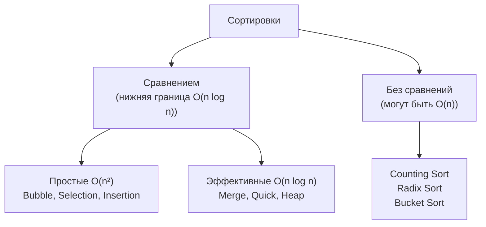
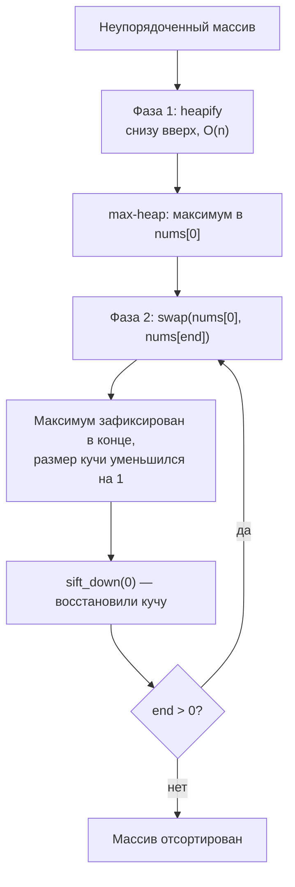
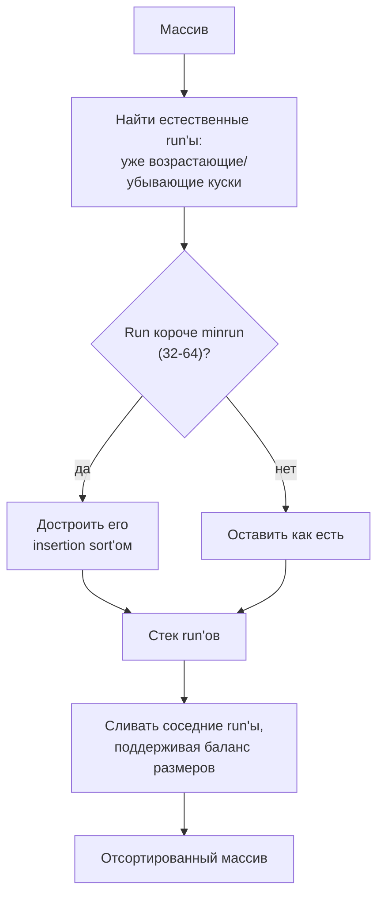
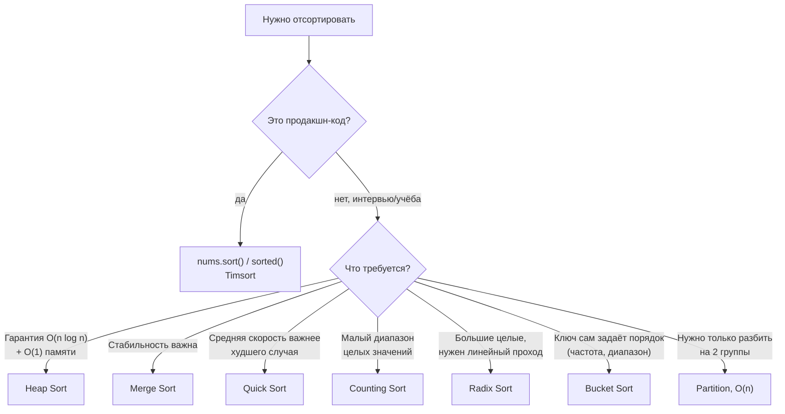

# Сортировки (Sorting)

## Алгоритмы и подходы в этой папке

| # | Название алгоритма | Класс | Сложность | Задачи |
|---|---|---|---|---|
| 1 | **Пузырьковая сортировка** (Bubble Sort) | обменная | `O(n²)` | 912 |
| 2 | **Пирамидальная сортировка** (Heap Sort) | на куче | `O(n log n)` | 912 |
| 3 | **Просеивание вниз** (Sift-down / Heapify) | вспомогательная процедура | `O(log n)` | 912 |
| 4 | **Сортировка вставками** (Insertion Sort) | вставками | `O(n²)` | 147 |
| 5 | **Разделение двумя указателями** (Partition / Dutch Flag) | разбиение по признаку | `O(n)` | 905, 75 |
| 6 | **Сортировка подсчётом** (Counting Sort) | не сравнением | `O(n + k)` | 75 |
| 7 | **Поразрядная сортировка** (Radix Sort, LSD) | не сравнением | `O(d·(n + k))` | 164 |
| 8 | **Блочная сортировка** (Bucket Sort) | не сравнением | `O(n)` | 347, 451 |
| 9 | **Timsort** (встроенный `sorted()`) | гибрид merge + insertion | `O(n log n)` | 451 |

---

## 1. Классификация сортировок



| Алгоритм | Лучший | Средний | Худший | Память | Стабильная? |
|---|---|---|---|---|---|
| Bubble Sort | `O(n)`* | `O(n²)` | `O(n²)` | `O(1)` | да |
| Selection Sort | `O(n²)` | `O(n²)` | `O(n²)` | `O(1)` | нет |
| Insertion Sort | `O(n)` | `O(n²)` | `O(n²)` | `O(1)` | да |
| **Merge Sort** | `O(n log n)` | `O(n log n)` | `O(n log n)` | `O(n)` | да |
| **Quick Sort** | `O(n log n)` | `O(n log n)` | `O(n²)` | `O(log n)` | нет |
| **Heap Sort** | `O(n log n)` | `O(n log n)` | `O(n log n)` | `O(1)` | нет |
| Counting Sort | `O(n + k)` | `O(n + k)` | `O(n + k)` | `O(k)` | да |
| Radix Sort (LSD) | `O(d·(n+k))` | `O(d·(n+k))` | `O(d·(n+k))` | `O(n + k)` | да |
| Bucket Sort | `O(n + k)` | `O(n + k)` | `O(n²)`** | `O(n + k)` | зависит от сортировки внутри корзины |
| **Timsort** (Python `sort()`) | `O(n)` | `O(n log n)` | `O(n log n)` | `O(n)` | да |

\* при наличии флага раннего выхода на уже отсортированном массиве.

\*\* если все элементы попали в одну корзину. В задачах 347 и 451 корзина индексируется частотой и внутри не сортируется, поэтому там честный `O(n)`.

**Стабильность** — сохраняется ли исходный порядок равных элементов. Важно, когда
сортируем по нескольким полям подряд.

---

## 2. Пузырьковая сортировка

### 912. Sort an Array — вариант `bubble_sort`

Файл: `e912_Bubble_Sort_an_Array.py`

**Идея:** проходим по массиву, сравниваем соседей и меняем их местами, если они
стоят не по порядку. За один проход самый большой элемент «всплывает» в конец —
отсюда и название.

```python
def bubble_sort(nums):
    n = len(nums)
    for i in range(n - 1):
        swapped = False
        for j in range(0, n - i - 1):      # хвост уже отсортирован
            if nums[j] > nums[j + 1]:
                nums[j], nums[j + 1] = nums[j + 1], nums[j]
                swapped = True
        if not swapped:                     # за проход ничего не поменяли
            break                           # → массив уже отсортирован
    return nums
```

Разбор `[5, 2, 3, 1]`:

**Проход i = 0** (диапазон j: 0..2)

| j | Сравниваем | Меняем? | Состояние |
|---|---|---|---|
| 0 | 5 > 2 | да | `[2, 5, 3, 1]` |
| 1 | 5 > 3 | да | `[2, 3, 5, 1]` |
| 2 | 5 > 1 | да | `[2, 3, 1, 5]` ← 5 всплыл |

**Проход i = 1** (диапазон j: 0..1)

| j | Сравниваем | Меняем? | Состояние |
|---|---|---|---|
| 0 | 2 > 3 | нет | `[2, 3, 1, 5]` |
| 1 | 3 > 1 | да | `[2, 1, 3, 5]` ← 3 на месте |

**Проход i = 2** (диапазон j: 0..0)

| j | Сравниваем | Меняем? | Состояние |
|---|---|---|---|
| 0 | 2 > 1 | да | `[1, 2, 3, 5]` ✅ |

**Две ключевые оптимизации в коде:**

1. **`n - i - 1`** — после `i`-го прохода последние `i` элементов уже на своих
   местах, их не нужно проверять.

   ```
   после прохода 0:  [ . . . | 5 ]        ← 1 элемент зафиксирован
   после прохода 1:  [ . . | 3   5 ]      ← 2 элемента
   после прохода 2:  [ . | 2   3   5 ]    ← 3 элемента
   ```

2. **Флаг `swapped`** — если за целый проход не было ни одного обмена, массив уже
   отсортирован. Это превращает лучший случай из `O(n²)` в `O(n)`.

> ⚠️ **На LeetCode 912 пузырёк не пройдёт по времени** — там `n` до 5·10⁴, что даёт
> 2.5 миллиарда операций. Задача требует `O(n log n)`. Поэтому в файле реализован
> и heap sort, который и вызывается в `sortArray`.

---

## 3. Пирамидальная сортировка (Heap Sort)

### Что такое куча

Куча (heap) — это двоичное дерево, упакованное в обычный массив. Для max-heap
выполняется свойство: **каждый родитель ≥ своих детей**.

```
Массив:  [9, 7, 8, 3, 5, 2, 4]
Индексы:  0  1  2  3  4  5  6

Дерево:
                9  (idx 0)
              /   \
          7(1)     8(2)
          /  \     /  \
       3(3) 5(4) 2(5) 4(6)
```

**Формулы навигации по массиву:**

| Что нужно | Формула |
|---|---|
| Левый ребёнок узла `i` | `2*i + 1` |
| Правый ребёнок узла `i` | `2*i + 2` |
| Родитель узла `i` | `(i - 1) // 2` |
| Последний узел с детьми | `n // 2 - 1` |

Проверка: у узла 1 (значение 7) дети — `2*1+1 = 3` (значение 3) и `2*1+2 = 4`
(значение 5). ✅ Оба меньше 7 — свойство кучи выполнено.

### Процедура sift-down (просеивание вниз)

Основной кирпичик. Берём узел, который может нарушать свойство кучи, и «топим» его
вниз, меняя местами с бо́льшим из детей, пока он не окажется на своём месте.

```python
def sift_down_cycle(i, size, arr):
    while i * 2 + 1 < size:           # пока есть хотя бы левый ребёнок
        left = 2 * i + 1
        right = 2 * i + 2
        j = left
        if right < size and arr[right] > arr[left]:
            j = right                 # выбираем БОЛЬШЕГО ребёнка
        if arr[i] >= arr[j]:
            break                     # родитель уже больше — всё в порядке
        arr[i], arr[j] = arr[j], arr[i]
        i = j                         # спускаемся на уровень ниже
```

Пример просеивания элемента 1 в массиве `[1, 7, 8, 3, 5]`:

```
Шаг 0:        1              i=0, дети: 7(idx1) и 8(idx2)
            /   \            больший = 8 → меняем
          7       8
         / \
        3   5

Шаг 1:        8              i=2, детей нет (2*2+1=5 >= size)
            /   \            → стоп
          7       1
         / \
        3   5

Итог: [8, 7, 1, 3, 5]
```

**Почему `>` а не `>=` при выборе ребёнка?** При равенстве неважно, какого брать —
свойство кучи не нарушится. Но `>` даёт меньше лишних обменов.

**Две реализации в файле:**

| Реализация | Плюсы | Минусы |
|---|---|---|
| `sift_down_cycle` (итеративная) | нет расхода стека, работает на любых `n` | чуть длиннее |
| `sift_down_rec` (рекурсивная) | короче и нагляднее | глубина стека `O(log n)`, накладные расходы на вызовы |

Обе делают одно и то же. В `sortArray` используется итеративная — она надёжнее.

### Сам алгоритм: две фазы

```python
def heap_sort(nums):
    n = len(nums)

    # ФАЗА 1: построить max-heap из неупорядоченного массива
    for i in range(n // 2 - 1, -1, -1):
        sift_down_cycle(i, n, nums)

    # ФАЗА 2: извлекать максимум
    for end in range(n - 1, 0, -1):
        nums[0], nums[end] = nums[end], nums[0]   # максимум → в конец
        sift_down_cycle(0, end, nums)             # чиним кучу (без хвоста)

    return nums
```



**Почему фаза 1 идёт с `n // 2 - 1` и назад?**
Листья (вторая половина массива) уже сами по себе являются корректными кучами
размера 1 — их просеивать не нужно. Начинаем с последнего узла, у которого есть
дети, и идём вверх: к моменту обработки узла оба его поддерева уже кучи.

Полный разбор `[5, 2, 3, 1]`, `n = 4`:

**Фаза 1.** Начинаем с `i = 4//2 - 1 = 1`.

```
i = 1: узел 2, дети: idx3 = 1. 2 >= 1 → ничего не делаем.
       [5, 2, 3, 1]

i = 0: узел 5, дети: 2(idx1) и 3(idx2). Больший = 3. 5 >= 3 → стоп.
       [5, 2, 3, 1]   ← это уже корректная max-heap
```

```
      5
     / \
    2   3
   /
  1
```

**Фаза 2.**

| end | Действие | Массив после swap | После sift_down | Отсортированный хвост |
|---|---|---|---|---|
| 3 | `swap(nums[0], nums[3])` | `[1, 2, 3, 5]` | `[3, 2, 1, 5]` | `5` |
| 2 | `swap(nums[0], nums[2])` | `[1, 2, 3, 5]` | `[2, 1, 3, 5]` | `3, 5` |
| 1 | `swap(nums[0], nums[1])` | `[1, 2, 3, 5]` | `[1, 2, 3, 5]` | `2, 3, 5` |

Результат: `[1, 2, 3, 5]` ✅

**Разбор sift_down на шаге `end = 3`:** после swap массив `[1, 2, 3, 5]`, куча —
только первые 3 элемента. Просеиваем 1: дети — `2(idx1)` и `3(idx2)`, больший = 3,
`1 < 3` → меняем → `[3, 2, 1, 5]`. У idx2 детей в пределах size=3 нет → стоп.

### Оценка сложности

| Фаза | Сложность | Почему |
|---|---|---|
| Построение кучи | `O(n)` | Большинство узлов — листья, просеивать их дёшево (доказывается суммой ряда) |
| Извлечение | `O(n log n)` | `n` извлечений × `O(log n)` на просеивание |
| **Итого** | **`O(n log n)`** | и в лучшем, и в худшем случае |

Память — `O(1)`: сортировка идёт на месте, никаких дополнительных массивов.

**Heap sort vs Quick sort:**

| | Heap Sort | Quick Sort |
|---|---|---|
| Худший случай | `O(n log n)` гарантированно | `O(n²)` (плохой опорный элемент) |
| На практике | медленнее (плохая локальность кэша) | обычно быстрее |
| Память | `O(1)` | `O(log n)` на стек рекурсии |
| Стабильность | нет | нет |

Heap sort выбирают, когда нужна **гарантия** `O(n log n)` и `O(1)` памяти.

> 💡 В реальном коде на Python используйте `nums.sort()` (Timsort — гибрид merge и
> insertion sort, `O(n log n)`, стабильный, отлично работает на частично
> отсортированных данных). Ручные реализации нужны для понимания и для интервью.

---

## 4. Сортировка вставками (Insertion Sort)

### 147. Insertion Sort List

Файл: `e147_Insertion_Sort_list.py`

**Идея:** держим слева готовый отсортированный участок и по одному берём элементы
из «хвоста», вставляя каждый на своё место внутри готовой части. Так мы собираем
руками карты в покере.

```
[ отсортировано | ? ? ? ? ]
                  ↑
              берём этот элемент и «протаскиваем» влево до нужного места
```

На массиве это выглядит так:

```python
def insertion_sort(nums):
    for i in range(1, len(nums)):
        key = nums[i]
        j = i - 1
        while j >= 0 and nums[j] > key:   # сдвигаем всё большее вправо
            nums[j + 1] = nums[j]
            j -= 1
        nums[j + 1] = key                 # ставим key в освободившуюся дырку
    return nums
```

### Версия для связного списка

В списке нет индексов и нельзя «сдвинуть хвост» — зато можно **перецепить
указатели**, и это дешевле, чем сдвигать элементы массива.

```python
def insertionSortList(self, head):
    if not head or not head.next:
        return head

    dummy = ListNode(0)                   # фиктивная голова нового списка
    current = head
    while current:
        next_node = current.next          # 1. запомнили, куда возвращаться

        prev = dummy                      # 2. ищем место вставки с начала
        while prev.next and prev.next.val < current.val:
            prev = prev.next

        current.next = prev.next          # 3. вставляем между prev и prev.next
        prev.next = current

        current = next_node               # 4. идём дальше по исходному списку
    return dummy.next
```

**Зачем `dummy`?** Вставка перед первым элементом — особый случай: нужно менять
саму голову списка. Фиктивный узел убирает этот случай — вставка «в начало»
становится обычной вставкой после `dummy`. В конце возвращаем `dummy.next`.

**Почему обязательно запоминать `next_node`?** Строка `current.next = prev.next`
затирает исходную связь. Если не сохранить `current.next` заранее, мы потеряем
непройденную часть списка (и, скорее всего, зациклимся).

Разбор `[4, 2, 1, 3]`:

| Шаг | current | Куда вставили | Новый список (после `dummy`) |
|---|---|---|---|
| 1 | 4 | `prev = dummy` (список пуст) | `4` |
| 2 | 2 | `prev = dummy` (2 < 4) | `2 → 4` |
| 3 | 1 | `prev = dummy` (1 < 2) | `1 → 2 → 4` |
| 4 | 3 | `prev = 2` (2 < 3, но 4 ≥ 3) | `1 → 2 → 3 → 4` ✅ |

**`<` или `<=` в условии поиска?** С `<` цикл останавливается перед первым равным
элементом, и `current` встаёт **перед** ним — порядок равных инвертируется, то есть
сортировка нестабильна. С `<=` мы проходим все равные и вставляем **после** них —
это стабильный вариант. На LeetCode 147 разницы не видно (сортируем просто числа),
но при сортировке объектов по ключу это принципиально.

### Сложность

| | Время | Почему |
|---|---|---|
| Лучший случай (уже отсортирован) | `O(n)` | внутренний `while` не делает ни шага |
| Средний / худший | `O(n²)` | в среднем проходим половину готовой части |
| Память | `O(1)` | вставка на месте / перецепка указателей |

**Где insertion sort реально применяют:** на коротких массивах (до ~32-64
элементов) он быстрее, чем merge/quick, потому что нет накладных расходов на
рекурсию. Именно поэтому он встроен в **Timsort** (см. §9) и в `std::sort` — на
маленьких кусках рекурсия останавливается и добивает insertion sort.

> 📎 Связанная задача: 148 (Sort List) — тот же связный список, но требуется
> `O(n log n)`, то есть merge sort.

---

## 5. Разделение двумя указателями (Partition)

### 905. Sort Array By Parity

Файл: `e905_Sort_Array_By_Parity.py`

Переставить массив так, чтобы все чётные шли перед всеми нечётными. Порядок внутри
групп не важен.

**Это не сортировка в полном смысле** — это **разбиение (partition)** по признаку,
как в quick sort. Достаточно `O(n)`.

```python
left, right = 0, len(nums) - 1
while left < right:
    if nums[left] % 2 == 0:
        left += 1                 # слева чётное — на своём месте
    elif nums[right] % 2 != 0:
        right -= 1                # справа нечётное — на своём месте
    else:
        # слева нечётное И справа чётное → меняем местами
        nums[left], nums[right] = nums[right], nums[left]
        left += 1
        right -= 1
return nums
```

Логика в трёх правилах:

```
[ чётные ... ? ? ? ... нечётные ]
   ↑                        ↑
  left                    right

1. nums[left] чётное  → left++   (уже на месте)
2. nums[right] нечёт. → right--  (уже на месте)
3. иначе (слева нечёт., справа чёт.) → обмен
```

Разбор `[3, 1, 2, 4]`:

| Шаг | left | right | nums | nums[left] | nums[right] | Правило | Действие |
|---|---|---|---|---|---|---|---|
| 1 | 0 | 3 | `[3,1,2,4]` | 3 (нечёт) | 4 (чёт) | 3 | обмен → `[4,1,2,3]`, left=1, right=2 |
| 2 | 1 | 2 | `[4,1,2,3]` | 1 (нечёт) | 2 (чёт) | 3 | обмен → `[4,2,1,3]`, left=2, right=1 |
| — | 2 | 1 | | | | `left >= right` | стоп |

Результат: `[4, 2, 1, 3]` — чётные впереди ✅

> 📌 **Тест на такую задачу нельзя писать по эталонному массиву.** LeetCode
> принимает любой порядок внутри групп, поэтому `assert result == [2,4,3,1]`
> сломается на корректном решении (наше даёт `[4,2,1,3]`). Проверять надо
> **свойство**, а не конкретный массив — так и сделано в `test_e905_param.py`:
>
> ```python
> result = sol_inst.sortArrayByParity(list(nums))
> evens = [x for x in result if x % 2 == 0]
> odds = [x for x in result if x % 2 != 0]
> assert result == evens + odds          # все чётные впереди всех нечётных
> assert sorted(result) == sorted(nums)  # состав массива не изменился
> ```

**Альтернативные подходы:**

| Подход | Код | Время | Память |
|---|---|---|---|
| Два указателя (в файле) | см. выше | `O(n)` | `O(1)` |
| Новый массив за два прохода | `[x for x in nums if x%2==0] + [x for x in nums if x%2]` | `O(n)` | `O(n)` |
| Сортировка по ключу | `nums.sort(key=lambda x: x % 2)` | `O(n log n)` | `O(n)` |
| Fast/slow указатели | см. ниже | `O(n)` | `O(1)` |

Вариант fast/slow (сохраняет относительный порядок чётных):

```python
write = 0
for read in range(len(nums)):
    if nums[read] % 2 == 0:
        nums[write], nums[read] = nums[read], nums[write]
        write += 1
```

> 📎 Тот же приём разделения используется в задачах 75 (Sort Colors — «голландский
> флаг», три указателя), 283 (Move Zeroes, см. `../TwoPointers`) и в фазе partition
> алгоритма quick sort.

---

## 6. Сортировка подсчётом (Counting Sort)

### 75. Sort Colors

Файл: `e75_Sort_Colors.py`

**Идея:** если значения — небольшие целые числа из диапазона `[min, max]`, можно не
сравнивать элементы, а просто посчитать, сколько раз встретилось каждое, и заново
разложить массив по этим счётчикам.

```python
def sortColors(self, nums):
    if not nums:
        return nums

    min_val, max_val = min(nums), max(nums)
    range_of_elements = max_val - min_val + 1
    count_arr = [0] * range_of_elements

    # 1. считаем вхождения; сдвиг на min_val позволяет работать с отрицательными
    for num in nums:
        count_arr[num - min_val] += 1

    # 2. разворачиваем счётчики обратно в массив (на месте)
    idx = 0
    for i in range(range_of_elements):
        while count_arr[i] > 0:
            nums[idx] = i + min_val
            idx += 1
            count_arr[i] -= 1
    return nums
```

Разбор `[2, 0, 2, 1, 1, 0]`:

```
min = 0, max = 2  →  count_arr на 3 ячейки

подсчёт:   count_arr = [2, 2, 2]
                        0  1  2   ← значение = индекс + min_val

разворот:  два нуля, две единицы, две двойки
результат: [0, 0, 1, 1, 2, 2] ✅
```

**Зачем `- min_val`?** Индекс массива не может быть отрицательным. Сдвиг переносит
диапазон `[min, max]` в `[0, max - min]`. Для задачи 75 значения и так `0..2`, но с
таким сдвигом функция становится универсальной.

### Два прочтения задачи 75

Условие просит one-pass с `O(1)` памяти (follow up) — это **алгоритм голландского
флага**, три указателя (см. §5):

```python
low, i, high = 0, 0, len(nums) - 1
while i <= high:
    if nums[i] == 0:
        nums[low], nums[i] = nums[i], nums[low]
        low += 1; i += 1
    elif nums[i] == 2:
        nums[high], nums[i] = nums[i], nums[high]
        high -= 1              # i НЕ увеличиваем: пришедший элемент не проверен
    else:
        i += 1
```

| | Counting sort (в файле) | Голландский флаг |
|---|---|---|
| Проходов по массиву | 2 | 1 |
| Память | `O(k)`, здесь `k = 3` | `O(1)` |
| Обобщается на любые целые | да | нет, только на 3 группы |
| Стабильность | да (в варианте с префиксными суммами) | нет |

Оба решения проходят LeetCode. Counting sort честно решает задачу и заодно
показывает приём, который дальше переиспользуется в поразрядной сортировке (§7).

### Классическая (стабильная) версия

Вариант выше **перезаписывает** значения — для чисел это нормально, но если
сортируются объекты по ключу, нужна версия с префиксными суммами, которая
переставляет сами элементы и сохраняет порядок равных:

```python
def counting_sort_stable(items, key):
    lo = min(key(x) for x in items)
    hi = max(key(x) for x in items)
    count = [0] * (hi - lo + 1)
    for x in items:
        count[key(x) - lo] += 1
    for i in range(1, len(count)):        # префиксные суммы → границы блоков
        count[i] += count[i - 1]
    out = [None] * len(items)
    for x in reversed(items):             # с конца — ради стабильности
        count[key(x) - lo] -= 1
        out[count[key(x) - lo]] = x
    return out
```

Ровно эта процедура и является одним проходом radix sort (§7).

| Когда работает отлично | Когда категорически нельзя |
|---|---|
| Диапазон значений мал (оценки 1-5, возраст, буквы) | Большой разброс: `[1, 10⁹]` → массив на миллиард ячеек |
| Целые числа | Вещественные числа, произвольные объекты без числового ключа |
| `k = hi - lo` сравнимо с `n` | `k ≫ n` — память улетает |

Сложность: `O(n + k)` времени и `O(k)` памяти. При маленьком `k` это быстрее любой
сортировки сравнением — нижняя граница `Ω(n log n)` на неё не распространяется,
потому что мы не сравниваем элементы между собой.

---

## 7. Поразрядная сортировка (Radix Sort)

### 164. Maximum Gap

Файл: `e164_Maximum_Gap_Radix_Sort.py`

**Задача:** найти максимальную разницу между соседними элементами в отсортированном
виде — но за **линейное время**. Обычный `sort()` дал бы `O(n log n)`, поэтому
сортируем без сравнений.

**Идея radix sort (LSD, least significant digit):** сортируем числа не целиком, а
по одному разряду за раз — сначала по единицам, потом по десяткам, потом по сотням.
Каждый проход — **стабильная** сортировка подсчётом по одной цифре (10 корзин).
Стабильность и делает всю магию: порядок, установленный младшими разрядами,
сохраняется, когда мы сортируем по старшим.

```python
def maximumGap(self, nums):
    if len(nums) < 2:
        return 0

    max_num = max(nums)
    exp = 1
    while max_num // exp > 0:          # 1, 10, 100, ... пока есть разряды
        nums = self.sort_radix(nums, exp)
        exp *= 10

    return max(nums[i + 1] - nums[i] for i in range(len(nums) - 1))
```

### Один проход: counting sort по разряду `exp`

```python
def sort_radix(self, nums, exp):
    count = [0] * 10
    output = [0] * len(nums)

    # 1. считаем, сколько каких цифр в разряде exp
    for x in nums:
        count[(x // exp) % 10] += 1

    # 2. префиксные суммы: count[d] = позиция ПОСЛЕ последней ячейки цифры d
    for i in range(1, 10):
        count[i] += count[i - 1]

    # 3. раскладываем, идя С КОНЦА — это даёт стабильность
    for i in range(len(nums) - 1, -1, -1):
        digit = (nums[i] // exp) % 10
        count[digit] -= 1
        output[count[digit]] = nums[i]

    return output
```

**Как достать нужный разряд:** `(x // exp) % 10`. Для `x = 802`:

| exp | `x // exp` | `% 10` | Разряд |
|---|---|---|---|
| 1 | 802 | **2** | единицы |
| 10 | 80 | **0** | десятки |
| 100 | 8 | **8** | сотни |

**Что делают префиксные суммы.** После шага 1 `count[d]` — это «сколько чисел с
цифрой d». После шага 2 `count[d]` — «сколько чисел с цифрой ≤ d», то есть граница
блока цифры `d` в выходном массиве. Уменьшая `count[digit]` перед записью, мы
заполняем блок справа налево.

```
nums = [170, 45, 75, 90, 802],  exp = 1
цифры:   0    5   5   0    2

count после шага 1: [2,0,1,0,0,2,0,0,0,0]      ← два нуля, одна двойка, две пятёрки
count после шага 2: [2,2,3,3,3,5,5,5,5,5]      ← границы блоков
                     0 1 2 3 4 5 6 7 8 9
раскладка (с конца): 802→idx2, 90→idx1, 75→idx4, 45→idx3, 170→idx0
output = [170, 90, 802, 45, 75]
```

Полный прогон `[170, 45, 75, 90, 802]`:

| exp | Сортируем по | Результат |
|---|---|---|
| 1 | единицам: 0, 5, 5, 0, 2 | `[170, 90, 802, 45, 75]` |
| 10 | десяткам: 7, 9, 0, 4, 7 | `[802, 45, 170, 75, 90]` |
| 100 | сотням: 8, 0, 1, 0, 0 | `[45, 75, 90, 170, 802]` ✅ |

Обратите внимание на `exp = 10`: у 170 и 75 одинаковый разряд десятков (7), и они
остались в том же взаимном порядке, что были после прохода по единицам. Это и есть
стабильность — сломай её, и алгоритм перестанет работать.

> ⚠️ **Почему шаг 3 идёт с конца массива.** Если идти слева направо и при этом
> брать позицию из уменьшающегося счётчика, равные цифры лягут в обратном порядке —
> сортировка станет нестабильной, и старшие разряды затрут результат младших.

### Сложность

| | Оценка |
|---|---|
| Время | `O(d · (n + k))`, где `d` — число разрядов, `k = 10` — основание |
| Память | `O(n + k)` |

При ограничении задачи `nums[i] ≤ 10⁹` разрядов не больше 10, то есть `d` —
константа, и итог линейный: `O(n)`. Требование задачи выполнено.

### Ограничения и альтернатива

| Ограничение | Что делать |
|---|---|
| Отрицательные числа | разделить на два массива по знаку, отсортировать модули, развернуть отрицательную часть |
| Вещественные числа | radix напрямую не применим |
| Огромный разброс при малом `n` | `d` растёт, `O(n log n)` может оказаться быстрее |

> 💡 «Каноническое» решение 164 — не radix, а **pigeonhole/bucket**: разбить
> диапазон на `n - 1` корзин ширины `(max - min) / (n - 1)`, хранить в каждой
> только min и max. Максимальный разрыв гарантированно лежит **между** соседними
> непустыми корзинами, поэтому внутрь корзины смотреть не нужно. Тоже `O(n)`, но
> без зависимости от количества разрядов.

---

## 8. Блочная сортировка (Bucket Sort)

### Общая идея

Раскидываем элементы по «карманам» (buckets) так, чтобы **номер кармана сам по себе
задавал порядок**. Тогда сортировать нечего — достаточно пройти карманы по порядку
и собрать содержимое. Сравнений между элементами нет, поэтому нижняя граница
`Ω(n log n)` не действует.

Ключевой вопрос всегда один: **что взять за индекс кармана?** В обеих задачах ниже
это **частота**.

### 347. Top K Frequent Elements

Файл: `e347_Top_K_Frequent_Elements_Block_Sort.py`

```python
def topKFrequent(self, nums, k):
    freqDict = {}
    for i in nums:
        freqDict[i] = freqDict.get(i, 0) + 1

    # индекс кармана = частота; частота не может превысить len(nums)
    buckets = [[] for _ in range(len(nums) + 1)]
    for key, val in freqDict.items():
        buckets[val].append(key)

    result = []
    for i in range(len(buckets) - 1, -1, -1):    # идём от самых частых
        for j in buckets[i]:
            result.append(j)
            if len(result) == k:
                return result
    return result
```

Разбор `nums = [1,1,1,2,2,3], k = 2`:

```
частоты:  {1: 3, 2: 2, 3: 1}

карманы (индекс = частота):
  0: []
  1: [3]        ← число 3 встретилось 1 раз
  2: [2]
  3: [1]
  4: []  5: []  6: []

идём справа налево: i=3 → берём 1; i=2 → берём 2; набрали k=2 → стоп
result = [1, 2] ✅
```

**Почему размер `len(nums) + 1`?** Частота любого числа лежит в диапазоне
`1..len(nums)`, значит индекс `len(nums)` должен существовать. Ячейка 0 не
используется, но её проще оставить, чем всюду писать `val - 1`.

**Сложность:** `O(n)` времени и `O(n)` памяти — требование follow-up («быстрее, чем
`O(n log n)`») выполнено.

| Подход к 347 | Время | Комментарий |
|---|---|---|
| **Bucket sort** (в файле) | `O(n)` | лучший по асимптотике |
| Куча размера k (`heapq.nlargest`) | `O(n log k)` | меньше памяти, хорош при `k ≪ n` |
| `sorted(freq, key=freq.get)` | `O(n log n)` | одна строка, но медленнее |
| Quickselect по частотам | `O(n)` в среднем | `O(n²)` в худшем |

### 451. Sort Characters By Frequency

Файл: `e451_Sort_Characters_By_Frequency_Bucket_sort.py`

Та же схема, только собираем строку и повторяем символ столько раз, какой у него
индекс кармана:

```python
def BucketSort(self, s):
    count_dict = {}
    for ch in s:
        count_dict[ch] = count_dict.get(ch, 0) + 1

    buckets = [[] for _ in range(len(s) + 1)]
    for ch, freq in count_dict.items():
        buckets[freq].append(ch)

    result_list = []
    for i in range(len(buckets) - 1, -1, -1):
        for ch in buckets[i]:
            result_list.append(ch * i)      # i = частота = сколько раз повторить
    return ''.join(result_list)
```

Разбор `s = "tree"`:

```
частоты: {t: 1, r: 1, e: 2}
карманы: 1: ['t', 'r']   2: ['e']

i=2 → "ee";  i=1 → "t", "r"
результат: "eert" ✅  (LeetCode принимает и "eetr" — порядок равных частот любой)
```

> ⚠️ `''.join(result_list)` в конце — не косметика. Конкатенация строк в цикле
> (`res += ch * i`) создаёт новую строку на каждой итерации: `O(n²)` при `n` до
> 5·10⁵. `join` собирает результат за один проход.

### Классическая блочная сортировка

В учебниках bucket sort обычно описывают для **равномерно распределённых
вещественных чисел** на `[0, 1)`:

```python
def bucket_sort(nums):
    n = len(nums)
    buckets = [[] for _ in range(n)]
    for x in nums:
        buckets[int(n * x)].append(x)    # номер кармана — по значению
    for b in buckets:
        b.sort()                          # внутри кармана — insertion/Timsort
    return [x for b in buckets for x in b]
```

| | Bucket sort по значению | Bucket sort по частоте (347, 451) |
|---|---|---|
| Индекс кармана | функция от значения | сама частота |
| Нужно ли сортировать внутри кармана | да | **нет** |
| Среднее время | `O(n + k)` | `O(n)` |
| Худшее время | `O(n²)` — всё в одном кармане | `O(n)` — частот не больше `n` |

Именно потому, что в 347/451 внутри кармана порядок не важен, вариант «по частоте»
даёт честный линейный худший случай.

---

## 9. Timsort — то, что внутри `sorted()`

Файл: `e451_Sort_Characters_By_Frequency_Bucket_sort.py`, метод `TimSort`

```python
def TimSort(self, s):
    count_dict = {}
    for ch in s:
        count_dict[ch] = count_dict.get(ch, 0) + 1

    unique_chars = sorted(count_dict.keys(),
                          key=lambda ch: count_dict[ch], reverse=True)
    return ''.join(ch * count_dict[ch] for ch in unique_chars)
```

Здесь мы не пишем сортировку руками, а пользуемся встроенной — в CPython это
**Timsort** (с 3.11 — powersort-вариант выбора порядка слияний). Знать его устройство
полезно: это гибрид merge sort и insertion sort, заточенный под **реальные данные**,
которые почти всегда частично упорядочены.



Три идеи, из которых он состоит:

| Приём | Что даёт |
|---|---|
| **Run'ы** — поиск уже отсортированных участков (убывающие разворачиваются на месте) | на отсортированных данных — `O(n)` |
| **minrun + insertion sort** — короткие куски добиваются вставками | нет рекурсии на мелочи |
| **Galloping** — при слиянии двоичным поиском перепрыгивает длинные «серии» одного run'а | ускоряет слияние похожих по структуре данных |

| | Timsort |
|---|---|
| Лучший случай | `O(n)` (данные уже отсортированы) |
| Средний / худший | `O(n log n)` |
| Память | `O(n)` |
| Стабильность | **да** — это гарантия языка |

**Про `key=` и `reverse=True`:**

- `key` вычисляется **один раз** для каждого элемента (декорирование), а не при
  каждом сравнении — поэтому `key=lambda ch: count_dict[ch]` дешевле, чем
  `cmp`-подход;
- `reverse=True` **не** переворачивает результат в конце — сортировка идёт «в
  обратную сторону», сохраняя стабильность. Поэтому `sorted(x, reverse=True)` и
  `list(reversed(sorted(x)))` дают разный порядок равных элементов.

**Сложность решения 451 через Timsort:** `O(n + m log m)`, где `m` — количество
уникальных символов (не больше 62 по условию). Формально хуже, чем `O(n)` у bucket
sort, практически — неотличимо, потому что `m` мало.

> 💡 Правило: в продакшене — `sorted()` / `.sort()`. Ручные реализации нужны для
> интервью и для случаев, когда есть особая структура данных (малый диапазон
> значений → counting/radix; нужны только k элементов → куча/quickselect).

---

## 10. Сводная таблица задач

| Задача | Файл | Алгоритм | Время | Память |
|---|---|---|---|---|
| [75. Sort Colors](https://leetcode.com/problems/sort-colors/) | `e75_Sort_Colors.py` | counting sort | `O(n + k)` | `O(k)` |
| [147. Insertion Sort List](https://leetcode.com/problems/insertion-sort-list/) | `e147_Insertion_Sort_list.py` | insertion sort на связном списке | `O(n²)` | `O(1)` |
| [164. Maximum Gap](https://leetcode.com/problems/maximum-gap/) | `e164_Maximum_Gap_Radix_Sort.py` | radix sort (LSD) | `O(d·(n + 10))` | `O(n)` |
| [347. Top K Frequent Elements](https://leetcode.com/problems/top-k-frequent-elements/) | `e347_Top_K_Frequent_Elements_Block_Sort.py` | bucket sort по частоте | `O(n)` | `O(n)` |
| [451. Sort Characters By Frequency](https://leetcode.com/problems/sort-characters-by-frequency/) | `e451_Sort_Characters_By_Frequency_Bucket_sort.py` | bucket sort / Timsort | `O(n)` / `O(n + m log m)` | `O(n)` |
| [905. Sort Array By Parity](https://leetcode.com/problems/sort-array-by-parity/) | `e905_Sort_Array_By_Parity.py` | partition двумя указателями | `O(n)` | `O(1)` |
| [912. Sort an Array](https://leetcode.com/problems/sort-an-array/) | `e912_Bubble_Sort_an_Array.py` | bubble sort (учебный) + heap sort (рабочий) | `O(n²)` / `O(n log n)` | `O(1)` |

---

## 11. Покрытие видов сортировок

Что уже разобрано и что осталось.

| Вид сортировки | Статус | Задача |
|---|---|---|
| Пузырьковая (Bubble) | ✅ | 912 |
| Сортировка вставками (Insertion) | ✅ | 147 |
| Сортировка выбором (Selection) | ❌ | — предлагается [2418. Sort the People](https://leetcode.com/problems/sort-the-people/) |
| Сортировка подсчётом (Counting) | ✅ | 75 |
| Блочная (Bucket) | ✅ | 347, 451 |
| Поразрядная (Radix) | ✅ | 164 |
| Пирамидальная (Heap) | ✅ | 912 |
| Timsort | ✅ | 451 |
| Сортировка слиянием (Merge) | ❌ | — предлагается [148. Sort List](https://leetcode.com/problems/sort-list/) |
| Быстрая сортировка (Quick) | ❌ | — предлагается [912. Sort an Array](https://leetcode.com/problems/sort-an-array/) с рандомным пивотом |
| Quickselect (k-й элемент) | ❌ | — предлагается [215. Kth Largest Element in an Array](https://leetcode.com/problems/kth-largest-element-in-an-array/) |
| Partition / голландский флаг | ✅ | 905, 75 |

---

## 12. Частые ошибки

| Ошибка | Последствие | Как избежать |
|---|---|---|
| В пузырьке цикл `for j in range(n-1)` вместо `n-i-1` | `IndexError` при `nums[j+1]` на последней итерации | Внутренний цикл всегда до `n - i - 1` |
| Нет флага `swapped` | Лишние проходы по отсортированному массиву | Добавить ранний выход |
| В sift_down взяли левого ребёнка без сравнения с правым | Свойство кучи нарушается, сортировка врёт | Всегда выбирать **бо́льшего** из детей |
| В фазе 2 передали в sift_down полный размер `n` | Уже отсортированный хвост снова затягивается в кучу | Передавать `end` — текущий размер кучи |
| Начали heapify с `n - 1` | Лишняя работа (листья просеивать не нужно) | Стартовать с `n // 2 - 1` |
| Забыли, что `right` в `2*i+2` может выйти за границу | `IndexError` | Проверять `right < size` |
| В задаче 905 условие `left <= right` | Лишний обмен элемента с самим собой | `while left < right` |
| Counting sort на большом диапазоне | `MemoryError` | Проверять `hi - lo` перед выделением |
| В radix sort раскладка идёт слева направо | Теряется стабильность → старшие разряды затирают младшие, ответ неверный | Третий цикл всегда `for i in range(len(nums) - 1, -1, -1)` |
| В radix sort забыли префиксные суммы | Числа пишутся поверх друг друга | После подсчёта обязательно `count[i] += count[i - 1]` |
| Radix sort на отрицательных числах | `(x // exp) % 10` для отрицательных даёт неверный разряд | Разделить по знаку или сдвинуть на `-min` |
| Bucket'ы созданы как `[[]] * n` | Все элементы списка — **один и тот же** список, ломается раскладка | `[[] for _ in range(n)]` |
| Размер buckets = `len(nums)` вместо `len(nums) + 1` | `IndexError`, когда все элементы одинаковые (частота = `n`) | Резервировать `len(nums) + 1` ячеек |
| Сборка строки в 451 через `res += ch * i` | `O(n²)` на строке длиной 5·10⁵ | Копить в списке и делать `''.join(...)` |
| В insertion sort на списке не сохранили `current.next` до перецепки | Потеря хвоста списка / бесконечный цикл | Сначала `next_node = current.next`, потом вставка |
| В insertion sort на списке ищут место без `dummy` | Отдельный случай для вставки в голову, легко ошибиться | Всегда начинать поиск с фиктивного узла |

---

## 13. Как выбрать сортировку



**Чек-лист перед реализацией:**
- [ ] Нужна ли полная сортировка, или достаточно разбиения / k-го элемента?
      (для «k-й по величине» есть quickselect за `O(n)` и куча за `O(n log k)`)
- [ ] Важен ли относительный порядок равных элементов (стабильность)?
- [ ] Есть ли ограничение на дополнительную память?
- [ ] Каков диапазон значений — может, подойдёт counting sort?
- [ ] Данные уже частично отсортированы? (Timsort и insertion sort это используют)

**Что учить дальше** — то, чего в папке пока нет:

| Тема | Задача | Зачем |
|---|---|---|
| Сортировка слиянием | [148. Sort List](https://leetcode.com/problems/sort-list/) | merge sort на связном списке, `O(n log n)` / `O(1)` доп. памяти |
| Быстрая сортировка | [912. Sort an Array](https://leetcode.com/problems/sort-an-array/) | quick sort с рандомным пивотом — обязательно, иначе TLE на отсортированном входе |
| Quickselect | [215. Kth Largest Element in an Array](https://leetcode.com/problems/kth-largest-element-in-an-array/) | k-й элемент за `O(n)` в среднем, без полной сортировки |
| Сортировка выбором | [2418. Sort the People](https://leetcode.com/problems/sort-the-people/) | маленький вход — можно писать `O(n²)` руками |
| Куча + хеш-таблица | [973. K Closest Points to Origin](https://leetcode.com/problems/k-closest-points-to-origin/) | альтернатива bucket sort для «top k» |
| Слияние на месте | [88. Merge Sorted Array](https://leetcode.com/problems/merge-sorted-array/) | см. `../TwoPointers` — фаза merge без доп. массива |
