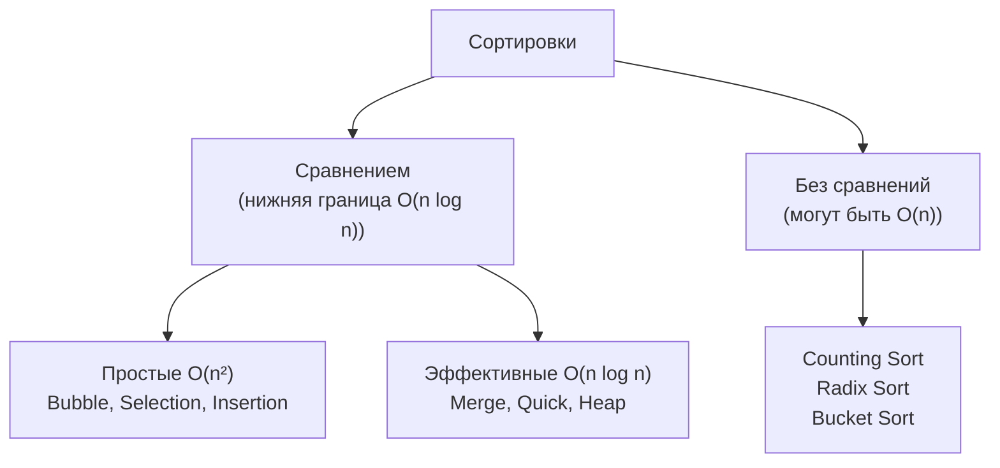
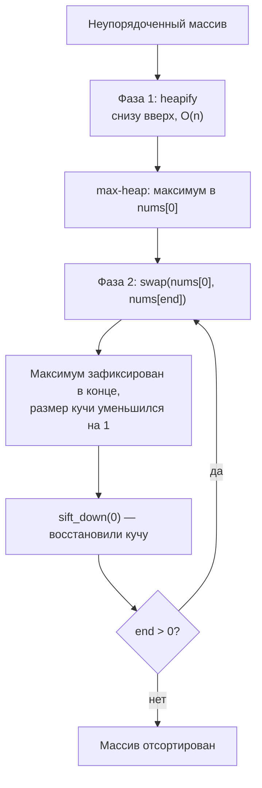
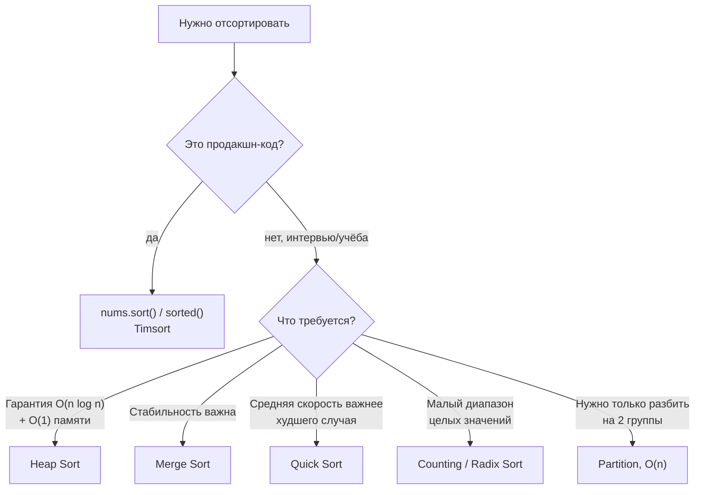

# Сортировки (Sorting)

## Алгоритмы и подходы в этой папке

| # | Название алгоритма | Класс | Сложность | Задачи |
|---|---|---|---|---|
| 1 | **Пузырьковая сортировка** (Bubble Sort) | обменная | `O(n²)` | 912 |
| 2 | **Пирамидальная сортировка** (Heap Sort) | на куче | `O(n log n)` | 912 |
| 3 | **Просеивание вниз** (Sift-down / Heapify) | вспомогательная процедура | `O(log n)` | 912 |
| 4 | **Разделение двумя указателями** (Partition / Dutch Flag) | разбиение по признаку | `O(n)` | 905 |
| 5 | **Сортировка подсчётом** (Counting Sort) | не сравнением | `O(n + k)` | упоминается |

---

## 1. Классификация сортировок



| Алгоритм | Лучший | Средний | Худший | Память | Стабильная? |
|---|---|---|---|---|---|
| Bubble Sort | `O(n)`* | `O(n²)` | `O(n²)` | `O(1)` | да |
| Selection Sort | `O(n²)` | `O(n²)` | `O(n²)` | `O(1)` | нет |
| Insertion Sort | `O(n)` | `O(n²)` | `O(n²)` | `O(1)` | да |
| **Merge Sort** | `O(n log n)` | `O(n log n)` | `O(n log n)` | `O(n)` | да |
| **Quick Sort** | `O(n log n)` | `O(n log n)` | `O(n²)` | `O(log n)` | нет |
| **Heap Sort** | `O(n log n)` | `O(n log n)` | `O(n log n)` | `O(1)` | нет |
| Counting Sort | `O(n + k)` | `O(n + k)` | `O(n + k)` | `O(k)` | да |
| **Timsort** (Python `sort()`) | `O(n)` | `O(n log n)` | `O(n log n)` | `O(n)` | да |

\* при наличии флага раннего выхода на уже отсортированном массиве.

**Стабильность** — сохраняется ли исходный порядок равных элементов. Важно, когда
сортируем по нескольким полям подряд.

---

## 2. Пузырьковая сортировка

### 912. Sort an Array — вариант `bubble_sort`

Файл: `e912_Bubble_Sort_an_Array.py`

**Идея:** проходим по массиву, сравниваем соседей и меняем их местами, если они
стоят не по порядку. За один проход самый большой элемент «всплывает» в конец —
отсюда и название.

```python
def bubble_sort(nums):
    n = len(nums)
    for i in range(n - 1):
        swapped = False
        for j in range(0, n - i - 1):      # хвост уже отсортирован
            if nums[j] > nums[j + 1]:
                nums[j], nums[j + 1] = nums[j + 1], nums[j]
                swapped = True
        if not swapped:                     # за проход ничего не поменяли
            break                           # → массив уже отсортирован
    return nums
```

Разбор `[5, 2, 3, 1]`:

**Проход i = 0** (диапазон j: 0..2)

| j | Сравниваем | Меняем? | Состояние |
|---|---|---|---|
| 0 | 5 > 2 | да | `[2, 5, 3, 1]` |
| 1 | 5 > 3 | да | `[2, 3, 5, 1]` |
| 2 | 5 > 1 | да | `[2, 3, 1, 5]` ← 5 всплыл |

**Проход i = 1** (диапазон j: 0..1)

| j | Сравниваем | Меняем? | Состояние |
|---|---|---|---|
| 0 | 2 > 3 | нет | `[2, 3, 1, 5]` |
| 1 | 3 > 1 | да | `[2, 1, 3, 5]` ← 3 на месте |

**Проход i = 2** (диапазон j: 0..0)

| j | Сравниваем | Меняем? | Состояние |
|---|---|---|---|
| 0 | 2 > 1 | да | `[1, 2, 3, 5]` ✅ |

**Две ключевые оптимизации в коде:**

1. **`n - i - 1`** — после `i`-го прохода последние `i` элементов уже на своих
   местах, их не нужно проверять.

   ```
   после прохода 0:  [ . . . | 5 ]        ← 1 элемент зафиксирован
   после прохода 1:  [ . . | 3   5 ]      ← 2 элемента
   после прохода 2:  [ . | 2   3   5 ]    ← 3 элемента
   ```

2. **Флаг `swapped`** — если за целый проход не было ни одного обмена, массив уже
   отсортирован. Это превращает лучший случай из `O(n²)` в `O(n)`.

> ⚠️ **На LeetCode 912 пузырёк не пройдёт по времени** — там `n` до 5·10⁴, что даёт
> 2.5 миллиарда операций. Задача требует `O(n log n)`. Поэтому в файле реализован
> и heap sort, который и вызывается в `sortArray`.

---

## 3. Пирамидальная сортировка (Heap Sort)

### Что такое куча

Куча (heap) — это двоичное дерево, упакованное в обычный массив. Для max-heap
выполняется свойство: **каждый родитель ≥ своих детей**.

```
Массив:  [9, 7, 8, 3, 5, 2, 4]
Индексы:  0  1  2  3  4  5  6

Дерево:
                9  (idx 0)
              /   \
          7(1)     8(2)
          /  \     /  \
       3(3) 5(4) 2(5) 4(6)
```

**Формулы навигации по массиву:**

| Что нужно | Формула |
|---|---|
| Левый ребёнок узла `i` | `2*i + 1` |
| Правый ребёнок узла `i` | `2*i + 2` |
| Родитель узла `i` | `(i - 1) // 2` |
| Последний узел с детьми | `n // 2 - 1` |

Проверка: у узла 1 (значение 7) дети — `2*1+1 = 3` (значение 3) и `2*1+2 = 4`
(значение 5). ✅ Оба меньше 7 — свойство кучи выполнено.

### Процедура sift-down (просеивание вниз)

Основной кирпичик. Берём узел, который может нарушать свойство кучи, и «топим» его
вниз, меняя местами с бо́льшим из детей, пока он не окажется на своём месте.

```python
def sift_down_cycle(i, size, arr):
    while i * 2 + 1 < size:           # пока есть хотя бы левый ребёнок
        left = 2 * i + 1
        right = 2 * i + 2
        j = left
        if right < size and arr[right] > arr[left]:
            j = right                 # выбираем БОЛЬШЕГО ребёнка
        if arr[i] >= arr[j]:
            break                     # родитель уже больше — всё в порядке
        arr[i], arr[j] = arr[j], arr[i]
        i = j                         # спускаемся на уровень ниже
```

Пример просеивания элемента 1 в массиве `[1, 7, 8, 3, 5]`:

```
Шаг 0:        1              i=0, дети: 7(idx1) и 8(idx2)
            /   \            больший = 8 → меняем
          7       8
         / \
        3   5

Шаг 1:        8              i=2, детей нет (2*2+1=5 >= size)
            /   \            → стоп
          7       1
         / \
        3   5

Итог: [8, 7, 1, 3, 5]
```

**Почему `>` а не `>=` при выборе ребёнка?** При равенстве неважно, какого брать —
свойство кучи не нарушится. Но `>` даёт меньше лишних обменов.

**Две реализации в файле:**

| Реализация | Плюсы | Минусы |
|---|---|---|
| `sift_down_cycle` (итеративная) | нет расхода стека, работает на любых `n` | чуть длиннее |
| `sift_down_rec` (рекурсивная) | короче и нагляднее | глубина стека `O(log n)`, накладные расходы на вызовы |

Обе делают одно и то же. В `sortArray` используется итеративная — она надёжнее.

### Сам алгоритм: две фазы

```python
def heap_sort(nums):
    n = len(nums)

    # ФАЗА 1: построить max-heap из неупорядоченного массива
    for i in range(n // 2 - 1, -1, -1):
        sift_down_cycle(i, n, nums)

    # ФАЗА 2: извлекать максимум
    for end in range(n - 1, 0, -1):
        nums[0], nums[end] = nums[end], nums[0]   # максимум → в конец
        sift_down_cycle(0, end, nums)             # чиним кучу (без хвоста)

    return nums
```



**Почему фаза 1 идёт с `n // 2 - 1` и назад?**
Листья (вторая половина массива) уже сами по себе являются корректными кучами
размера 1 — их просеивать не нужно. Начинаем с последнего узла, у которого есть
дети, и идём вверх: к моменту обработки узла оба его поддерева уже кучи.

Полный разбор `[5, 2, 3, 1]`, `n = 4`:

**Фаза 1.** Начинаем с `i = 4//2 - 1 = 1`.

```
i = 1: узел 2, дети: idx3 = 1. 2 >= 1 → ничего не делаем.
       [5, 2, 3, 1]

i = 0: узел 5, дети: 2(idx1) и 3(idx2). Больший = 3. 5 >= 3 → стоп.
       [5, 2, 3, 1]   ← это уже корректная max-heap
```

```
      5
     / \
    2   3
   /
  1
```

**Фаза 2.**

| end | Действие | Массив после swap | После sift_down | Отсортированный хвост |
|---|---|---|---|---|
| 3 | `swap(nums[0], nums[3])` | `[1, 2, 3, 5]` | `[3, 2, 1, 5]` | `5` |
| 2 | `swap(nums[0], nums[2])` | `[1, 2, 3, 5]` | `[2, 1, 3, 5]` | `3, 5` |
| 1 | `swap(nums[0], nums[1])` | `[1, 2, 3, 5]` | `[1, 2, 3, 5]` | `2, 3, 5` |

Результат: `[1, 2, 3, 5]` ✅

**Разбор sift_down на шаге `end = 3`:** после swap массив `[1, 2, 3, 5]`, куча —
только первые 3 элемента. Просеиваем 1: дети — `2(idx1)` и `3(idx2)`, больший = 3,
`1 < 3` → меняем → `[3, 2, 1, 5]`. У idx2 детей в пределах size=3 нет → стоп.

### Оценка сложности

| Фаза | Сложность | Почему |
|---|---|---|
| Построение кучи | `O(n)` | Большинство узлов — листья, просеивать их дёшево (доказывается суммой ряда) |
| Извлечение | `O(n log n)` | `n` извлечений × `O(log n)` на просеивание |
| **Итого** | **`O(n log n)`** | и в лучшем, и в худшем случае |

Память — `O(1)`: сортировка идёт на месте, никаких дополнительных массивов.

**Heap sort vs Quick sort:**

| | Heap Sort | Quick Sort |
|---|---|---|
| Худший случай | `O(n log n)` гарантированно | `O(n²)` (плохой опорный элемент) |
| На практике | медленнее (плохая локальность кэша) | обычно быстрее |
| Память | `O(1)` | `O(log n)` на стек рекурсии |
| Стабильность | нет | нет |

Heap sort выбирают, когда нужна **гарантия** `O(n log n)` и `O(1)` памяти.

> 💡 В реальном коде на Python используйте `nums.sort()` (Timsort — гибрид merge и
> insertion sort, `O(n log n)`, стабильный, отлично работает на частично
> отсортированных данных). Ручные реализации нужны для понимания и для интервью.

---

## 4. Разделение двумя указателями (Partition)

### 905. Sort Array By Parity

Файл: `e905_Sort_Array_By_Parity.py`

Переставить массив так, чтобы все чётные шли перед всеми нечётными. Порядок внутри
групп не важен.

**Это не сортировка в полном смысле** — это **разбиение (partition)** по признаку,
как в quick sort. Достаточно `O(n)`.

```python
left, right = 0, len(nums) - 1
while left < right:
    if nums[left] % 2 == 0:
        left += 1                 # слева чётное — на своём месте
    elif nums[right] % 2 != 0:
        right -= 1                # справа нечётное — на своём месте
    else:
        # слева нечётное И справа чётное → меняем местами
        nums[left], nums[right] = nums[right], nums[left]
        left += 1
        right -= 1
return nums
```

Логика в трёх правилах:

```
[ чётные ... ? ? ? ... нечётные ]
   ↑                        ↑
  left                    right

1. nums[left] чётное  → left++   (уже на месте)
2. nums[right] нечёт. → right--  (уже на месте)
3. иначе (слева нечёт., справа чёт.) → обмен
```

Разбор `[3, 1, 2, 4]`:

| Шаг | left | right | nums | nums[left] | nums[right] | Правило | Действие |
|---|---|---|---|---|---|---|---|
| 1 | 0 | 3 | `[3,1,2,4]` | 3 (нечёт) | 4 (чёт) | 3 | обмен → `[4,1,2,3]`, left=1, right=2 |
| 2 | 1 | 2 | `[4,1,2,3]` | 1 (нечёт) | 2 (чёт) | 3 | обмен → `[4,2,1,3]`, left=2, right=1 |
| — | 2 | 1 | | | | `left >= right` | стоп |

Результат: `[4, 2, 1, 3]` — чётные впереди ✅

> ⚠️ Локальный тест `test_e905_param.py` для входа `[3,1,2,4]` ожидает `[2,4,3,1]`
> и **падает** (`assert [4,2,1,3] == [2,4,3,1]`). Само решение верное: LeetCode
> принимает любой порядок внутри групп. Ошибка в тесте — он жёстко зафиксировал
> один конкретный результат. Правильнее проверять свойство, а не точный массив:
>
> ```python
> res = sol_inst.sortArrayByParity(nums)
> evens = [x for x in res if x % 2 == 0]
> assert res[:len(evens)] == evens              # все чётные впереди
> assert sorted(res) == sorted(nums)            # состав не изменился
> ```

**Альтернативные подходы:**

| Подход | Код | Время | Память |
|---|---|---|---|
| Два указателя (в файле) | см. выше | `O(n)` | `O(1)` |
| Новый массив за два прохода | `[x for x in nums if x%2==0] + [x for x in nums if x%2]` | `O(n)` | `O(n)` |
| Сортировка по ключу | `nums.sort(key=lambda x: x % 2)` | `O(n log n)` | `O(n)` |
| Fast/slow указатели | см. ниже | `O(n)` | `O(1)` |

Вариант fast/slow (сохраняет относительный порядок чётных):

```python
write = 0
for read in range(len(nums)):
    if nums[read] % 2 == 0:
        nums[write], nums[read] = nums[read], nums[write]
        write += 1
```

> 📎 Тот же приём разделения используется в задачах 75 (Sort Colors — «голландский
> флаг», три указателя), 283 (Move Zeroes, см. `../TwoPointers`) и в фазе partition
> алгоритма quick sort.

---

## 5. Сортировка подсчётом (Counting Sort)

Упоминается в решениях папки `../TwoPointers` (задачи 26, 977). Полезно знать, когда
она уместна.

**Идея:** если значения — небольшие целые числа из диапазона `[min, max]`, можно
не сравнивать элементы, а просто посчитать, сколько раз встретилось каждое.

```python
def counting_sort(nums):
    lo, hi = min(nums), max(nums)
    counts = [0] * (hi - lo + 1)
    for x in nums:
        counts[x - lo] += 1              # «решето»
    result = []
    for i, c in enumerate(counts):
        result.extend([i + lo] * c)      # разворачиваем обратно
    return result
```

```
nums = [3, 1, 4, 1, 3]
lo=1, hi=4  →  counts (индексы 1..4): [2, 0, 2, 1]
                                       1  2  3  4
результат: 1,1, 3,3, 4  →  [1, 1, 3, 3, 4]
```

| Когда работает отлично | Когда категорически нельзя |
|---|---|
| Диапазон значений мал (оценки 1-5, возраст, буквы) | Большой разброс: `[1, 10**9]` → массив на миллиард ячеек |
| Целые числа | Вещественные числа, строки |
| `k = hi - lo` сравнимо с `n` | `k >> n` — память улетает |

Сложность: `O(n + k)` времени и `O(k)` памяти. При маленьком `k` это быстрее любой
сортировки сравнением — нижняя граница `Ω(n log n)` на неё не распространяется,
потому что мы не сравниваем элементы между собой.

---

## 6. Сводная таблица задач

| Задача | Подход | Время | Память |
|---|---|---|---|
| 912. Sort an Array (bubble) | пузырёк с флагом | `O(n²)` | `O(1)` |
| 912. Sort an Array (heap) | heap sort | `O(n log n)` | `O(1)` |
| 905. Sort Array By Parity | partition двумя указателями | `O(n)` | `O(1)` |

---

## 7. Частые ошибки

| Ошибка | Последствие | Как избежать |
|---|---|---|
| В пузырьке цикл `for j in range(n-1)` вместо `n-i-1` | `IndexError` при `nums[j+1]` на последней итерации | Внутренний цикл всегда до `n - i - 1` |
| Нет флага `swapped` | Лишние проходы по отсортированному массиву | Добавить ранний выход |
| В sift_down взяли левого ребёнка без сравнения с правым | Свойство кучи нарушается, сортировка врёт | Всегда выбирать **бо́льшего** из детей |
| В фазе 2 передали в sift_down полный размер `n` | Уже отсортированный хвост снова затягивается в кучу | Передавать `end` — текущий размер кучи |
| Начали heapify с `n - 1` | Лишняя работа (листья просеивать не нужно) | Стартовать с `n // 2 - 1` |
| Забыли, что `right` в `2*i+2` может выйти за границу | `IndexError` | Проверять `right < size` |
| В задаче 905 условие `left <= right` | Лишний обмен элемента с самим собой | `while left < right` |
| Counting sort на большом диапазоне | `MemoryError` | Проверять `hi - lo` перед выделением |

---

## 8. Как выбрать сортировку



**Чек-лист перед реализацией:**
- [ ] Нужна ли полная сортировка, или достаточно разбиения / k-го элемента?
      (для «k-й по величине» есть quickselect за `O(n)` и куча за `O(n log k)`)
- [ ] Важен ли относительный порядок равных элементов (стабильность)?
- [ ] Есть ли ограничение на дополнительную память?
- [ ] Каков диапазон значений — может, подойдёт counting sort?
- [ ] Данные уже частично отсортированы? (Timsort и insertion sort это используют)

**Что учить дальше:** 75 (Sort Colors — голландский флаг), 215 (Kth Largest — куча
или quickselect), 88 (Merge Sorted Array — см. `../TwoPointers`), 148 (Sort List —
merge sort на связном списке), 347 (Top K Frequent — куча + хеш-таблица),
973 (K Closest Points to Origin).
