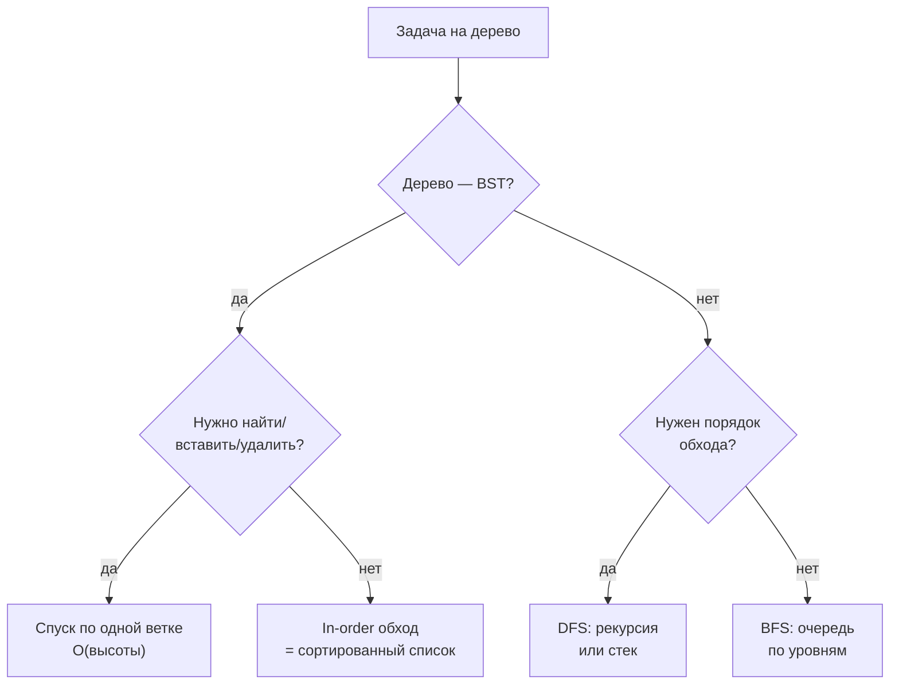
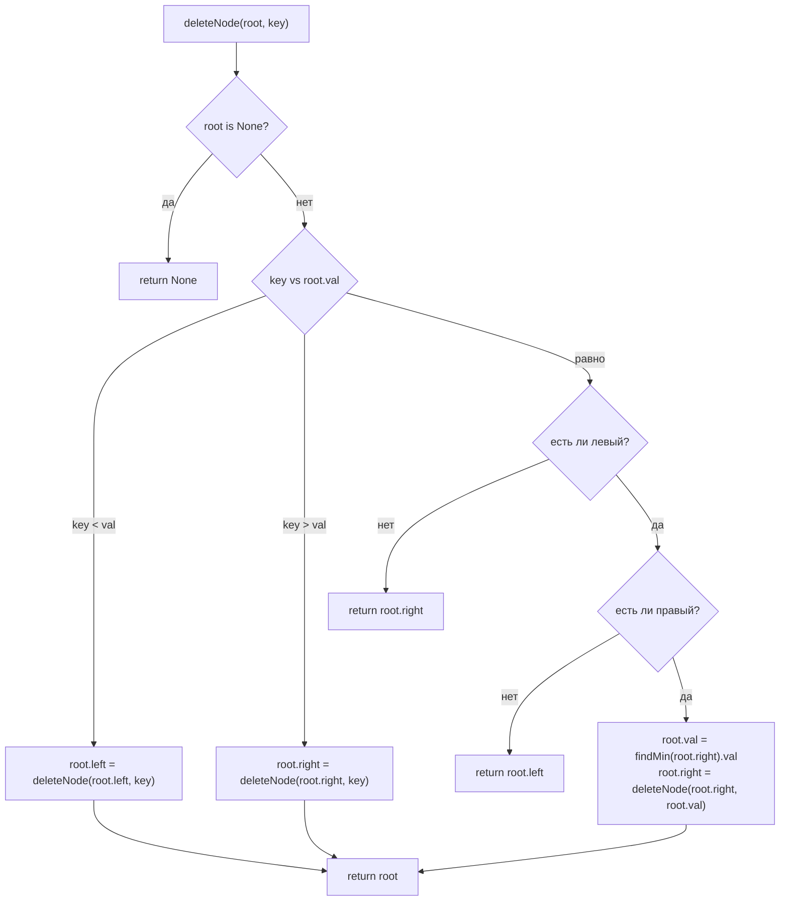

# Деревья (Tree / BST)

## Алгоритмы и подходы в этой папке

| # | Название подхода | Суть | Задачи |
|---|---|---|---|
| 1 | **Рекурсивный обход** (DFS) | Функция вызывает себя для `left` и `right`, база — `None` | 94, 450 |
| 2 | **Итеративный in-order со стеком** | Стек заменяет стек вызовов: спуск влево → выдача → вправо | 94 |
| 3 | **Спуск по BST** (`while current`) | На каждом узле выбираем одну ветку по сравнению с `val` | 700, 701 |
| 4 | **Перепривязка через возврат** (`root.left = f(root.left)`) | Функция возвращает новое поддерево, родитель сам переписывает ссылку | 450, 701 (рекурсивный вариант) |
| 5 | **In-order successor** (минимум правого поддерева) | Замена удаляемого узла на следующий по возрастанию | 450 |
| 6 | **Level-order сборка дерева из списка** | `[1, null, 2, 3]` → дерево через очередь | `util.py` |

Общие утилиты лежат в `util.py`: `TreeNode` (с `addNodeLeft` / `addNodeRight` / `__eq__`)
и статический `TreeNode.fromList`.

---

## 1. Главная идея простыми словами

Дерево — это тот же связный список, только у ноды **две** ссылки вместо одной:
`left` и `right`. Отсюда всё остальное:

```
            5
          ╱   ╲
        3       6
      ╱   ╲       ╲
    2       4       7
```

1. **Обход всегда рекурсивен по сути.** Обработали узел → та же задача для
   левого поддерева → та же для правого. Рекурсия здесь не трюк, а прямая
   запись определения.
2. **Глубина = длина «пути вниз»**, а не число узлов. Для сбалансированного
   дерева это `O(log n)`, для «палки» (вырожденного) — `O(n)`.
3. **Родителя у ноды нет.** Как и в связном списке, назад ходить нельзя.
   Поэтому изменение структуры делают через возврат: `root.left = f(root.left)`.

### BST — бинарное дерево поиска

Отдельное свойство, которое превращает дерево в «отсортированный массив»:

> для любого узла: **все** значения слева `< val`, **все** справа `> val`

```
Из BST-свойства следуют два факта, на которых стоят задачи 700, 701, 450:

  1. Поиск — как бинарный поиск: одно сравнение отсекает целое поддерево.
  2. In-order обход BST даёт значения по возрастанию:  2 3 4 5 6 7
```

### Три порядка обхода

```
        1
      ╱   ╲
    2       3

pre-order  (корень, лево, право):  1 2 3     ← «сначала обработать, потом спускаться»
in-order   (лево, корень, право):  2 1 3     ← для BST даёт сортировку
post-order (лево, право, корень):  2 3 1     ← «сначала дети, потом родитель» (удаление)
```



---

## 2. Шаблоны

### Шаблон А — рекурсивный обход

```python
def walk(node):
    if node is None:        # база: пустое поддерево
        return
    walk(node.left)         # переставляя эти три строки,
    process(node.val)       # получаем pre/in/post-order
    walk(node.right)
```

Глубина рекурсии = высота дерева. При лимите задач папки (10⁴ узлов) вырожденное
дерево упрётся в `RecursionError` (лимит CPython — 1000).

### Шаблон Б — итеративный in-order через стек

```python
res, stack, curr = [], [], root
while curr is not None or stack:
    while curr is not None:      # 1. спуск до упора влево, путь пишем в стек
        stack.append(curr)
        curr = curr.left
    curr = stack.pop()           # 2. левее ничего нет — узел готов к выдаче
    res.append(curr.val)
    curr = curr.right            # 3. уходим вправо, дальше всё сначала
return res
```

Условие цикла составное неспроста: `stack` пуст в самом начале (ещё не спускались)
и в конце (всё выдали), а `curr is None` бывает в середине работы — сразу после
шага 3, когда правого ребёнка нет. Проверять что-то одно — потерять либо старт,
либо середину.

### Шаблон В — спуск по BST

```python
current = root
while current:
    if current.val == val:
        return current
    current = current.right if current.val < val else current.left
return None
```

Ни стека, ни рекурсии: `O(1)` памяти, `O(высоты)` времени.

### Шаблон Г — перепривязка через возврат

```python
def change(node, key):
    if not node:
        return None
    if key < node.val:
        node.left = change(node.left, key)     # ← родитель переписывает ссылку
    elif key > node.val:
        node.right = change(node.right, key)
    else:
        ...                                     # нашли: строим новое поддерево
    return node                                 # вернули (возможно, другой) корень
```

Это способ обойтись без указателя на родителя: каждый уровень рекурсии сам
чинит свою ссылку тем, что ему вернули снизу.

---

## 3. Разбор задач

### 94. Binary Tree Inorder Traversal — рекурсия против стека

Файл: `e94_Binary_Tree_Inorder_Traversal.py`

Два решения в файле:

| Метод | Идея | Память |
|---|---|---|
| `recurseSolution` | `left + [val] + right`, конкатенация списков | `O(h)` стек + `O(n²)` на склейки в худшем случае |
| `iterateSolution` | явный стек, шаблон Б | `O(h)` стек |

Разбор на примере `[1, null, 2, 3]`:

```
        1
          ╲
            2
          ╱
        3

curr=1  → стек [1], curr=1.left=None
        pop 1 → res=[1],  curr=1.right=2
curr=2  → стек [2], curr=2.left=3 → стек [2,3], curr=None
        pop 3 → res=[1,3], curr=None
        pop 2 → res=[1,3,2], curr=None, стек пуст → стоп ✅
```

Обратите внимание: `1` выдался **до** `3`, хотя `3` левее в дереве — потому что
`3` лежит в правом поддереве корня. In-order — это «спроецировать дерево на
горизонтальную ось», а не «сверху вниз».

Тест `test_e94.py` гоняет оба крайних случая: пустое дерево (`[]`) и «палку»
вправо (`[1, null, 2, null, 3]` → `[1, 2, 3]`).

> 📌 В `__main__`-блоке файла остался комментарий-черновик
> `# [3,1,2] — wait, let me verify`. Правильный ответ — `[1, 3, 2]`, тест это
> подтверждает; комментарий стоит убрать.

---

### 700. Search in a Binary Search Tree — бинарный поиск по дереву

Файл: `e700_Search_in_a_Binary_Search_Tree.py`

Ровно шаблон В. Каждое сравнение выбрасывает целое поддерево:

```
root = [4, 2, 7, 1, 3], val = 2

        4          4 > 2 → влево, вся ветка 7 отброшена
      ╱   ╲
    2       7      2 == 2 → нашли, возвращаем поддерево [2, 1, 3] ✅
  ╱   ╲
1       3
```

Возвращать надо **узел**, а не `True`: ответ задачи — поддерево с этим корнем.

`O(h)` времени, `O(1)` памяти. Для вырожденного дерева `h = n`, и поиск
деградирует до линейного — то же ограничение, что у бинарного поиска по
неотсортированным данным.

Дерево для локального прогона собирается через `TreeNode.fromList([4, 2, 7, 1, 3])`:
level-order-список из условия уже является корректным BST, отдельный
«балансировщик» не нужен.

---

### 701. Insert into a Binary Search Tree — спуск до пустого места

Файл: `e701_Insert_into_a_Binary_Search_Tree.py`

Новый узел в BST всегда становится **листом**: спускаемся по тем же правилам,
что и при поиске, и как только нужная ветка оказалась пустой — вешаем узел туда.

```
root = [4, 2, 7, 1, 3], val = 5

        4          4 < 5 → вправо
      ╱   ╲
    2       7      7 > 5 → влево, а слева пусто → сюда ✅
  ╱   ╲   ╱
1       3 5
```

В решении используется пара `current` / `parent`: `current` уходит на `None`,
а `parent` помнит последний живой узел, к которому и цепляем новый лист.

Отдельно обрабатывается пустое дерево: `if not root: return TreeNode(val)` —
иначе цепляться было бы не к чему.

Рекурсивная запись того же (шаблон Г) короче и не требует `parent`:

```python
def insertIntoBST(self, root, val):
    if not root:
        return TreeNode(val)          # пустое место — здесь и создаём
    if val < root.val:
        root.left = self.insertIntoBST(root.left, val)
    else:
        root.right = self.insertIntoBST(root.right, val)
    return root
```

Прогон в конце файла проверяет оба примера условия и вырожденный случай пустого
дерева — сравнение результата с эталоном опирается на рекурсивный `TreeNode.__eq__`
из `util.py`.

---

### 450. Delete Node in a BST — три сценария удаления

Файл: `e450_Delete_Node_in_a_BST.py`

Самая содержательная задача папки. Поиск — привычный спуск, а вот удаление
распадается на три случая по числу детей:

| Детей | Что делаем | Почему BST не ломается |
|---|---|---|
| 0 | Возвращаем `None` | Лист ни с чем не связан снизу |
| 1 | Возвращаем единственного ребёнка | Всё поддерево целиком лежит по нужную сторону от родителя |
| 2 | Копируем значение in-order successor и удаляем его ниже | Successor больше всего левого поддерева и меньше всего правого — ровно то, что требуется на этом месте |

Сценарии 0 и 1 в коде схлопнуты в две строки — `return root.right` уже покрывает
случай листа, когда `root.right` сам `None`:

```python
if not root.left:
    return root.right       # нет детей → None; только правый → он
if not root.right:
    return root.left        # только левый → он
```

Случай двух детей — на примере `key = 3`:

```
        5                              5
      ╱   ╲                          ╱   ╲
    3       6      удаляем 3 →     4       6
  ╱   ╲       ╲                  ╱           ╲
2       4       7              2               7

1. min правого поддерева узла 3   →  4  (бежим влево до упора)
2. root.val = 4                   →  на месте «3» теперь 4, но 4 есть и ниже
3. root.right = deleteNode(root.right, 4)  →  удаляем дубликат ✅
```

Третий шаг всегда попадает в лёгкий случай: минимум поддерева по определению
не имеет левого ребёнка, значит у него максимум один ребёнок.



Сложность — `O(h)`: один спуск до узла плюс не более одного спуска за минимумом,
то есть требование follow-up «O(height of tree)» выполнено.

Симметричный вариант — брать **максимум левого** поддерева (`predecessor`);
LeetCode принимает оба ответа.

> 📌 Проверка в конце файла закомментирована (`# assert res == expected`).
> `TreeNode.__eq__` в `util.py` уже сравнивает деревья рекурсивно, так что
> ассерт можно включить — но только для варианта с successor: с predecessor
> ответ будет другим (тоже верным) деревом.

---

## 4. Сводная таблица сложности

`h` — высота дерева: `O(log n)` для сбалансированного, `O(n)` для вырожденного.

| Задача | Подход | Время | Память |
|---|---|---|---|
| 94 Inorder Traversal | рекурсия | `O(n)` (со склейками списков — до `O(n²)`) | `O(h)` стек |
| 94 Inorder Traversal | явный стек | `O(n)` | `O(h)` |
| 700 Search in a BST | спуск по ветке | `O(h)` | `O(1)` |
| 701 Insert into a BST | спуск до пустого места | `O(h)` | `O(1)` |
| 450 Delete Node in a BST | спуск + successor | `O(h)` | `O(h)` стек рекурсии |
| `TreeNode.fromList` | level-order через очередь | `O(n²)` из-за `queue.pop(0)` | `O(n)` |

---

## 5. Частые ошибки

| Ошибка | Последствие | Как избежать |
|---|---|---|
| Забыли базу `if node is None` | `AttributeError: 'NoneType' has no attribute 'left'` | Первая строка любой рекурсии по дереву |
| Изменили `node.left` внутри функции вместо возврата | Родитель по-прежнему смотрит на старый узел | `node.left = f(node.left)` — шаблон Г |
| При удалении узла с двумя детьми взяли произвольного ребёнка | BST-свойство сломано | Только in-order successor/predecessor |
| Забыли удалить дубликат successor'а после копирования значения | Значение встречается в дереве дважды | `root.right = deleteNode(root.right, min_node.val)` |
| В итеративном обходе условие только `while stack` | Обход обрывается после первого правого перехода | `while curr is not None or stack` |
| Спуск по BST сравнивает не с тем узлом | Уходим не в ту ветку, ответ `None` при существующем значении | Сравнивать `current.val` с `val`, а не с `root.val` |
| Рекурсия на «палке» из тысяч узлов | `RecursionError` | Итеративный вариант или `sys.setrecursionlimit` |
| Сборка дерева списком без учёта `null` | Дети `None`-узла съезжают на чужие места | `TreeNode.fromList` не кладёт `None` в очередь — компактный формат LeetCode |
| `return True` вместо узла в 700 | Неверный тип ответа | Задача просит **поддерево** |

---

## 6. Как распознать задачу «на дерево»

- [ ] На входе `TreeNode` с полями `left` / `right` — индексов нет, только ссылки.
- [ ] В условии написано «binary **search** tree» → работает бинарный поиск,
      цель по времени — `O(h)`, а не `O(n)`.
- [ ] Просят «значения по возрастанию» из BST → **in-order** обход.
- [ ] Просят «сверху вниз, по уровням» → BFS с очередью, а не DFS.
- [ ] Меняем структуру (вставка/удаление/обрезка) → функция **возвращает**
      поддерево, родитель переписывает ссылку.
- [ ] В follow-up сказано «iteratively» → шаблон Б (стек) или шаблон В (спуск).
- [ ] Требование `O(height)` — признак того, что обходить всё дерево не надо.
