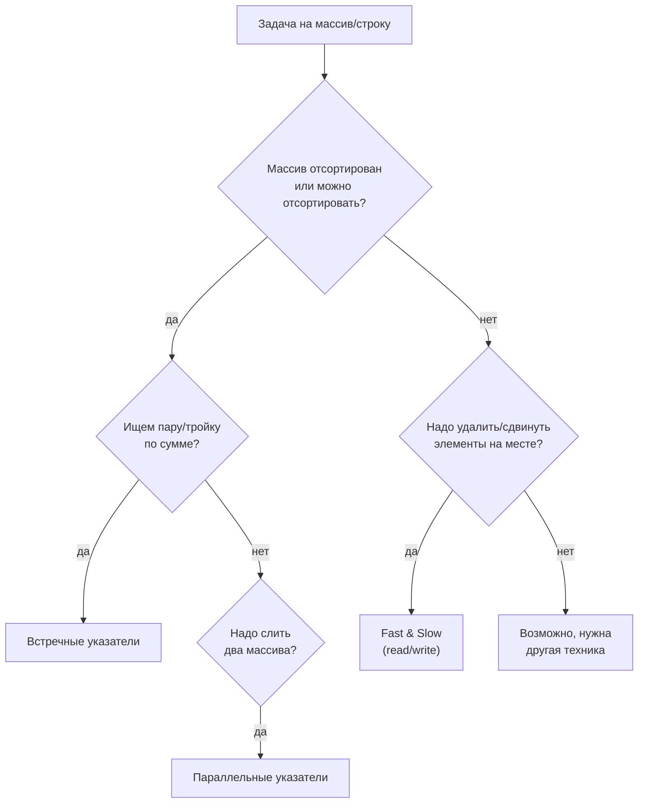

# Два указателя (Two Pointers)

## Алгоритмы и подходы в этой папке

| # | Название подхода | Суть | Задачи |
|---|---|---|---|
| 1 | **Встречные указатели** (Opposite Direction / Converging) | `left` с начала, `right` с конца, идут навстречу | 344, 125, 167, 11, 977 |
| 2 | **Быстрый и медленный** (Fast & Slow / Read-Write pointers) | Оба идут слева направо с разной скоростью | 26, 283, 443 |
| 3 | **Слияние двух массивов** (Merge / Parallel pointers) | По указателю на каждый из двух массивов | 88, 349, 165 |
| 4 | **Сортировка + два указателя внутри цикла** | Внешний перебор + сжатие окна | 15 (3Sum) |
| 5 | **Заполнение с конца** (Backward filling) | Пишем в массив с конца, чтобы не затирать данные | 88, 977 |
| 6 | **Snowball / счётчик пропусков** | Считаем «дырки» и сдвигаем на их количество | 283 (альтернатива) |

---

## 1. Главная идея простыми словами

Вместо двух вложенных циклов (`O(n²)`) мы заводим **две переменные-курсора** и
двигаем их по массиву так, чтобы каждый элемент был просмотрен один раз. Получается
`O(n)`.

Есть три базовые «геометрии» движения:

```
A. Встречные (converging)          B. Однонаправленные (fast/slow)
   [ a b c d e f g ]                  [ a b c d e f g ]
     ↑           ↑                      ↑ ↑
   left       right                  slow fast
     →         ←                        →   →

C. Параллельные (два массива)
   nums1: [ 1 2 3 ]     i
   nums2: [ 2 5 6 ]     j
```



---

## 2. Подход 1: встречные указатели

### Шаблон

```python
left, right = 0, len(arr) - 1
while left < right:
    # что-то посчитали на паре (left, right)
    if <нужно увеличить значение>:
        left += 1
    else:
        right -= 1
```

### 344. Reverse String — самый простой пример

Файл: `344-Reverse_String.py`

```python
left, right = 0, len(s) - 1
while left < right:
    s[left], s[right] = s[right], s[left]
    left += 1
    right -= 1
```

```
["h","e","l","l","o"]
  ↑             ↑        меняем h ↔ o  →  ["o","e","l","l","h"]
  L             R

["o","e","l","l","h"]
      ↑     ↑            меняем e ↔ l  →  ["o","l","l","e","h"]
      L     R

["o","l","l","e","h"]
        ↑↑               left == right → стоп
```

В файле три варианта одного и того же:
* **Variant 1** — классический `while` (лучший).
* **Variant 2** — цикл `for i in range(n // 2)`, `j = n - i - 1`. То же самое, просто
  считаем зеркальный индекс.
* **Variant 3** — рекурсия. Работает, но тратит `O(n)` стека и на длинных строках
  упрётся в лимит рекурсии Python (~1000). Учебный вариант.

### 125. Valid Palindrome

Файл: `125-Valid_Palindrome.py`

В файле реализован **самый простой подход** — очистить строку и сравнить с её
переворотом:

```python
s_clean = "".join(c for c in s if c.isalnum()).lower()
return s_clean == s_clean[::-1]
```

`O(n)` по времени, но `O(n)` по памяти (создаём две новые строки).

**Альтернатива на двух указателях — `O(1)` по памяти:**

```python
left, right = 0, len(s) - 1
while left < right:
    while left < right and not s[left].isalnum():
        left += 1
    while left < right and not s[right].isalnum():
        right -= 1
    if s[left].lower() != s[right].lower():
        return False
    left += 1
    right -= 1
return True
```

Разбор `"A man, a plan, a canal: Panama"`:

```
A man, a plan, a canal: Panama
↑                            ↑     'A' vs 'a' → ок
  ↑                        ↑       ' ' пропускаем → 'm' vs 'm' → ок
     ...
```

| Подход | Время | Память | Когда выбрать |
|---|---|---|---|
| Очистка + срез `[::-1]` | `O(n)` | `O(n)` | Быстро написать, читаемо |
| Два указателя на месте | `O(n)` | `O(1)` | Просят константную память |

### 167. Two Sum II — почему это работает

Файл: `167-Two_Sum_II-Input_Array_Is_Sorted.py`

Массив **отсортирован**. Ищем пару с суммой `target`.

```python
left, right = 0, len(numbers) - 1
while left < right:
    s = numbers[left] + numbers[right]
    if s == target:
        return [left + 1, right + 1]   # ответ в 1-индексации
    elif s < target:
        left += 1      # сумма мала → берём число побольше слева
    else:
        right -= 1     # сумма велика → берём число поменьше справа
```

**Почему мы ничего не теряем?** Если `s < target`, то `numbers[left]` в паре с
*любым* элементом левее `right` даст сумму ещё меньше. Значит `left` в принципе
не может участвовать в ответе — его можно смело выбросить.

Разбор `numbers = [2, 7, 11, 15]`, `target = 9`:

| Шаг | left | right | numbers[left] | numbers[right] | Сумма | Действие |
|---|---|---|---|---|---|---|
| 1 | 0 | 3 | 2 | 15 | 17 | 17 > 9 → `right = 2` |
| 2 | 0 | 2 | 2 | 11 | 13 | 13 > 9 → `right = 1` |
| 3 | 0 | 1 | 2 | 7 | 9 | **найдено → [1, 2]** |

### 11. Container With Most Water

Файл: `11-Container_With_Most_Water.py`

```
height = [1,8,6,2,5,4,8,3,7]

  8│  █           █
  7│  █           █     █
  6│  █ █         █     █
  5│  █ █   █     █     █
  4│  █ █   █ █   █     █
  3│  █ █   █ █   █ █   █
  2│  █ █ █ █ █   █ █   █
  1│█ █ █ █ █ █   █ █   █
   └─────────────────────
    0 1 2 3 4 5 6 7 8
```

Площадь = `(right - left) * min(height[left], height[right])` — ширина на **меньшую**
из двух стенок (вода перельётся через низкую).

**Правило сдвига: двигаем указатель с МЕНЬШЕЙ стенкой.**

Почему? Ширина при любом шаге только уменьшается. Если сдвинуть высокую стенку,
`min` не вырастет (он ограничен низкой), а ширина упадёт → площадь гарантированно
хуже. Значит единственный шанс улучшить результат — заменить низкую стенку.

Разбор:

| Шаг | left | right | h[left] | h[right] | Ширина | min | Площадь | max | Двигаем |
|---|---|---|---|---|---|---|---|---|---|
| 1 | 0 | 8 | 1 | 7 | 8 | 1 | 8 | 8 | left (1 < 7) |
| 2 | 1 | 8 | 8 | 7 | 7 | 7 | **49** | 49 | right |
| 3 | 1 | 7 | 8 | 3 | 6 | 3 | 18 | 49 | right |
| 4 | 1 | 6 | 8 | 8 | 5 | 8 | 40 | 49 | right |
| 5 | 1 | 5 | 8 | 4 | 4 | 4 | 16 | 49 | right |
| 6 | 1 | 4 | 8 | 5 | 3 | 5 | 15 | 49 | right |
| 7 | 1 | 3 | 8 | 2 | 2 | 2 | 4 | 49 | right |
| 8 | 1 | 2 | 8 | 6 | 1 | 6 | 6 | 49 | right |
| — | | | | | | | | **49** | стоп |

Перебор всех пар был бы `O(n²)` — здесь `O(n)`.

### 977. Squares of a Sorted Array — встречные + запись с конца

Файл: `977-Squares_of_a_Sorted_Array.py`

Массив отсортирован, но содержит отрицательные числа. После возведения в квадрат
порядок ломается:

```
[-4, -1, 0, 3, 10]  →  [16, 1, 0, 9, 100]   ← не отсортировано!
```

**Наблюдение:** самые большие квадраты — всегда по краям (либо самое большое
положительное, либо самое маленькое отрицательное). Значит идём с двух концов и
**заполняем результат с конца**:

```python
result = [0] * n
start, end = 0, n - 1
pos = n - 1
while start <= end:
    l, r = nums[start] ** 2, nums[end] ** 2
    if l > r:
        result[pos] = l
        start += 1
    else:
        result[pos] = r
        end -= 1
    pos -= 1
```

Разбор `[-4, -1, 0, 3, 10]`:

| Шаг | start | end | left² | right² | Кто больше | result[pos] | pos |
|---|---|---|---|---|---|---|---|
| 1 | 0 | 4 | 16 | 100 | right | `result[4] = 100` | 3 |
| 2 | 0 | 3 | 16 | 9 | left | `result[3] = 16` | 2 |
| 3 | 1 | 3 | 1 | 9 | right | `result[2] = 9` | 1 |
| 4 | 1 | 2 | 1 | 0 | left | `result[1] = 1` | 0 |
| 5 | 2 | 2 | 0 | 0 | right | `result[0] = 0` | -1 |

Итог: `[0, 1, 9, 16, 100]` ✅

Обратите внимание на `while start <= end` (а не `<`) — иначе последний элемент
(когда указатели сошлись) не попадёт в результат.

**Альтернатива** (закомментирована в файле): возвести всё в квадрат и отсортировать
— `O(n log n)`. Проще, но медленнее.

---

## 3. Подход 2: быстрый и медленный (read/write)

### Шаблон

```python
write = 0                     # куда пишем
for read in range(len(nums)): # что читаем
    if <элемент нужно оставить>:
        nums[write] = nums[read]
        write += 1
return write                  # длина «полезной» части
```

`read` бежит вперёд и просматривает всё. `write` отстаёт и отмечает границу уже
обработанной, «чистой» части массива.

### 283. Move Zeroes

Файл: `283-Move-Zeroes.py`

```
nums = [0, 1, 0, 3, 12]

read=0: nums[0]=0  → пропускаем           write=0  [0,1,0,3,12]
read=1: nums[1]=1  → nums[0]=1, write=1   write=1  [1,1,0,3,12]
read=2: nums[2]=0  → пропускаем           write=1  [1,1,0,3,12]
read=3: nums[3]=3  → nums[1]=3, write=2   write=2  [1,3,0,3,12]
read=4: nums[4]=12 → nums[2]=12, write=3  write=3  [1,3,12,3,12]

Добиваем нулями с позиции write=3:       [1,3,12,0,0] ✅
```

**Альтернатива из файла — «snowball» (снежный ком):**

```python
snowball = 0
for i in range(len(nums)):
    if nums[i] == 0:
        snowball += 1          # ком нулей растёт
    elif snowball > 0:
        nums[i], nums[i - snowball] = nums[i - snowball], nums[i]
```

Здесь `snowball` — количество нулей, накопленных слева. Ненулевой элемент
«перепрыгивает» через весь ком назад ровно на `snowball` позиций. Второго прохода
не нужно — нули оказываются в конце автоматически, потому что мы их меняем местами.

| Вариант | Проходов | Операций записи |
|---|---|---|
| write-pointer | 2 (перенос + добивка нулями) | до `n` присваиваний + хвост |
| snowball | 1 | обмены только для ненулевых |

### 26. Remove Duplicates from Sorted Array

Файл: `26-Remove_Duplicates_from_Sorted_Array.py`

Каноническое решение (`removeDuplicates_orig`):

```python
k = 1
for i in range(1, len(nums)):
    if nums[i] != nums[k - 1]:   # сравниваем с последним записанным
        nums[k] = nums[i]
        k += 1
return k
```

`nums = [0,0,1,1,1,2,2,3,3,4]`:

```
i:  1   2   3   4   5   6   7   8   9
                    сравниваем nums[i] с nums[k-1]

i=1  nums[1]=0 == nums[0]=0  → дубль, пропуск           k=1
i=2  nums[2]=1 != nums[0]=0  → nums[1]=1                k=2  [0,1,...]
i=3  nums[3]=1 == nums[1]=1  → дубль                    k=2
i=4  nums[4]=1 == nums[1]=1  → дубль                    k=2
i=5  nums[5]=2 != nums[1]=1  → nums[2]=2                k=3  [0,1,2,...]
i=6  nums[6]=2 == nums[2]=2  → дубль                    k=3
i=7  nums[7]=3 != nums[2]=2  → nums[3]=3                k=4  [0,1,2,3,...]
i=8  дубль                                              k=4
i=9  nums[9]=4 != nums[3]=3  → nums[4]=4                k=5  [0,1,2,3,4,...]
```

Ответ `k = 5`, первые 5 элементов — `[0,1,2,3,4]` ✅

> В файле есть и авторское решение через **counting sort** (массив-«решето» размером
> `max - min + 1`). Оно работает, но требует `O(диапазон значений)` памяти и ломается
> при больших значениях (например, `[1, 1000000000]` → массив на миллиард ячеек).
> Два указателя тут строго лучше: `O(n)` времени, `O(1)` памяти.

### 443. String Compression

Файл: `443-String_Compression.py`

Тут работают **три** курсора:
* `i` — читаем текущий символ,
* `write_pos` — куда пишем сжатый результат,
* `symb_in_group` — сколько раз подряд встретился текущий символ.

```
chars = ["a","a","b","b","c","c","c"]

i=0 'a', next='a' → одинаковые, symb_in_group=2, continue
i=1 'a', next='b' → группа кончилась:
        пишем chars[0]='a', write_pos=1
        count=2 → пишем '2' в chars[1], write_pos=2
        сброс symb_in_group=1
i=2 'b', next='b' → symb_in_group=2, continue
i=3 'b', next='c' → пишем chars[2]='b', chars[3]='2', write_pos=4
i=4 'c', next='c' → symb_in_group=2
i=5 'c', next='c' → symb_in_group=3
i=6 'c', последний → пишем chars[4]='c', chars[5]='3', write_pos=6

Результат: ["a","2","b","2","c","3", ...], возвращаем 6 ✅
```

Важные тонкости:
1. **Счётчик 1 не пишется.** `["a","b"]` → `["a","b"]`, а не `["a","1","b","1"]`.
2. **Многозначные счётчики пишутся по цифрам.** 12 одинаковых символов → `'1'`, `'2'`
   — два отдельных элемента массива. В коде это `list(str(symb_in_group))`.
3. **Запись не обгонит чтение.** Сжатие группы длины `L` занимает не больше `L`
   ячеек (`1 + len(str(L)) <= L` при `L >= 2`), поэтому можно писать в тот же массив.

---

## 4. Подход 3: параллельные указатели (два массива)

### 88. Merge Sorted Array — слияние с конца

Файл: `88-Merge_Sorted_Array.py`

Нужно слить `nums2` в `nums1` **на месте**. У `nums1` есть «хвост» из нулей длиной `n`.

**Проблема слияния с начала:** записывая в `nums1[0]`, мы затрём ещё не прочитанный
элемент. Нужен буфер.

**Решение — идти с конца.** Свободное место как раз в конце!

```python
i = m - 1          # последний реальный элемент nums1
j = n - 1          # последний элемент nums2
pos = m + n - 1    # последняя ячейка nums1

while i >= 0 and j >= 0:
    if nums1[i] > nums2[j]:
        nums1[pos] = nums1[i]; i -= 1
    else:
        nums1[pos] = nums2[j]; j -= 1
    pos -= 1

while j >= 0:      # добираем остаток nums2
    nums1[pos] = nums2[j]; j -= 1; pos -= 1
```

Разбор `nums1 = [1,2,3,0,0,0]`, `m=3`, `nums2 = [2,5,6]`, `n=3`:

| Шаг | i | j | pos | nums1[i] | nums2[j] | Пишем | Состояние nums1 |
|---|---|---|---|---|---|---|---|
| старт | 2 | 2 | 5 | 3 | 6 | 6 | `[1,2,3,0,0,6]` |
| 2 | 2 | 1 | 4 | 3 | 5 | 5 | `[1,2,3,0,5,6]` |
| 3 | 2 | 0 | 3 | 3 | 2 | 3 | `[1,2,3,3,5,6]` |
| 4 | 1 | 0 | 2 | 2 | 2 | 2 (из nums2) | `[1,2,2,3,5,6]` |
| — | 1 | -1 | 1 | | | j исчерпан → выход | `[1,2,2,3,5,6]` ✅ |

**Почему второй цикл только для `j`, а для `i` не нужен?** Если закончился `nums2`,
то оставшиеся элементы `nums1` уже стоят на своих местах в начале массива —
перекладывать их некуда и незачем.

### 349. Intersection of Two Arrays

Файл: `349-Intersection_of_two_arrays.py`

В файле — «наивный» вариант:

```python
result = set([sym for sym in nums1 if sym in nums2])
```

Он работает, но `sym in nums2` для списка — это линейный поиск, итого `O(n · m)`.

**Три варианта решения:**

| Подход | Код | Время | Память | Комментарий |
|---|---|---|---|---|
| Наивный (в файле) | `[x for x in nums1 if x in nums2]` | `O(n·m)` | `O(k)` | Медленно на больших входах |
| Множества | `list(set(nums1) & set(nums2))` | `O(n + m)` | `O(n + m)` | Самый практичный |
| Два указателя | см. ниже | `O(n log n + m log m)` | `O(1)*` | Если массивы уже отсортированы — `O(n+m)` |

Вариант на двух указателях (классика для этой темы):

```python
nums1.sort(); nums2.sort()
i = j = 0
res = []
while i < len(nums1) and j < len(nums2):
    if nums1[i] == nums2[j]:
        if not res or res[-1] != nums1[i]:   # защита от дублей
            res.append(nums1[i])
        i += 1; j += 1
    elif nums1[i] < nums2[j]:
        i += 1
    else:
        j += 1
return res
```

```
nums1: [4, 5, 9]      nums2: [4, 4, 8, 9, 9]
        i                     j
4 == 4 → пишем 4, i++, j++
5 vs 4 → 5 > 4, j++
5 vs 8 → 5 < 8, i++
9 vs 8 → 9 > 8, j++
9 == 9 → пишем 9
```

### 165. Compare Version Numbers

Файл: `165-Compare_Version_Numbers.py`

Сравниваем `"1.01"` и `"1.001"`, `"1.0"` и `"1.0.0"`. Ключевая идея: недостающие
компоненты считаются нулями.

```
"1.2"     →  [1, 2, 0]
"1.2.0"   →  [1, 2, 0]     равны!

"1.2"     →  [1, 2, 0]
"1.2.1"   →  [1, 2, 1]     второй больше
```

В файле три версии решения — хорошая иллюстрация эволюции кода:

**1. Своё решение** — определяем «лидера» (более длинную версию), идём по его длине,
у короткой подставляем 0. Работает, но 40 строк и легко ошибиться в знаке.

**2. `compareVersion_orig`** — `zip` по общей части + отдельная обработка хвостов:

```python
for a, b in zip(v1, v2):
    if a < b: return -1
    if a > b: return 1
for num in v1[len(v2):]:   # хвост первой версии
    if num: return 1
for num in v2[len(v1):]:
    if num: return -1
return 0
```

**3. `compareVersion_orig_best`** — `zip_longest` с `fillvalue=0`, самое компактное:

```python
from itertools import zip_longest

for a, b in zip_longest(map(int, version1.split('.')),
                        map(int, version2.split('.')),
                        fillvalue=0):
    if a < b: return -1
    if a > b: return 1
return 0
```

`int()` автоматически съедает ведущие нули: `int("001") == 1`. ✅

> ⚠️ В файле `compareVersion_orig_best` использует `zip_longest`, но `from itertools
> import zip_longest` не добавлен в начало файла — метод упадёт с `NameError` при
> вызове.

---

## 5. Подход 4: сортировка + два указателя внутри цикла

### 15. 3Sum

Файл: `15-3Sum.py`

Ищем все уникальные тройки с суммой 0. Полный перебор — `O(n³)`.

**Идея:** зафиксировать первый элемент, а оставшиеся два искать двумя указателями
(как в задаче 167). Итого `O(n²)`.

```
nums = [-1, 0, 1, 2, -1, -4]
после sort: [-4, -1, -1, 0, 1, 2]
             i    L           R
```

Разбор:

| i | nums[i] | left | right | Сумма | Действие |
|---|---|---|---|---|---|
| 0 | -4 | 1 | 5 | -4-1+2 = -3 | < 0 → `left++` |
| 0 | -4 | 2 | 5 | -4-1+2 = -3 | < 0 → `left++` |
| 0 | -4 | 3 | 5 | -4+0+2 = -2 | < 0 → `left++` |
| 0 | -4 | 4 | 5 | -4+1+2 = -1 | < 0 → `left++` → left == right, выход |
| 1 | -1 | 2 | 5 | -1-1+2 = **0** | ✅ `[-1,-1,2]`, сдвигаем оба |
| 1 | -1 | 3 | 4 | -1+0+1 = **0** | ✅ `[-1,0,1]`, сдвигаем оба |
| 2 | -1 | — | — | — | ⏭ **дубль** `nums[2] == nums[1]` → skip |
| 3 | 0 | 4 | 5 | 0+1+2 = 3 | > 0 → `right--` → выход |

Результат: `[[-1,-1,2], [-1,0,1]]` ✅

**Зачем нужна сортировка?** Две причины:
1. Только на отсортированном массиве работает правило «сумма мала → `left++`».
2. Дубликаты становятся соседями, и их легко пропускать.

**Три места пропуска дубликатов:**

```python
# 1. Дубль первого элемента
if i > 0 and nums[i] == nums[i-1]:
    continue

# 2 и 3. После найденной тройки — дубли второго и третьего
while left < right and nums[left] == nums[left + 1]:
    left += 1
while left < right and nums[right] == nums[right - 1]:
    right -= 1
left += 1
right -= 1
```

Условие `i > 0` обязательно: без него первый элемент массива пропускался бы
при сравнении с `nums[-1]` (в Python это последний элемент!).

---

## 6. Сводная таблица сложности

| Задача | Подход | Время | Память |
|---|---|---|---|
| 344 Reverse String | встречные | `O(n)` | `O(1)` |
| 125 Valid Palindrome | срез / встречные | `O(n)` | `O(n)` / `O(1)` |
| 167 Two Sum II | встречные | `O(n)` | `O(1)` |
| 11 Container With Most Water | встречные | `O(n)` | `O(1)` |
| 977 Squares of Sorted Array | встречные + запись с конца | `O(n)` | `O(n)` под ответ |
| 283 Move Zeroes | fast/slow | `O(n)` | `O(1)` |
| 26 Remove Duplicates | fast/slow | `O(n)` | `O(1)` |
| 443 String Compression | fast/slow + счётчик | `O(n)` | `O(1)` |
| 88 Merge Sorted Array | параллельные с конца | `O(m + n)` | `O(1)` |
| 349 Intersection | множества / два указателя | `O(n+m)` / `O(n log n)` | `O(n)` / `O(1)` |
| 165 Compare Version | параллельные по токенам | `O(n + m)` | `O(n + m)` |
| 15 3Sum | sort + встречные | `O(n²)` | `O(1)` без учёта ответа |

---

## 7. Частые ошибки

| Ошибка | Последствие | Как избежать |
|---|---|---|
| `while left <= right` там, где нужен `<` | Элемент сравнивается сам с собой (3Sum, 167 → неверный ответ) | Пара из двух РАЗНЫХ элементов → строго `<` |
| `while left < right` там, где нужен `<=` | Теряется центральный элемент (977) | Обрабатываем каждый элемент → `<=` |
| Слияние массивов «с начала» на месте | Затираются непрочитанные данные | Идти с конца (задача 88) |
| Забыли пропустить дубликаты | Одинаковые тройки в ответе (3Sum) | Пропуски в трёх местах |
| Забыли отсортировать | Логика сдвига перестаёт работать | Первая строка: `nums.sort()` |
| Сдвинули не тот указатель в задаче 11 | Пропущен максимум | Всегда двигаем указатель с **меньшей** высотой |

---

## 8. Как распознать задачу «на два указателя»

- [ ] Массив/строка **отсортированы** (или их можно отсортировать без потери смысла).
- [ ] Нужно найти **пару/тройку** элементов с заданным свойством.
- [ ] Просят изменить массив **на месте**, `O(1)` дополнительной памяти.
- [ ] Нужно **слить** два отсортированных набора.
- [ ] Наивное решение — вложенные циклы `O(n²)`, а нужен `O(n)`.
- [ ] В условии есть слова «палиндром», «максимальная площадь/контейнер», «удалить
      дубликаты», «переместить элементы».
